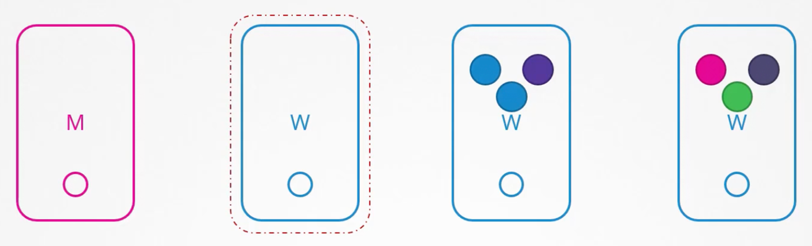
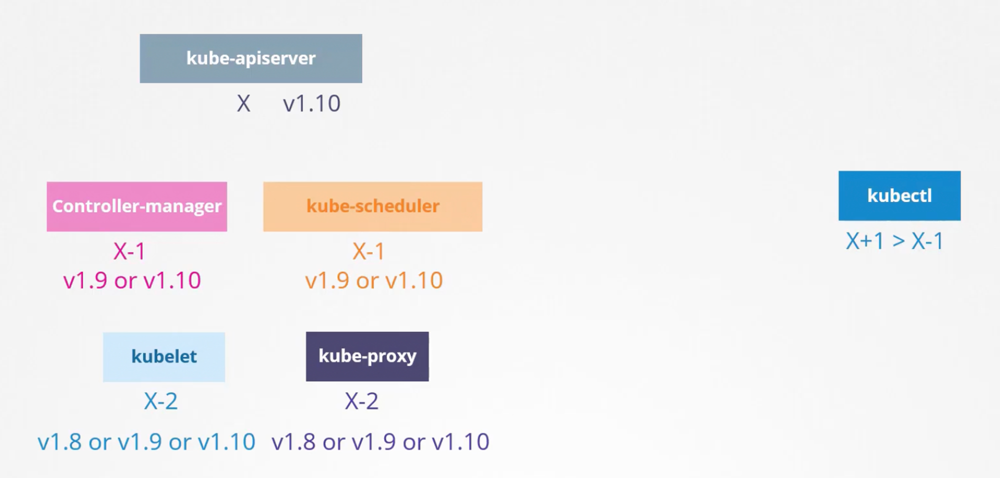
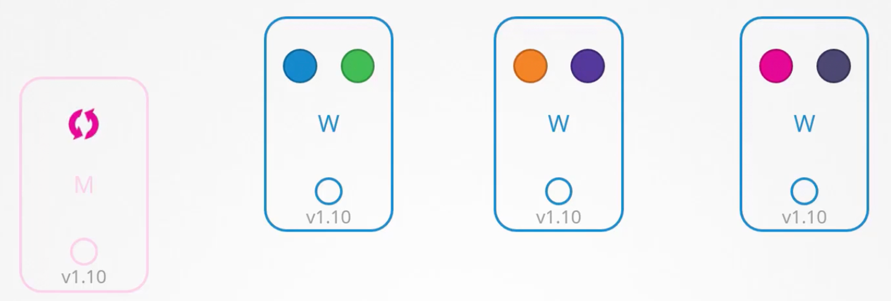
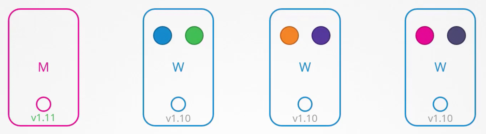
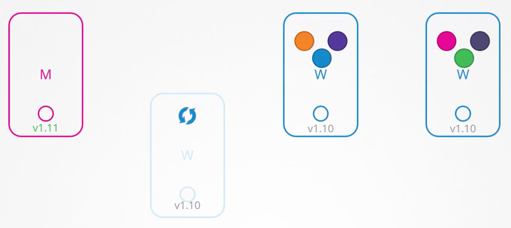
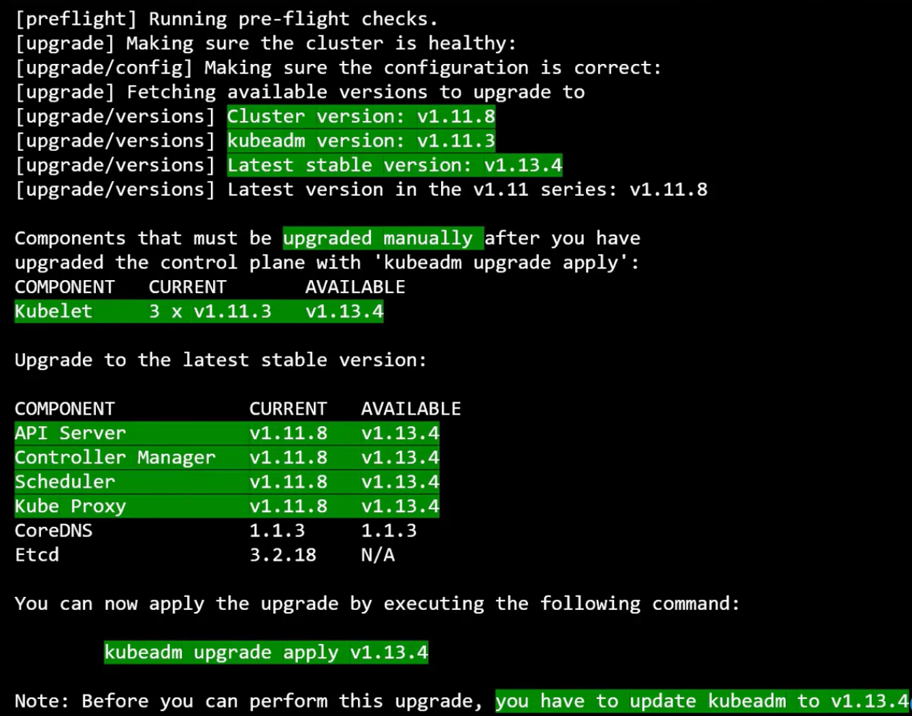
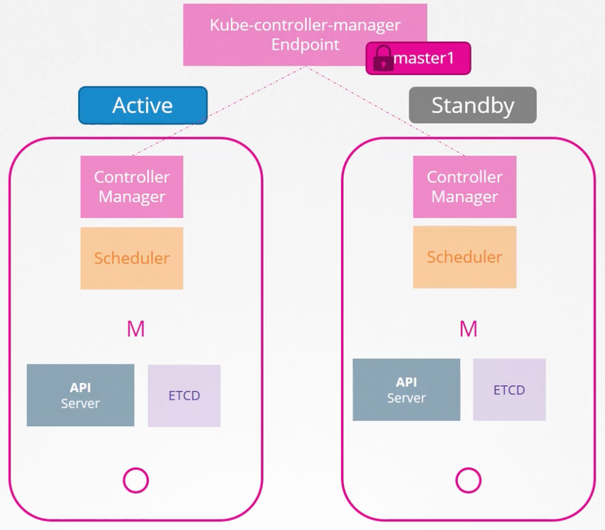
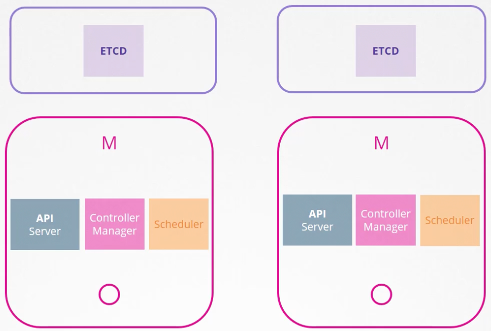

# Unhealthy Nodes

If a node in the cluster goes down, the `kube-controller-manager` waits for **5 mins (default, max)** for the node to come back online. If the node comes back online within 5 mins, the pods running on it are restarted and then everything works the same way.

If the node doesn’t come back online within 5 mins, it is considered unhealthy and all the pods running on it that were associated with replicasets are spawned on other nodes. Any pod on that node that was not associated with any replicaset dies with the node. 

The time for which the `kube-controller-manager` waits before declaring a node unhealthy is called **pod eviction timeout** and it is configured in the `kube-controller-manager`. If the node comes back online after the pod eviction timeout, it has no pod running on it.


# OS Upgrades

To perform OS upgrade or maintenance on a node, first drain it using `k drain <node-name>`. This will terminate the running pods on the node, spawn them on other nodes and mark the node as **cordon**, meaning no pods can be scheduled on it. The above command will not work if there are pods on the node that are not associated with any replicaset, as these pods will not be spawned on any other node. We’ll have to use `--force` option to terminate such pods forcefully.

Now, perform the upgrade or maintenance. After that, uncordon the node using k uncordon <node-name>. This will make the node schedulable again. 

We can manually cordon a node to prevent new pods from being scheduled on it by running k cordon <node-name>. This does not remove already running pods on the node.

# Cluster Version Upgrade

- When we download a K8s release, the 5 core components shown on the left in the image above are at the same version.
- The K8s components can be at different versions. The `kube-apiserver` must be at the highest version compared to other components, except `kubectl` which can be one minor version above.
- Upgrading the version of a cluster basically means upgrading the version of various K8s components running in the cluster.
- **K8s supports 3 latest minor versions.** If the current version of a K8s component is unsupported, we should upgrade it one minor version at a time.
- Upgrading the cluster on a managed K8s engine like GKE is very easy and takes only a few clicks.
- `k get nodes` command shows the version of `kubelet` running on each node.

## Upgrading the master node

First the master node is upgraded, during which the control plane components are unavailable. The worker nodes keep functioning and the application is up. While the master node is getting updated, all management functions are down. We cannot run `kubectl` commands as `kube-apiserver` is down. If a pod were to crash, a new one will not be spawned as the `kube-controller-manager` is down.

## Upgrading worker nodes

Once the master node has been upgraded, we need to upgrade the worker nodes (upgrade the k8s components running on them). As the worker nodes serve traffic, there are various strategies to upgrade them.

### Strategy 1: All at once

Upgrade all the worker nodes at once. This will lead to downtime as no pods will be running during the upgrade.

### Strategy 2: One at a time

Move the pods of the first node to the remaining nodes and upgrade the first node. Then repeat the same for the rest of the nodes.

### Strategy 3: Add new nodes

Add a new worker node with the latest k8s components running on it, drain the first node and then terminate it. Repeat the same for other nodes.

## Upgrading a cluster managed by KubeAdmin

To view the version details of the cluster along with the latest k8s release, run `kubeadm upgrade plan` command on the master node.

Let’s say we want to upgrade the cluster version from `v1.11.0` to `v1.13.0`. Since we can only upgrade one minor version at a time, we’ll first upgrade to `v1.12.0`. 

### Upgrading the master node

Before upgrading the cluster, update the `kubeadm` tool (`kubeadm` follows the same versioning as K8s) - `apt-get upgrade -y kubeadm=1.12.0-00`. 

Now, upgrade the cluster (control plane components of the cluster), except the `kubelet` service as it is not controlled by `kubeadm` - `kubeadm upgrade apply v1.12.0`. 

If the `kubelet` service is running on the master node, we need to upgrade it. Start by draining the master node by running `k drain controlplane`. If `kubelet` is installed as a service, upgrade its package version - `apt-get upgrade -y kubelet=1.12.0-00` and restart the service - `systemctl restart kubelet`. Now, un-cordon the master node - `k uncordon controlplane`. The master node has been upgraded. 

### Upgrading the worker nodes

Now, we need to upgrade the `kubelet` service on all the worker nodes (one at a time). Start by draining the first node by running `k drain node-1` on the master node. Now move to the first node and upgrade the `kubeadm` tool - `apt-get upgrade -y kubeadm=1.12.0-00` and `kubelet` service - `apt-get upgrade -y kubelet=1.12.0-00`. Upgrade the node config with the `kubelet` version - `kubeadm upgrade node` and restart the `kubelet` service - `systemctl restart kubelet`. The `kubelet` version of the first node has now been upgraded. Now, un-cordon the node - `k uncordon node-1`. Repeat for the remaining nodes. 

<aside>
💡 The above mentioned commands are just for reference. Follow [Upgrading kubeadm clusters | Kubernetes](https://kubernetes.io/docs/tasks/administer-cluster/kubeadm/kubeadm-upgrade/) for actual commands.

</aside>


# Backup and Restore

The following can be backed up:

- Resource Configurations
- ETCD Cluster
- Persistent Volumes

### Backing up Resource Configuration

If all the k8s resources are created using config files (declarative approach), then the configuration directory can be backed up using a version control system like Git. If all the resources are not created this way, we can generate resource configuration by running `kubectl get all --all-namespaces -o yaml > all.yaml`. 

Recommended to use **Velero,** a managed tool that can take backups of the cluster configuration. 

### Backing up ETCD Cluster

ETCD cluster can be backed up instead of generating the resource configuration for the cluster. For this, backup the data directory of the ETCD cluster. 

In managed k8s engine, ETCD data directory is not accessible. In such cases, backup the resource configuration.

## Velero

- Open-source
- Supports various plugins to backup the cluster to different storage locations like S3, Azure Blob Storage, etc.
- Download the binary and run the `velero install` command along with the storage plugin and credentials to create the Velero pod looking for backups in the storage destination.
- Works in CLI only
- Runs a velero container in the cluster
- We can define a TTL for the backups stored in the storage location.
- [Kubernetes Backup & Restore using Velero | ADITYA JOSHI | - YouTube](https://www.youtube.com/watch?v=_y0yGAbLknU)
- [Kubernetes Cluster Migration | Migrating Data Across Clusters | ADITYA JOSHI | - YouTube](https://www.youtube.com/watch?v=QWIk1UdIh5c)
- [Kubernetes Backups, Upgrades, Migrations - with Velero - YouTube](https://www.youtube.com/watch?v=zybLTQER0yY&t=923s)


# Cluster Design

## Basics

- K8s is not supported on Windows. You need to use a virtualization software to run a linux OS on it to support K8s.
- **Minikube** uses a virtualization software to run VMs that host k8s components. This allows us to deploy single node clusters easily.
- **KubeAdm** deploys single or multi node cluster on provisioned VMs for development purposes.

## Deploying production-grade clusters

Production grade clusters can be either setup from scratch (turnkey solution) or they can be managed by a cloud provider (hosted solution).

**Turnkey Solution**

- You provision VMs
- You configure VMs
- You use scripts to deploy cluster
- You maintain VMs yourself
- Eg: OpenShift, Vagrant, etc.

**Hosted Solution**

- Kubernetes-as-a-Service
- Provider provisions and configures VMs
- Provider installs Kubernetes
- Provider maintains VMs
- Eg: EKS, GKE, OpenShift Online, AKS

## High Availability

**To avoid single point of failure, production grade clusters should have at least 3 master nodes.** Consider a cluster with 2 master nodes. 

### API Server

The **API Server** is just a REST API server, it can be kept running on both the masters in an **active-active mode**. To distribute the incoming requests to both the KubeAPI servers, use a load balancer like `nginx` in front and point the `kubectl` utility to the load balancer (by configuring [KubeConfig](https://www.notion.so/KubeConfig-c99bacd10778413fbcb4f580dd0b9dbe?pvs=21)).

### Controller Manager and Scheduler

The **Controller Manager** and the **Scheduler** look after the state of the cluster and make necessary changes. Therefore to avoid duplicate processing, they run in an **active-passive mode**.

The instance that will be the active one is decided based on a **leader-election** approach. The two instances compete to lease the endpoint. The instance that leases it first gets to be the master for the lease duration. The active instance needs to renew the lease before the deadline is reached. Also, the passive instance retries to get a lease every `leader-elect-retry-period`. This way if the current active instance crashes, the standby instance can become active.



The kube-controller-manager and the kube-scheduler have leader election turned on by default.

```
kube-controller-manager --leader-elect true [other options]
												--leader-elect-lease-duration 15s
												--leader-elect-renew-deadline 10s
												--leader-elect-retry-period 2s

kube-scheduler --leader-elect true [other options]
							 --leader-elect-lease-duration 15s
							 --leader-elect-renew-deadline 10s
							 --leader-elect-retry-period 2s
```

### ETCD

The **ETCD Server** can be present in the master node (**stacked topology**) or externally on other servers (**external ETCD topology**). Stacked topology is easier to setup and manage but if both the master nodes are down, then all the control plane components along with the state of the cluster (ETCD servers) will be lost and thus redundancy will be compromised.

Regardless of the topology, both the API server instances should be able to reach both the ETCD servers as it is a distributed database.

ETCD is distributed datastore, which means it replicates the data across all its instances. It ensures **strongly consistent writes by electing a leader ETCD instance (master) which processes the writes**. If the writes go to any of the slave instances, they are forwarded to the master instance. Whenever writes are processed, the master ensures that the data is updated on all of the slaves. **Reads can take place on any instance.**

When setting up the ETCD cluster for HA, use the `initial-cluster` option to configure the ETCD peers in the cluster.

ETCD instances elect the leader among them using **RAFT protocol**. If the leader doesn’t regularly notify the other instances of its role regularly, it is assumed to have died and a new leader is elected.

A write operation is considered complete only if it can be written to a majority (**quorum**) of the ETCD instances (to ensure that a write goes through if a minority of ETCD instances goes down). If a dead instance comes back up, the write is propagated to it as well.

`Quorum = floor(N/2 + 1)`, where N is the total number of ETCD instances, is the minimum number of ETCD instances that should be up and running for the cluster to perform a successful write.

`N = 2 => Quorum = 2`, which means quorum cannot be met even if a single instance goes down. So, having 2 instances is the same as having a single instance (0 fault tolerance). So, **we should have at least 3 instances in the ETCD cluster as it offers fault tolerance of 1 instance.**

Considering 1 ETCD instance per master node, **it is recommended to have odd number of master nodes in the cluster.** This is because, during a network segmentation, there is higher changes of quorum being met for one of the network segments.


Since 1 and 2 nodes don’t provide any fault tolerance, the minimum number of nodes for fault tolerance is 3. Also, the even number of nodes can leave the cluster without quorum in certain network partitions. So, the most commonly used node count is 3 (good for most use cases) and 5 (higher fault tolerance). 


# KubeAdmin (`kubeadm`)

- Create the nodes to be used in the cluster
- Setup the nodes - forwarding IPv4 and letting iptables see bridged traffic on all the nodes - [Container Runtimes | Kubernetes](https://kubernetes.io/docs/setup/production-environment/container-runtimes/#install-and-configure-prerequisites)
- Install a [container runtime](https://kubernetes.io/docs/setup/production-environment/container-runtimes/) on all of the nodes (`containerd` recommended)
- Install `kubeadm`, `kubelet` and `kubectl` on all the nodes, refer [Installing kubeadm | Kubernetes](https://kubernetes.io/docs/setup/production-environment/tools/kubeadm/install-kubeadm/)
- Initialize the control plane node with the pod networking CIDR and the API server endpoint as the control plane’s IP address in its local network so that the worker nodes can reach the API server on the master node’s IP - `kubeadm init --apiserver-advertise-address 10.33.92.10 --pod-network-cidr=10.244.0.0/16`
- The above command will create a file `admin.conf` in `/etc/kubernetes` directory which can be used to authenticate to `kubectl`. Follow the on-screen instructions to move this file to the `.kube` folder in the user’s home directory.
    
    We can now run `kubectl` commands from the master node.
    
- The output of the `kubeadm init` command returns a `kubeadm join` command that needs to be run on all the worker nodes to join them with the master node.
- Deploy the cluster networking solution (eg. WeaveNet) as a DaemonSet on all the nodes by running a single `k apply` command on the master node, refer [Integrating Kubernetes via the Addon (weave.works)](https://www.weave.works/docs/net/latest/kubernetes/kube-addon/). Configure the networking solution to use the same CIDR as the pod network configured in `kubeadm init` command.

<aside>
💡 When the K8s cluster is deployed using `kubeadm`, all the control plane components (except the `kubelet`) are deployed as static pods in the `kube-system` namespace. The manifest files for these components are located at `/etc/kubernetes/manifests/`. Simply editing these manifest files leads to the static pods restarting with the updated config.

</aside>

# Kind

Kind is a tool, maintained by the K8s community, which allows us to deploy a K8s cluster within minutes by deploying the K8s nodes as Docker containers on a host.

# K3s

## Intro

- **K3s is a full blown K8s distribution packaged as a single binary.** It allows setting up the K8s cluster much easier as we only have to install a single binary, which installs all the required control-plane components as pods in the `kube-system` namespace.
- **K3s uses SQLite as the storage backend by default**, also supports MySQL, Postgres and ETCD as the storage backend.
- K3s automatically restarts after node reboots or if the process crashes or is killed (resilient)
- Installs the following by default:
    - `containerd` as the container runtime
    - Flannel (CNI)
    - CoreDNS
    - **Traefik** (Ingress Controller)
    - **KlipperLB** - load balancer solution to allow the Traefik load balancer service (Traefik proxy) to be available on port 80 and 443 on the node
- K3s monitors the manifests directory and installs all the resources present in it -  `/var/lib/rancher/k3s/server/manifests`
- K3s comes with `HelmChart` CRD to automate installing Helm charts when the cluster is bootstrapped. It avoids having to install the helm chart using the command line as an additional step. `HelmChartConfig` CRD can be used to modify the static config (`values.yaml`) in the helm chart.

## Architecture

- A server node is defined as a host running the `k3s server` command, with control-plane and datastore components managed by K3s.
- An agent node is defined as a host running the `k3s agent` command, without any datastore or control-plane components.
- Both servers and agents run the kubelet, container runtime, and CNI.

### Single Server Setup

Single server setups use a local SQLite DB to store the cluster state. Embedded SQLite is not supported in multi-server configuration. 


### High Availability Setup

When using embedded etcd DB, we need at least 3 server nodes (master nodes). This is required to have quorum in case a master node goes down.


If instead, we’re using an external DB to store the cluster state, we can get away with 2 master nodes.


## Setting up a single node cluster

Run `curl -sfL https://get.k3s.io | sh -s - --write-kubeconfig-mode 600` on any node to start a K3s cluster on the node. It will automatically install the required utilities like `kubectl` and will also create a `kubeconfig` file at `/etc/rancher/k3s/k3s.yaml` which will be automatically referenced by `kubectl`.

If you’re planning to use `helm` along with the K3s setup, you need to move the kube config file to `.kube` directory - `sudo mv /etc/rancher/k3s/k3s.yaml ~/.kube/config`

<aside>
💡 K3s is much better to setup single node containerized applications when compared to docker-compose.

</aside>

## Ingress

Since K3s clusters come with ‣ ingress controller pre-installed, we can directly create ingress resources to route external traffic to services within the cluster.

## Resources

- [Official Docs](https://docs.k3s.io/) - amazing documentation to get anything done
- Well explained how to setup a K3s cluster with GitOps - [Single-node Kubernetes Clusters Using K3s with Benefits of GitOps • Lasse Højgaard • GOTO 2021 - YouTube](https://www.youtube.com/watch?v=ePyFJ7Hd57Q)
- [k3s vs k8s: What's the difference? - YouTube](https://www.youtube.com/watch?v=FmLna7tHDRc)
- [HIGH AVAILABILITY k3s (Kubernetes) in minutes! - YouTube](https://www.youtube.com/watch?v=UoOcLXfa8EU)
