Environment Variables
Environment variables can be passed to containers running inside the pod. Environment variables are defined at the container level. It is the same as running docker run with -e flag.
💡
Environment variables can also be passed using ConfigMap and Secret 
```
apiVersion: v1
kind: Pod
metadata:
  labels:
    name: frontend
spec:
  containers:
	  - name: httpd
	    image: httpd:2.4-alpine
			env:
				- name: USER_ID
					value: 12345
				- name: USER_PASS
					value: 12345
```


# Security Context

Security context allow us to specify which user the container within a pod should be run. It also lets us add or remove capabilities (privilege) the user has within the container. 

<aside>
💡 Security context can be specified at the pod level or at the container level. If specified at the pod level, it applies to all the containers within the pod. If specified at both the levels, the security context at the container level will override that at the pod level.

</aside>

```yaml
apiVersion: v1
kind: Pod
metadata:
	name: web-pod
spec:
	securityContext:
		runAsUser: 1000
	containers:
		- name: ubuntu
			image: ubuntu
			command: ["sleep", "3600"]
```

<aside>
💡 `runAsUser` takes user ID as the value

</aside>

```yaml
apiVersion: v1
kind: Pod
metadata:
	name: web-pod
spec:
	containers:
		- name: ubuntu
			image: ubuntu
			command: ["sleep", "3600"]
			securityContext:
				runAsUser: 1000
				capabilities:
					add: ["MAC_ADMIN"]
```

<aside>
💡 Capabilities can only be specified at the container level, not at the pod level.

</aside>

# Resource Requirements

Every pod requires some resources (CPU, memory and disk space). Based on the pod’s resource requirements and the resource availability on each of the nodes, the scheduler decides which node to spawn the pod on.

<aside>
💡 If none of the nodes have the required resources, the scheduler keeps the pod in the pending state.

    


</aside>

### CPU and Memory metrics


### Resource Requests

We can specify the resource requirements for a container in the definition file. This will be used by the scheduler to find out which node has these resources available to spawn a new pod. If not specified explicitly, the scheduler assumes that the pod will require **0.5 CPU** and **256 Mi memory**.

### Resource Limits

A container has no limit on resources it can consume. A container can use up all the resources and starve the native processes of the host. However, pods support resource limits. They can be specified for each container in the pod definition file. If not specified explicitly, a container is given resource limits of **1 CPU** and **512 Mi memory**.

<aside>
💡 The container is not allowed to exceed the CPU limit. However, it can exceed the memory limit occasionally. If the container repeatedly exceeds its memory limit, k8s terminates the pod.

</aside>

### Pod definition file

```yaml
apiVersion: v1
kind: Pod
metadata:
	name: web-pod
spec:
	containers:
		- name: nginx
			image: nginx
			resources:
				requests:
					memory: "1Gi"
					cpu: 1
				limits:
					memory: "2Gi"
					cpu: 3
```

# Taints and Tolerations

- **It’s a way to control which pods are allowed to be scheduled on a given node.**
- Taints are key-value pairs. **Once we apply a taint to a node, only those pods that are tolerant to that taint can be scheduled on that node.** This prevents the intolerant pods from being scheduled on this node. This however, does not mean that the tolerant pod can only be scheduled on the tainted node. It can very well be scheduled on another node that is not tainted. If we want to restrict some pods to certain nodes, we need to use [Node Affinity](https://www.notion.so/Node-Affinity-6613a8c58f8a4b2188bca73ad5a04d2a?pvs=21).

<aside>
💡 When a K8s cluster is setup. A taint is automatically applied to the master node to prevent any pod from being scheduled on the master node. This is to prevent other processes from starving the master processes required to run the K8s cluster.


</aside>

- **Taint effect** defines what happens to pods that don’t tolerate this taint. There are 3 possible taint effects:
    - `NoSchedule` - do not schedule new intolerant pods on this node
    - `PreferNoSchedule` - try not to schedule intolerant pods on this node
    - `NoExecute` - do not schedule intolerant pods on this node; if there are existing intolerant pods on this node, they will be evicted from the node

### Commands

- Taint a node - `kubectl taint node <node-name> <key>=<value>:<taint-effect>`
- Un-taint a node - `kubectl taint node <node-name> <key>=<value>:<taint-effect>-`
- List taints on a node - `k describe node <node-name> | grep Taints`

### Apply toleration to a pod

The below pod definition file tolerates the taint applied to the node as:
`kubectl taint node node1 compute=high:NoSchedule`

```yaml
apiVersion: v1
kind: Pod
metadata:
	name: web-pod
spec:
	tolerations:
		- key: compute
			operator: Equal
			value: high
			effect: NoSchedule
	containers:
		- name: nginx
			image: nginx
```

# Node Selector

We can label our nodes using key-value pairs and use these labels to schedule a pod on a given node. Node selectors have limitations. **We can only use a single label and selector to select a pod.** We cannot use complex logic to decide which node should be used for scheduling a pod. Example: we cannot specify a pod to be scheduled on a node with `compute: high` or `compute:medium` at the same time. For such use cases, we need [Node Affinity](https://www.notion.so/Node-Affinity-6613a8c58f8a4b2188bca73ad5a04d2a?pvs=21). 

### Select a node for a pod

Example: schedule the pod on a node with high compute power.

`kubectl label node node01 compute=high`

```yaml
apiVersion: v1
kind: Pod
metadata:
	name: web-pod
spec:
	nodeSelector:
		compute: high
	containers:
		- name: nginx
			image: nginx
```

### Commands

- Label a node - `kubectl label node <node-name> <key>=<value>`
- View labels of a node - `k describe node <node-name>`

Node Affinity
It is used to ensure the pods are scheduled on the right nodes. It allows us to use complex logic to decide which node the pod should be scheduled on. It uses the concept of labelling nodes as seen in Node Selector.
Node Affinity Types
It defines the behavior of the node affinity when scheduling a new pod (DuringScheduling) and when a pod has been running (DuringExecution). 
These are of types:
requiredDuringSchedulingIgnoredDuringExecution 
During pod scheduling, the node must satisfy the node affinity requirements. If none of the nodes satisfy the requirements, the pod will not be scheduled.
A pod already running should be allowed to keep running.
preferredDuringSchedulingIgnoredDuringExecution
During pod scheduling, the node should ideally satisfy the node affinity requirements. If none of the nodes satisfy the requirements, the pod will still be scheduled on a node.
A pod already running should be allowed to keep running.
requiredDuringSchedulingRequiredDuringExecution (planned to be released)
During pod scheduling, the node must satisfy the node affinity requirements. If none of the nodes satisfy the requirements, the pod will not be scheduled.
A pod already running on a node that does not satisfy the node affinity requirements will be evicted from that node.
Schedule a pod on a node with compute label high or medium
apiVersion: v1
kind: Pod
metadata:
	name: web-pod
spec:
	containers:
		- name: nginx
			image: nginx
	affinity:
		nodeAffinity:
			requiredDuringSchedulingIgnoredDuringExecution:
				nodeSelectorTerms:
					- matchExpressions:
						- key: compute
							operator: In
							values:
							- high
							- medium
​
Schedule a pod on a node with compute label not low
apiVersion: v1
kind: Pod
metadata:
	name: web-pod
spec:
	containers:
		- name: nginx
			image: nginx
	affinity:
		nodeAffinity:
			requiredDuringSchedulingIgnoredDuringExecution:
				nodeSelectorTerms:
					- matchExpressions:
						- key: compute
							operator: NotIn
							values:
							- low
​
Schedule a pod on a node where compute label exists
apiVersion: v1
kind: Pod
metadata:
	name: web-pod
spec:
	containers:
		- name: nginx
			image: nginx
	affinity:
		nodeAffinity:
			requiredDuringSchedulingIgnoredDuringExecution:
				nodeSelectorTerms:
					- matchExpressions:
						- key: compute
							operator: Exists


# Combining Taints & Tolerations and Node Affinity

We want to deploy the colored pods on matching nodes and ensure that other pods don’t get deployed on colored nodes. We also don’t want the colored pods to get deployed on other nodes.


If we taint the colored nodes accordingly and apply tolerations to the pods, we can prevent non-matching and other pods from being deployed on the colored nodes. However, we cannot guarantee that a colored pod will not get deployed on a non-tainted node.


If we label the nodes according to their color and use node affinity to make colored pods schedule on the corresponding colored nodes, the colored pods will always be deployed on matching nodes. However, this does not guarantee that other pods will not be deployed on colored nodes.


We can combine both taints & tolerations and node affinity to achieve the desired result. Taints and tolerations ensure that other pods don’t get scheduled on colored nodes. Node affinity ensures that colored pods get scheduled on the right nodes.

# Controllers


Controller is a process in k8s which runs in the background and monitors the resource config in `etcd` for state changes. When the state of the resource changes, it makes necessary changes to the cluster to match the new state.

All of the k8s resource types have controllers that monitor their state in the `etcd` and make necessary changes to the cluster. If a request to modify something in the cluster is approved by the `kube-apiserver`, the changes are written to the `etcd` store. The controller monitoring that resource is responsible to make the necessary changes.

## Deployment Controller

When a deployment is created, updated or deleted in K8s, the up-to-date manifest is stored in the `etcd` database. The deployment controller continuously monitors the state of the deployment objects in the `etcd` store. When the deployment is first created, the deployment controller creates a [ReplicaSet](https://www.notion.so/ReplicaSet-df784dc061344ab6a5a83f1f61652f1c?pvs=21) object in the `etcd`, after which the ReplicaSet controller creates the necessary Pod objects in the `etcd`.

Multi-Container Pods


Multi-container pods are used in cases where it’s better to have separate code for some added functionality along with the application code. Example: log agent alongside the application to collect logs and send them to a centralized log server.
Containers inside a pod share the same:
Lifecycle - created and destroyed together
Network - can refer each other as localhost
Storage - can access the same storage volumes
All the containers inside a pod must keep running for the pod to remain in running state. If any of them fails, the pod restarts.
Sharing volumes in multi-container pods
apiVersion: v1
kind: Pod
metadata:
	name: web-pod
spec:
	volumes:
		- name: shared-vol
			emptyDir: {}
	containers:
		- name: webapp
			image: webapp
			volumeMounts:
		    - name: shared-vol
		      mountPath: /files
		- name: log-agent
			image: log-agent
			volumeMounts:
		    - name: shared-vol
		      mountPath: /logs
​
Init Containers
Init containers run once during the pod initialization and they terminate after that. When a POD is first created, the init container is run, and the process in the init container must run to a completion before the real container hosting the application starts. We can have multiple init containers. In that case each init container is run one at a time in sequential order. If any of the init containers fail to complete, Kubernetes restarts the Pod repeatedly until all the init containers succeed.
For example: a process that pulls a code or binary from a repository that will be used by the main web application or a process that waits for an external service or database to be up before the actual application starts.
Init containers are defined just like other containers inside a pod definition file. However, they are defined under initContainers section.
apiVersion: v1
kind: Pod
metadata:
  name: myapp-pod
  labels:
    app: myapp
spec:
  containers:
  - name: myapp-container
    image: busybox:1.28
    command: ['sh', '-c', 'echo The app is running! && sleep 3600']
  initContainers:
  - name: init-myservice
    image: busybox:1.28
    command: ['sh', '-c', 'until nslookup myservice; do echo waiting for myservice; sleep 2; done;']
  - name: init-mydb
    image: busybox:1.28
    command: ['sh', '-c', 'until nslookup mydb; do echo waiting for mydb; sleep 2; done;']

# Deploying a Production grade Application

## On-premise Solution

### Getting the application online

Let’s say we want to deploy a clothing e-commerce application on K8s. We package the application in a Docker container and use [Deployment](https://www.notion.so/Deployment-aaa3756097d1452a9d42cc3e493a36c6?pvs=21) to deploy 3 pods of this application. Since we want the users to be able to access our application, we create a NodePort [Service](https://www.notion.so/Service-56c166dcc5624cd89cc6e86f66cf278d?pvs=21) to expose the application on port 38080 of the public IP of the node. The service takes care of load balancing among the pods.


### DNS and Reverse Proxy

We configure a DNS server to point to the public IP of the node. This way, users don’t have to type in the IP address. Also, since NodePorts have to be greater than 30000, we need to have a reverse proxy (eg. **MetalLB**) to forward requests coming in on port 80 to the NodePort 38080. This way, users can access the application using the URL directly without having to type in the IP or port of the node. **This solution is good to implement on-prem.**

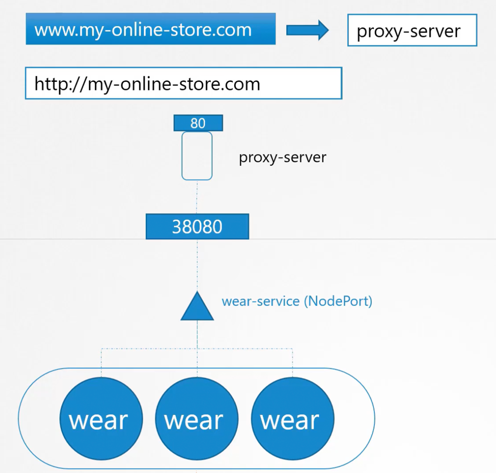

## Cloud Solution

If the application is deployed on a cloud provider like GCP, instead of configuring a reverse proxy along with a NodePort service, we can make the service as LoadBalancer. In this case, K8s will internally create a NodePort service and provision a network load balancer of the cloud provider to route the incoming traffic to the given port on all the nodes. We can then configure the DNS server to point to the NLB’s IP. This means, all incoming requests will be routed to one of the application pods running on any of the nodes. 

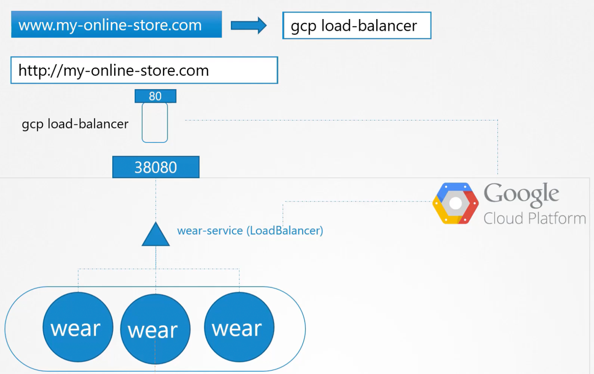

### Hosting multiple applications on the same cluster

A new application needs to be added and the old app needs to be hosted on a path. 

- `www.my-online-store.com/wear`
- `www.my-online-store.com/watch`

Both of these applications will share the same cluster going forward. We need to create another service of type LoadBalancer which will select another available NodePort and provision another NLB. Therefore, for every service, we need a separate NLB (expensive). Apart from that, we need an ALB (layer-7 load balancer) to route requests to the two NLBs depending on the request path. Since the app will require SSL termination, we need to handle that at the ALB. 

We can see that hosting multiple configurations on the same cluster can become expensive and difficult to manage.

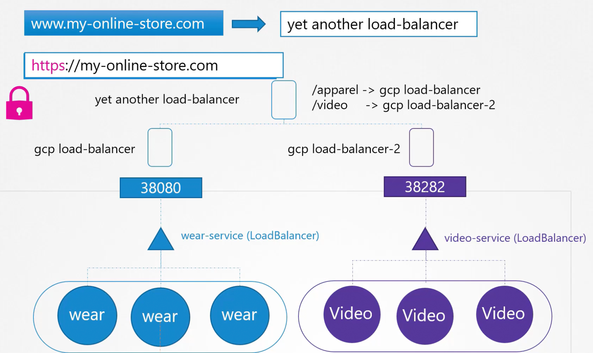

### Ingress

We can move the entire ALB setup inside the K8s cluster using [Ingress](https://www.notion.so/Ingress-9fe828fdf67b42d09b0da2a4579ad636?pvs=21), which is basically a layer-7 load balancer managed inside the K8s cluster. **The ingress requires a LoadBalancer Service to be exposed as a public IP.** However, this is a one time setup. We don’t need additional cloud native load balancers. All the layer-7 load balancing, routing and SSL termination will take place inside the K8s ingress.

# Blue-Green and Canary Deployments

Blue-Green and Canary deployments are not supported by default in K8s. We need to implement them manually.

## Blue-Green Deployment in K8s

In blue-green deployments, while the old version (blue) is still running, we bring up the new version (green) and switch the users from blue to green all at once. 

To implement blue-green deployment in k8s, we deploy both blue and green version as [Deployment](https://www.notion.so/Deployment-aaa3756097d1452a9d42cc3e493a36c6?pvs=21). The blue deployment has all the pods labelled as `version: v1` whereas green deployment has all the pods labelled as `version: v2`. When we want to shift to the green deployment, we just update the service to route to pods with label `version: v2`. 


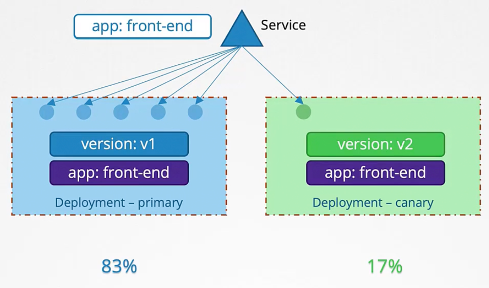

## Canary Deployment in K8s

To implement canary deployment, create a new [Deployment](https://www.notion.so/Deployment-aaa3756097d1452a9d42cc3e493a36c6?pvs=21) (canary deployment) with label `version: v2` containing just 1 pod. Also, have a common label between the old and new deployments and use that label in the service to direct traffic to both the deployments. Since the canary deployment only has 1 pod, it will only serve a portion of the traffic. Once we are sure that the canary deployment is working fine, we can scale up the canary deployment to bring up the desired number of pods and delete the primary deployment.


# Kubernetes Networking

## Cluster (Node) Networking

Each node must have at least one interface connected to a common network. Each interface must have an IP address configured. Every node must have a unique hostname as well as a unique MAC address.


Various ports need to be opened (firewall and security group settings must be configured) on the master and worker nodes as shown in the diagram. The worker nodes expose services for external access on ports 30000 - 32767 (for `NodePort` services). 

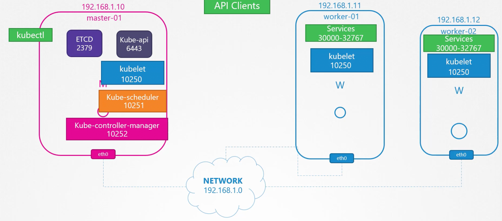

In a multi-master setup, the ETCD clients need to communicate on port 2380, so that needs to be open as well.


## Pod Networking

Now that we have configured networking at the cluster level as explained in the previous section, all the nodes can communicate with each other each other. But we also need to establish networking at the pod level. K8s doesn’t come with a native pod networking solution. Instead it requires us to set it up ourselves. 

We can use a CNI compatible networking solution (plugin) to achieve this. Basically, the CNI plugin ensures that every pod on the cluster (irrespective of the node it is running on), gets a unique IP address.

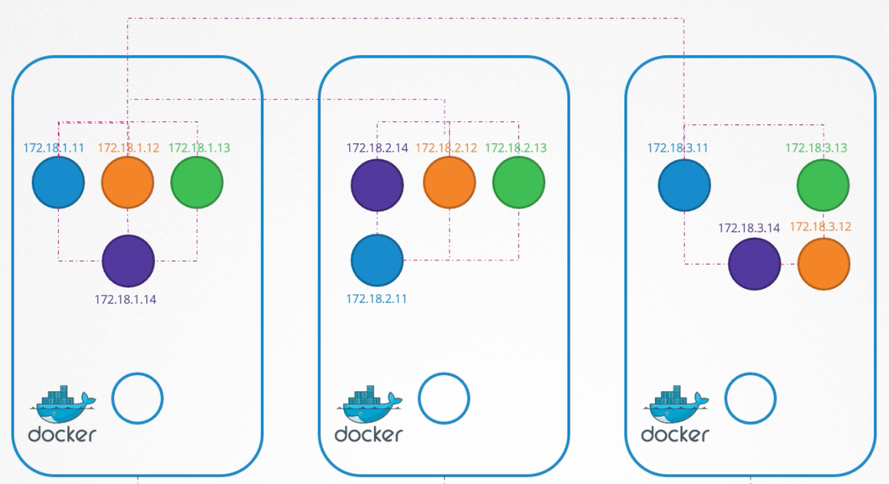

After setting up the networking solution:

- Every pod in the cluster should have a unique IP Address.
- Every pod should be able to communicate with every other POD on the same node by using IP addresses.
- Every pod should be able to communicate with every other POD on other nodes by directly using their IP addresses, without using a NAT.

Networking solutions create a bridge network on each node with a different subnet mask and attach every pod to the bridge network on its node. This way, every pod in the cluster gets a unique IP address. Also, pods on the same node can now communicate with each other using IP addresses. 


At this stage, pods cannot communicate across nodes. If the blue pod (`10.244.1.2`) tries to ping the purple pod (`10.244.2.2`), it won’t be able to since it is on a different subnet. It then routes the request to NODE1’s IP (`192.168.1.11`) as it is the default gateway for the bridge network on NODE1. Even NODE1 has no idea where the subnet `10.244.2.0/24` is as it is a private network on NODE2. So, we need a router configured as the default gateway on each node to tell them where to forward the requests going to pods on various bridge networks.

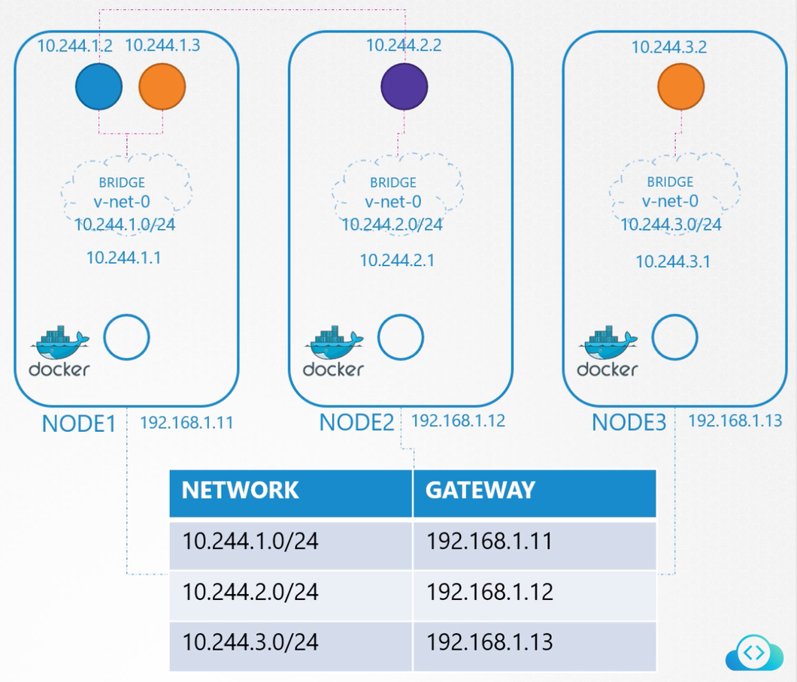

This way, the bridge networks running on each node coalesce together to form a large network with CIDR `10.244.0.0/16`.


## CNI Standards

Networking solutions for K8s must follow the **Container Networking Interface (CNI)** standards. CNI defines how networking solutions (plugins) should be developed and how container runtimes should invoke them. **Docker does not support CNI.** K8s uses a workaround to achieve networking when using Docker as the container runtime.

CNI is configured on the [Kubelet](https://www.notion.so/Kubelet-4ba7a09077064494a8f74868b6e1eebf?pvs=21) service. Here, we define the `cni-bin-dir` (default `/opt/cni/bin`) which contains the supported CNI plugins as executable binaries. We also define `cni-conf-dir` (default `/etc/cni/net.d/`) which contains the different config files for CNI to be used by Kubelet.

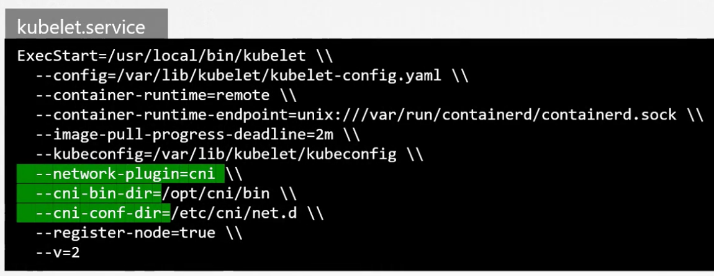

## WeaveNet - Pod Networking Solution


WeaveNet is a CNI compatible networking solution plugin for K8s. Instead of configuring a router to route traffic between nodes, it deploys an agent on each node. These agents communicate with each other to share information about their node. Each agent stores the entire network topology, so they know the pods and their IPs on the other nodes.

Weave creates a separate bridge network on each node called `weave` and connects the pods to it. The pods are connected to the docker bridge network and the weave bridge network at the same time. Weave configures the routing on the pods to ensure that all packets destined for other nodes are delivered to the agent. The agent then encapsulates the packet and sends it to the agent running on the other node, which then decapsulates the original packet and sends it to the required pod.

Weave allocates the CIDR `10.32.0.0/12` for the entire cluster. This allows for IP range `10.32.0.1` to `10.47.255.254` (over a million IPs). Weave peers (agents) split this range among themselves.

Weave can be deployed as a deamonset on each node. For installation steps, refer [Integrating Kubernetes via the Addon (weave.works)](https://www.weave.works/docs/net/latest/kubernetes/kube-addon/#-installation) and https://github.com/weaveworks/weave/releases

## Service Networking


In a cluster, pods communicate with each other through services, using their DNS names or IP addresses, instead of using the pod’s IP which can change if it restarts. While a pod runs on a single node, a service spans the entire cluster and can be reached from any of the nodes. In the above image, the purple service is of type `NodePort`, which means it can be accessed at a given port from any node in the cluster. 

Services are allocated IPs from a range configured in the **KubeAPI** server using the `service-cluster-ip-range` parameter. The service networking CIDR should not overlap with the pod networking CIDR. 

Services in K8s are not resources like pods. When a service object is created, the **KubeProxy** running on each node configures the IPTable rules on all of the nodes to forward the requests coming to the `IP:port` of the service to the `IP:port` of the backend pod configured in the service. 


## Important Commands

- Find which ports on the node is being used by what process - `netstat -nplt`
- To find the interface used by k8s on the node, run `ip link` or `ip address` and search for node’s internal IP (found using `k get nodes -o wide`).
- View the route table on a node - `route`
- Find the interface of the bridge network created by the container runtime on a node - `ip address show type bridge`
- To find the range of IP addresses for the nodes in the cluster, run `ip address` and deduce the range for `eth0` interface.
- To find the range of IP addresses for the pods in the cluster running a networking solution like WeaveNet, run `ip address` and deduce the range for `weave` interface.

# DNS in Kubernetes

K8s sets up a built-in DNS server on the cluster to resolve pod and service names to their IPs. Prior to K8s v1.12, it was `kube-dns`. From v1.12 onwards, **CoreDNS** is the recommended DNS solution. When setting up the cluster using **KubeAdmin**, CoreDNS is deployed as a deployment of **2 replicas** for high availability in the `kube-system` namespace.


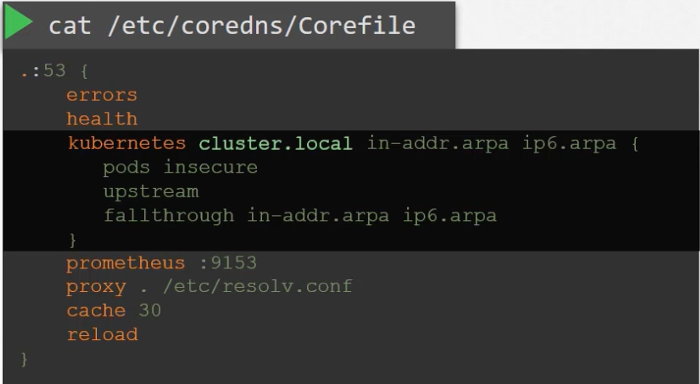

Each CoreDNS pod runs the `Coredns` executable which uses the config `/etc/coredns/Corefile`. The `Corefile` is passed to the deployment as a ConfigMap named `coredns` so that it can be easily edited.

To allow other pods to reach the CoreDNS pods, a service named `kube-dns` is created in the `kube-system` namespace. The IP address of this service is configured as the `nameserver` in all the pods’ `/etc/resolv.conf` by the Kubelet.

## DNS for Services

Whenever a service is created, an entry is added to the DNS server to map the service name to its IP. Now, any pod within the same namespace can reach the service by its name. Pods in some other namespace can reach the service at `<service-name>.<namespace>` where `namespace` is the namespace in which the service is present.

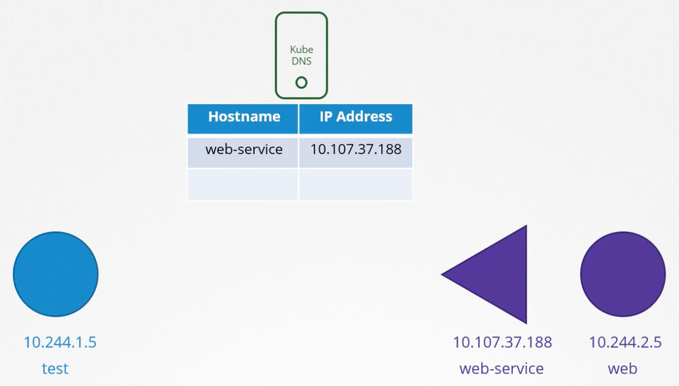

## DNS for Pods

**DNS records are not created for pods by default.** But we can enable it. In this case, the pod name is generated by replacing `.` with `-` in the IP address of the pod.

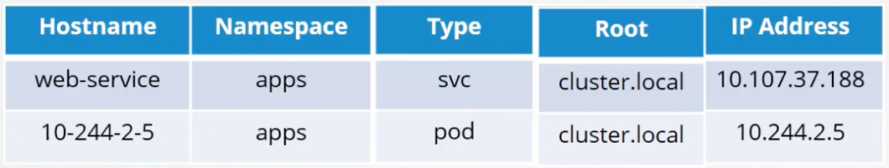


Private Container Registry
When we specify an image name in the K8s manifest file, it has three parts: registry/user-account/image-repository. If the registry is not specified, by default it is docker.io. If the user-account is not specified, by default it is library. Image repositories under the library user account are built with best practices and are maintained by a dedicated team.
Using Private Container Registry in K8s
To use a container image from a private repository, create a secret object of type docker-registry with the registry credentials. Use this secret as imagePullSecrets in the pod definition.
```
kubectl create secret docker-registry regred \
--docker-server=private-registry.io
--docker-username=registry-user \
--docker-password=registry-password \
--docker-email=registry-user@org.com
​```

```
apiVersion: v1
kind: Pod
metadata:
	name: webapp
spec:
	containers:
		- name: nginx
			image: private-registry.io/apps/webapp
	imagePullSecrets:
		- name: regcred
```


# Multiple Schedulers

We can have additional schedulers on top of the default scheduler to schedule pods on nodes based on complex logic. We can also write a custom scheduler and use it as the default scheduler.

The default scheduler has the name `default-scheduler` by default, which is configured in the `scheduler-config.yaml` present at `/etc/kubernetes/manifests/`. 

```yaml
apiversion: kubescheduler.config.k8s.io/v1
kind: KubeSchedulerConfiguration
profiles:
- schedulerName: default-scheduler
```

When creating other schedulers, we can change the scheduler name in the scheduler config. Every scheduler in a cluster must have a unique name. 

```yaml
apiversion: kubescheduler.config.k8s.io/v1
kind: KubeSchedulerConfiguration
profiles:
- schedulerName: my-scheduler
```

<aside>
💡 Since most of K8s cluster is created using KubeAdmin, all the schedulers can be deployed as pods or deployments where the scheduler config file is passed as an argument (using ConfigMap).

</aside>

## Selecting scheduler for a pod

When we have multiple scheduler, we can specify which scheduler to use for a pod or a deployment. If a scheduler is not specified, the pod will remain in pending state.

```yaml
apiVersion: v1
kind: Pod
metadata:
  labels:
    name: frontend
spec:
  containers:
	  - name: httpd
	    image: httpd:2.4-alpine
	schedulerName: my-scheduler
```

## Scheduler Profiles

When running multiple schedulers in the cluster, there might be race conditions where multiple schedulers try to schedule a single pod. To avoid this, the latest K8s release has the concept of scheduler profiles. 

It allows a single scheduler to have multiple profiles, each with a different set of plugins enabled and disabled. This way, a single scheduler acts like multiple schedulers and only one is used to schedule a pod.

We can also write custom plugins and use them.

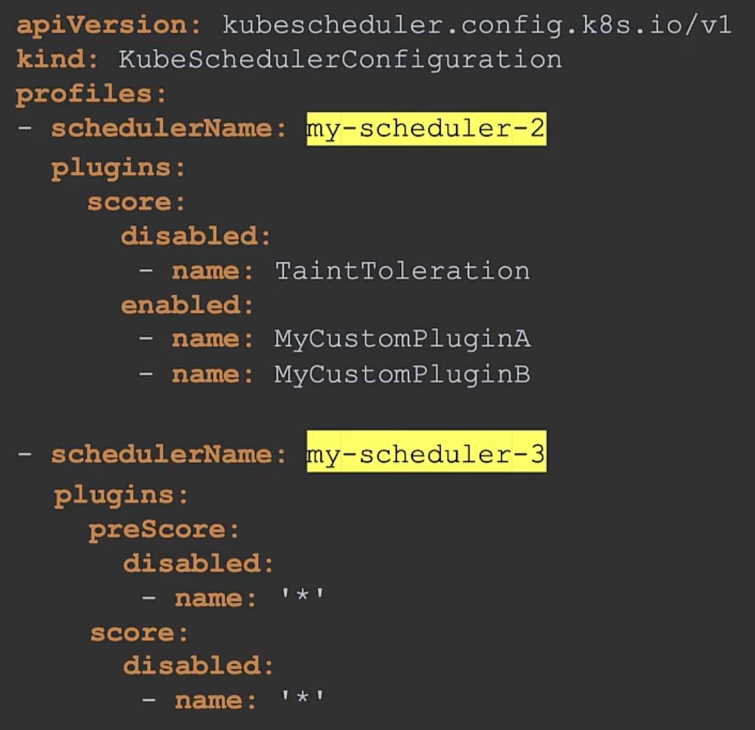
