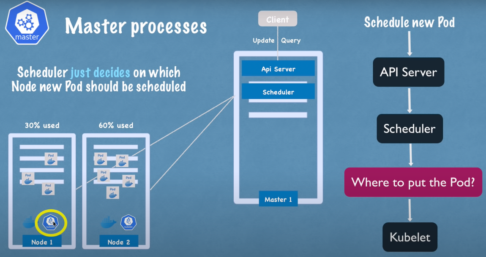
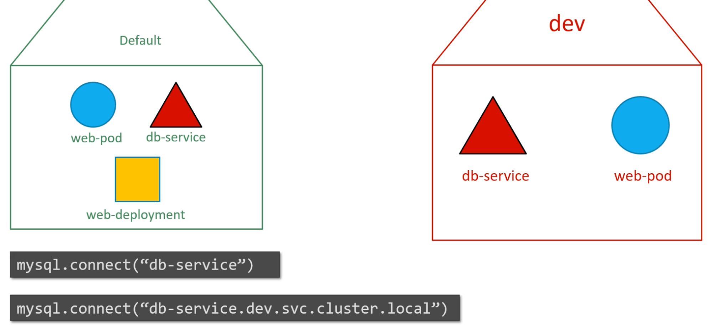
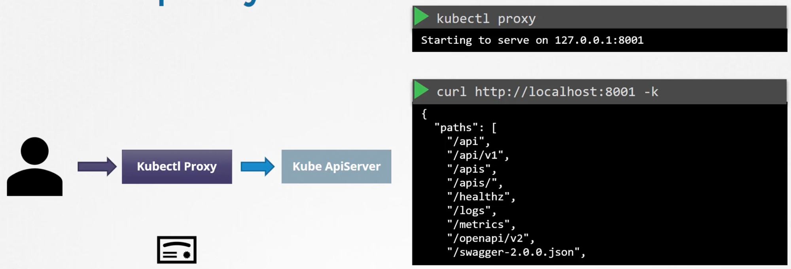
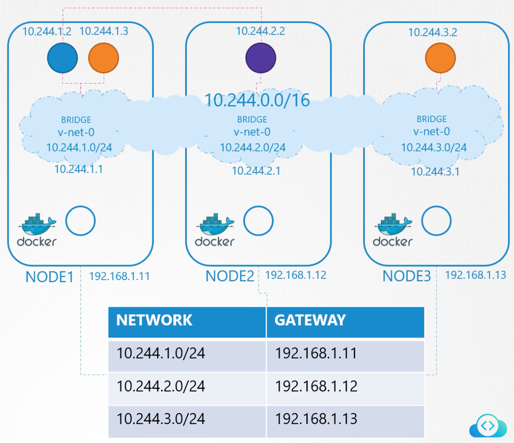

# Intro

- Kubernetes is an open-source **container orchestration** tool developed by Google.
- It helps us manage containerized applications in different deployment environments

## Container Orchestration

- The automated deployment and management of containers is called **container orchestration**
- Containers act as perfect hosts for micro-services (running independently)
- The rise of micro-services architecture led to applications using 1000s of containers that need to be smartly managed.
- Container orchestration offers:
    - **High Availability** (no downtime)
    - **Horizontal Scalability**
    - **Disaster Recovery**


# YAML Definition File
```
apiVersion: v1
kind: Pod
metadata:
	name: myapp-pod
	labels:
		app: myapp
		type: front-end
	annotations:       # misc info (not used by K8s)
		podVersion: 1.2
spec:
	containers:
		- name: nginx-container
			image: nginx
```

- YAML config file to create and maintain objects in a Kubernetes cluster
- It has 4 top level required fields
    - `apiVersion` - string
        - depending upon the kind of K8s object being created, use the right API version
          
        - `kind` - the kind of K8s object being created (string)
- `metadata` - metadata about the K8s object being created (dictionary)
    - `name` - name of the K8s object (string)
    - `labels` - key-value pairs for grouping K8s objects after creation (dictionary)
    - `annotations` - used to specify misc information not directly used by K8s but could be used by other tools running on the k8s cluster (dictionary)
- `spec` - specifications (dictionary)
    - specific to the K8s object (need to refer the docs)
- Once you have the YAML file, you can deploy the K8s object by `kubectl apply -f <filename>.yaml`
- - To override the `Dockerfile` `CMD`, specify the command as `args` in JSON array format. Similarly, to override the `ENTRYPOINT`, specify the new docker entrypoint as `command` in the config file.
    
    Example:
# dockerfile
```
FROM Ubuntu
ENTRYPOINT sleep
CMD 5
```
# pod.yaml
```
apiVersion: v1
kind: Pod
metadata:
	name: ubuntu-sleeper-pod
spec:
	containers:
		- name: ubuntu-sleeper
			image: ubuntu-sleeper
			command: ['sleeper']
			args: ['100']
```

# Labels, Selectors and Annotations
Labels and Selectors allow us to label every K8s resource and later select them to apply an action. 

- Get pods with label filter - `k get pod --selector key=value`
- Get pods with multiple label filters - `k get pods --selector env=prod,bu=finance,tier=frontend`

### Labels in Pod
```
apiVersion: v1
kind: Pod
metadata:
  labels:
    name: frontend
	annotations:
		podVersion: 1.2
spec:
  containers:
	  - name: httpd
	    image: httpd:2.4-alpine
```
### Labels in Deployment

Labels in the template section is used to label the Pods created by the deployment. These labels are then selected by the deployment to group these pods under the same deployment. If any other pod that was created before this deployment and it matches the label selector criteria, it will be controlled by this deployment too. 

The labels for the deployment is not directly involved in labelling or selecting the pods.

```
apiVersion: apps/v1
kind: Deployment
metadata:
  name: httpd-frontend
  labels:
    name: frontend
	annotations:
		buildVersion: 1.2
spec:
  replicas: 3
  selector:
    matchLabels:
      name: frontend
  template:
    metadata:
      labels:
        name: frontend
    spec:
      containers:
      - name: httpd
        image: httpd:2.4-alpine
```
### Annotations

**Annotations are used to provide miscellaneous information to the Pod.** They are not used by K8s internally but they can be used by other tools running on the K8s cluster.

```
apiVersion: networking.k8s.io/v1
kind: Ingress
metadata:
  annotations:
    nginx.ingress.kubernetes.io/rewrite-target: /
    nginx.ingress.kubernetes.io/ssl-redirect: "false"
  name: ingress-pay
  namespace: critical-space
spec:
  rules:
  - http:
      paths:
      - backend:
          service:
            name: pay-service
            port:
              number: 8282
        path: /pay
        pathType: Prefix
```


# Networking in Kubernetes

# Networking in a single node


- When K8s is installed on a host, it creates an internal private network in the range `10.244.0.0/16` and every pod on the host gets an IP address on this network.
- The pods can communicate with each other using IP addresses but it’s not a good idea as IP addresses change when pods are restarted.
- **Every node gets an IP address on the external network** (not the K8s internal network)

## Networking in a cluster


- When we have multiple nodes in the cluster, each of them have a unique IP in the external network.
- Each node sets up their own internal private network, which means they could be using overlapping CIDRs. This could lead to IP conflicts between pods. In this case, pods won’t be able to communicate across nodes.
- When we setup a cluster, Kubernetes expects us to setup the networking to fulfill certain requirements:
    - All pods should be able to communicate with each other without configuring a NAT
    - All nodes should be able to communicate with all the pods and vice-versa without a NAT
- There are multiple third party networking solutions for K8s networking that we can use. This makes each node use a different CIDR for its internal private network thus allows each proper communication between the pods.

# Kubectl Commands

- `kubectl` can be replaced with `k` by using an alias
- `kubectl` makes calls to the `kube-apiserver` behind the scenes

# Get or List Resources

- List all K8s objects - `k get all`
- List nodes - `k get nodes`
- List pods - `k get pods`
- List pods with additional info - `k get pods -o wide`
- List services - `k get services` or `k get svc`
- List deployments - `k get deployments`
- List replica sets - `k get replicasets`
- List replica sets with additional information - `k get replicasets -o wide`
- List deployments in another namespace - `k get deployments --namespace=<namespace>`
- List pods in all the namespaces - `k get pods --all-namespaces`
- List service accounts - `k get serviceaccount`
- List pods with label filter - `k get pod --selector key=value`
- Get pods with multiple label filters - `k get pods --selector env=prod,bu=finance,tier=frontend`
- List all jobs - `k get jobs`
- List all cron jobs - `k get cronjobs`
- List all network policies - `k get networkpolicies`
- List all ingress resources - `k get ingress`
- List persistent volumes - `k get persistentvolume`
- List persistent volume claims - `k get persistentvolumeclaim`
- List all DaemonSets - `k get daemonsets`
- List cluster events - `k get events -o wide`
- Get what node each pod is deployed on - `k get pods -o wide`

# Describe

- Describe a pod - `k describe pod <pod-name>`
- Describe a deployment - `k describe deployment <deployment-name>`
- Describe a service account - `k describe serviceaccount <service-account-name>`
- Describe an ingress - `k describe ingress <ingress-name>`
- Describe a DaemonSet - `k describe daemonset <daemonset-name>`

# Create

- Create a pod from an image - `k run <pod-name> --image <image-name>`
- Apply a K8s config.yaml file (declarative) - `k apply -f <filename>.yaml`
- Create a namespace - `k create namespace <namespace>`
- Create service account - `k create serviceaccount <service-account-name>`

# Delete

- Delete a pod - `k delete pod <pod-name>`
- Delete a replica set - `k delete replicaset <replicaset-name>`
- Delete a deployment - `k delete deployment <deployment-name>`
- Delete a K8s resource from a config file - `k delete -f config.yaml`

# Logs

- View logs of a pod - `k logs <pod-name>`
- View live logs of a pod - `k logs -f <pod-name>`
- View logs of a container in a multi-container pod (must specify the container name, otherwise the command will fail) - `k logs <pod-name> <container-name>`
- View logs of the previous container if the pod failed - `k logs <pod-name> --previous`

# Rollouts and Update

- `k rollout status deployment/<deployment-name>` - view the status of rollout for a deployment
- `k rollout history deployment/<deployment-name>` - view the history of rollouts for a deployment
- `k rollout history deployment/<deployment-name> --revision=1` - view the history of rollouts for a deployment revision
- `k rollout undo deployment/<deployment-name>` - rollback a deployment
- `k rollout undo deployment/<deployment-name> --to-revision=1` - rollback a deployment to a specific revision

# Node Commands

- Cordon a node (mark it unschedulable) - `k cordon <node-name>`
- Un-cordon a node (mark it schedulable) - `k uncordon <node-name>`
- Drain a node of all the pods - `k drain <node-name>`
- Drain a node of all the pods except DaemonSets - `k drain <node-name> --ignore-daemonsets`

# Auth

- View roles - `k get roles`
- View role bindings - `k get rolebindings`
- Check if you have access to perform an operation in K8s:
    - Create deployments - `k auth can-i create deployments`
    - Delete nodes in dev ns - `k auth can-i delete nodes -n dev`
- Check if another user has access to perform an operation in K8s:
    - Create deployments - `k auth can-i create deployments --as dev-user`
    - Delete nodes in dev namespace - `k auth can-i delete nodes --as dev-user -n dev`
- Check if a service account has access to perform an operation in K8s - `k auth can-i get pods --as=system:serviceaccount:default:<serviceaccount-name>`

# Config

- List all clusters - `k config get-clusters`
- Set context for a cluster - `k config use-context <cluster-name>`

## Certificates

- List all CSR - `k get csr`
- View a CSR in YAML format - `k get csr <csr-name> -o yaml`
- Delete a CSR - `k delete csr <csr-name>`
- Approve a CSR - `k certificate approve <csr-name>`
- Deny a CSR - `k certificate deny <csr-name>`

# Output formats

`-o json` - json output

`-o name` - only the resource name

`-o wide` - extra info in plain text

`-o yaml` - yaml output

# Useful Imperative Commands

- Create a pod - `k run <pod-name> --image=<image-name> --command -- <command-with-args>`
- Create a deployment - `k create deployment <deployment-name> --image <image-name> --replicas 3`
- Create a service for a deployment - `k expose deployment <deployment-name> --port 80 --name <service-name>`
- Create a service for a pod - `k expose pod <pod-name> --port 80 --name <service-name>`
- Edit a deployment (in memory) - `k edit deployment <deployment-name>`
- Scale a deployment - `k scale deployment <deployment-name> --replicas 3`
- Update the image in a deployment - `k set image deployment <deployment-name> <old-image>=<new-image>`
- Create resources from a config file - `k create -f filename.yaml`
- Update resources from a config file - `k replace -f filename.yaml`
- Delete and recreate resources from a config file - `k replace --force -f filename.yaml`
- Edit a deployment (doesn’t work for pods as they require recreation) - `k edit deployment <deployment-name>`

# Handy Commands

- Get the config YAML of a pod - 
`k get pod <pod-name> -o yaml > pod.yaml`
- Get the config YAML of a deployment - 
`k get deployment <deployment-name> -o yaml > deployment.yaml`
- Create a sample config YAML file for a pod - `k run <pod-name> --image <image-name> --dry-run=client -o yaml > filename.yaml`
- Create a sample config YAML file for a deployment - `k create deployment <deployment-name> --image <image-name> --dry-run=client -o yaml > filename.yaml`
- Create a sample config YAML file for a service - `k expose deployment <deployment-name> --port 80 --dry-run=client -o yaml > filename.yaml`

## JSON Path in Kubectl

- Get images of all the pods - `k get pods -o jsonpath='{.items[0].spec.containers[0].image}'`

## Metrics

- Get top nodes by memory - `k top nodes --sort-by memory`
- Get top nodes by CPU for a context - `k --context <context> top nodes --sort-by cpu`

# Unhealthy Nodes

If a node in the cluster goes down, the `kube-controller-manager` waits for **5 mins (default, max)** for the node to come back online. If the node comes back online within 5 mins, the pods running on it are restarted and then everything works the same way.

If the node doesn’t come back online within 5 mins, it is considered unhealthy and all the pods running on it that were associated with replicasets are spawned on other nodes. Any pod on that node that was not associated with any replicaset dies with the node. 

The time for which the `kube-controller-manager` waits before declaring a node unhealthy is called **pod eviction timeout** and it is configured in the `kube-controller-manager`. If the node comes back online after the pod eviction timeout, it has no pod running on it.


# OS Upgrades

To perform OS upgrade or maintenance on a node, first drain it using `k drain <node-name>`. This will terminate the running pods on the node, spawn them on other nodes and mark the node as **cordon**, meaning no pods can be scheduled on it. The above command will not work if there are pods on the node that are not associated with any replicaset, as these pods will not be spawned on any other node. We’ll have to use `--force` option to terminate such pods forcefully.

Now, perform the upgrade or maintenance. After that, uncordon the node using k uncordon <node-name>. This will make the node schedulable again. 

We can manually cordon a node to prevent new pods from being scheduled on it by running k cordon <node-name>. This does not remove already running pods on the node.

# Cluster Version Upgrade

- When we download a K8s release, the 5 core components shown on the left in the image above are at the same version.
- The K8s components can be at different versions. The `kube-apiserver` must be at the highest version compared to other components, except `kubectl` which can be one minor version above.
- Upgrading the version of a cluster basically means upgrading the version of various K8s components running in the cluster.
- **K8s supports 3 latest minor versions.** If the current version of a K8s component is unsupported, we should upgrade it one minor version at a time.
- Upgrading the cluster on a managed K8s engine like GKE is very easy and takes only a few clicks.
- `k get nodes` command shows the version of `kubelet` running on each node.

## Upgrading the master node

First the master node is upgraded, during which the control plane components are unavailable. The worker nodes keep functioning and the application is up. While the master node is getting updated, all management functions are down. We cannot run `kubectl` commands as `kube-apiserver` is down. If a pod were to crash, a new one will not be spawned as the `kube-controller-manager` is down.

## Upgrading worker nodes

Once the master node has been upgraded, we need to upgrade the worker nodes (upgrade the k8s components running on them). As the worker nodes serve traffic, there are various strategies to upgrade them.

### Strategy 1: All at once

Upgrade all the worker nodes at once. This will lead to downtime as no pods will be running during the upgrade.

### Strategy 2: One at a time

Move the pods of the first node to the remaining nodes and upgrade the first node. Then repeat the same for the rest of the nodes.

### Strategy 3: Add new nodes

Add a new worker node with the latest k8s components running on it, drain the first node and then terminate it. Repeat the same for other nodes.

## Upgrading a cluster managed by KubeAdmin

To view the version details of the cluster along with the latest k8s release, run `kubeadm upgrade plan` command on the master node.

Let’s say we want to upgrade the cluster version from `v1.11.0` to `v1.13.0`. Since we can only upgrade one minor version at a time, we’ll first upgrade to `v1.12.0`. 

### Upgrading the master node

Before upgrading the cluster, update the `kubeadm` tool (`kubeadm` follows the same versioning as K8s) - `apt-get upgrade -y kubeadm=1.12.0-00`. 

Now, upgrade the cluster (control plane components of the cluster), except the `kubelet` service as it is not controlled by `kubeadm` - `kubeadm upgrade apply v1.12.0`. 

If the `kubelet` service is running on the master node, we need to upgrade it. Start by draining the master node by running `k drain controlplane`. If `kubelet` is installed as a service, upgrade its package version - `apt-get upgrade -y kubelet=1.12.0-00` and restart the service - `systemctl restart kubelet`. Now, un-cordon the master node - `k uncordon controlplane`. The master node has been upgraded. 

### Upgrading the worker nodes

Now, we need to upgrade the `kubelet` service on all the worker nodes (one at a time). Start by draining the first node by running `k drain node-1` on the master node. Now move to the first node and upgrade the `kubeadm` tool - `apt-get upgrade -y kubeadm=1.12.0-00` and `kubelet` service - `apt-get upgrade -y kubelet=1.12.0-00`. Upgrade the node config with the `kubelet` version - `kubeadm upgrade node` and restart the `kubelet` service - `systemctl restart kubelet`. The `kubelet` version of the first node has now been upgraded. Now, un-cordon the node - `k uncordon node-1`. Repeat for the remaining nodes. 

<aside>
💡 The above mentioned commands are just for reference. Follow [Upgrading kubeadm clusters | Kubernetes](https://kubernetes.io/docs/tasks/administer-cluster/kubeadm/kubeadm-upgrade/) for actual commands.

</aside>


# Backup and Restore

The following can be backed up:

- Resource Configurations
- ETCD Cluster
- Persistent Volumes

### Backing up Resource Configuration

If all the k8s resources are created using config files (declarative approach), then the configuration directory can be backed up using a version control system like Git. If all the resources are not created this way, we can generate resource configuration by running `kubectl get all --all-namespaces -o yaml > all.yaml`. 

Recommended to use **Velero,** a managed tool that can take backups of the cluster configuration. 

### Backing up ETCD Cluster

ETCD cluster can be backed up instead of generating the resource configuration for the cluster. For this, backup the data directory of the ETCD cluster. 

In managed k8s engine, ETCD data directory is not accessible. In such cases, backup the resource configuration.

## Velero

- Open-source
- Supports various plugins to backup the cluster to different storage locations like S3, Azure Blob Storage, etc.
- Download the binary and run the `velero install` command along with the storage plugin and credentials to create the Velero pod looking for backups in the storage destination.
- Works in CLI only
- Runs a velero container in the cluster
- We can define a TTL for the backups stored in the storage location.
- [Kubernetes Backup & Restore using Velero | ADITYA JOSHI | - YouTube](https://www.youtube.com/watch?v=_y0yGAbLknU)
- [Kubernetes Cluster Migration | Migrating Data Across Clusters | ADITYA JOSHI | - YouTube](https://www.youtube.com/watch?v=QWIk1UdIh5c)
- [Kubernetes Backups, Upgrades, Migrations - with Velero - YouTube](https://www.youtube.com/watch?v=zybLTQER0yY&t=923s)


# Cluster Design

## Basics

- K8s is not supported on Windows. You need to use a virtualization software to run a linux OS on it to support K8s.
- **Minikube** uses a virtualization software to run VMs that host k8s components. This allows us to deploy single node clusters easily.
- **KubeAdm** deploys single or multi node cluster on provisioned VMs for development purposes.

## Deploying production-grade clusters

Production grade clusters can be either setup from scratch (turnkey solution) or they can be managed by a cloud provider (hosted solution).

**Turnkey Solution**

- You provision VMs
- You configure VMs
- You use scripts to deploy cluster
- You maintain VMs yourself
- Eg: OpenShift, Vagrant, etc.

**Hosted Solution**

- Kubernetes-as-a-Service
- Provider provisions and configures VMs
- Provider installs Kubernetes
- Provider maintains VMs
- Eg: EKS, GKE, OpenShift Online, AKS

## High Availability

**To avoid single point of failure, production grade clusters should have at least 3 master nodes.** Consider a cluster with 2 master nodes. 

### API Server

The **API Server** is just a REST API server, it can be kept running on both the masters in an **active-active mode**. To distribute the incoming requests to both the KubeAPI servers, use a load balancer like `nginx` in front and point the `kubectl` utility to the load balancer (by configuring [KubeConfig](https://www.notion.so/KubeConfig-c99bacd10778413fbcb4f580dd0b9dbe?pvs=21)).

### Controller Manager and Scheduler

The **Controller Manager** and the **Scheduler** look after the state of the cluster and make necessary changes. Therefore to avoid duplicate processing, they run in an **active-passive mode**.

The instance that will be the active one is decided based on a **leader-election** approach. The two instances compete to lease the endpoint. The instance that leases it first gets to be the master for the lease duration. The active instance needs to renew the lease before the deadline is reached. Also, the passive instance retries to get a lease every `leader-elect-retry-period`. This way if the current active instance crashes, the standby instance can become active.


The kube-controller-manager and the kube-scheduler have leader election turned on by default.

```
kube-controller-manager --leader-elect true [other options]
												--leader-elect-lease-duration 15s
												--leader-elect-renew-deadline 10s
												--leader-elect-retry-period 2s

kube-scheduler --leader-elect true [other options]
							 --leader-elect-lease-duration 15s
							 --leader-elect-renew-deadline 10s
							 --leader-elect-retry-period 2s
```

### ETCD

The **ETCD Server** can be present in the master node (**stacked topology**) or externally on other servers (**external ETCD topology**). Stacked topology is easier to setup and manage but if both the master nodes are down, then all the control plane components along with the state of the cluster (ETCD servers) will be lost and thus redundancy will be compromised.

Regardless of the topology, both the API server instances should be able to reach both the ETCD servers as it is a distributed database.

ETCD is distributed datastore, which means it replicates the data across all its instances. It ensures **strongly consistent writes by electing a leader ETCD instance (master) which processes the writes**. If the writes go to any of the slave instances, they are forwarded to the master instance. Whenever writes are processed, the master ensures that the data is updated on all of the slaves. **Reads can take place on any instance.**

When setting up the ETCD cluster for HA, use the `initial-cluster` option to configure the ETCD peers in the cluster.

ETCD instances elect the leader among them using **RAFT protocol**. If the leader doesn’t regularly notify the other instances of its role regularly, it is assumed to have died and a new leader is elected.

A write operation is considered complete only if it can be written to a majority (**quorum**) of the ETCD instances (to ensure that a write goes through if a minority of ETCD instances goes down). If a dead instance comes back up, the write is propagated to it as well.

`Quorum = floor(N/2 + 1)`, where N is the total number of ETCD instances, is the minimum number of ETCD instances that should be up and running for the cluster to perform a successful write.

`N = 2 => Quorum = 2`, which means quorum cannot be met even if a single instance goes down. So, having 2 instances is the same as having a single instance (0 fault tolerance). So, **we should have at least 3 instances in the ETCD cluster as it offers fault tolerance of 1 instance.**

Considering 1 ETCD instance per master node, **it is recommended to have odd number of master nodes in the cluster.** This is because, during a network segmentation, there is higher changes of quorum being met for one of the network segments.


Since 1 and 2 nodes don’t provide any fault tolerance, the minimum number of nodes for fault tolerance is 3. Also, the even number of nodes can leave the cluster without quorum in certain network partitions. So, the most commonly used node count is 3 (good for most use cases) and 5 (higher fault tolerance). 


# KubeAdmin (`kubeadm`)

- Create the nodes to be used in the cluster
- Setup the nodes - forwarding IPv4 and letting iptables see bridged traffic on all the nodes - [Container Runtimes | Kubernetes](https://kubernetes.io/docs/setup/production-environment/container-runtimes/#install-and-configure-prerequisites)
- Install a [container runtime](https://kubernetes.io/docs/setup/production-environment/container-runtimes/) on all of the nodes (`containerd` recommended)
- Install `kubeadm`, `kubelet` and `kubectl` on all the nodes, refer [Installing kubeadm | Kubernetes](https://kubernetes.io/docs/setup/production-environment/tools/kubeadm/install-kubeadm/)
- Initialize the control plane node with the pod networking CIDR and the API server endpoint as the control plane’s IP address in its local network so that the worker nodes can reach the API server on the master node’s IP - `kubeadm init --apiserver-advertise-address 10.33.92.10 --pod-network-cidr=10.244.0.0/16`
- The above command will create a file `admin.conf` in `/etc/kubernetes` directory which can be used to authenticate to `kubectl`. Follow the on-screen instructions to move this file to the `.kube` folder in the user’s home directory.
    
    We can now run `kubectl` commands from the master node.
    
- The output of the `kubeadm init` command returns a `kubeadm join` command that needs to be run on all the worker nodes to join them with the master node.
- Deploy the cluster networking solution (eg. WeaveNet) as a DaemonSet on all the nodes by running a single `k apply` command on the master node, refer [Integrating Kubernetes via the Addon (weave.works)](https://www.weave.works/docs/net/latest/kubernetes/kube-addon/). Configure the networking solution to use the same CIDR as the pod network configured in `kubeadm init` command.

<aside>
💡 When the K8s cluster is deployed using `kubeadm`, all the control plane components (except the `kubelet`) are deployed as static pods in the `kube-system` namespace. The manifest files for these components are located at `/etc/kubernetes/manifests/`. Simply editing these manifest files leads to the static pods restarting with the updated config.

</aside>

# Kind

Kind is a tool, maintained by the K8s community, which allows us to deploy a K8s cluster within minutes by deploying the K8s nodes as Docker containers on a host.

# K3s

## Intro

- **K3s is a full blown K8s distribution packaged as a single binary.** It allows setting up the K8s cluster much easier as we only have to install a single binary, which installs all the required control-plane components as pods in the `kube-system` namespace.
- **K3s uses SQLite as the storage backend by default**, also supports MySQL, Postgres and ETCD as the storage backend.
- K3s automatically restarts after node reboots or if the process crashes or is killed (resilient)
- Installs the following by default:
    - `containerd` as the container runtime
    - Flannel (CNI)
    - CoreDNS
    - **Traefik** (Ingress Controller)
    - **KlipperLB** - load balancer solution to allow the Traefik load balancer service (Traefik proxy) to be available on port 80 and 443 on the node
- K3s monitors the manifests directory and installs all the resources present in it -  `/var/lib/rancher/k3s/server/manifests`
- K3s comes with `HelmChart` CRD to automate installing Helm charts when the cluster is bootstrapped. It avoids having to install the helm chart using the command line as an additional step. `HelmChartConfig` CRD can be used to modify the static config (`values.yaml`) in the helm chart.

## Architecture

- A server node is defined as a host running the `k3s server` command, with control-plane and datastore components managed by K3s.
- An agent node is defined as a host running the `k3s agent` command, without any datastore or control-plane components.
- Both servers and agents run the kubelet, container runtime, and CNI.

### Single Server Setup

Single server setups use a local SQLite DB to store the cluster state. Embedded SQLite is not supported in multi-server configuration. 


### High Availability Setup

When using embedded etcd DB, we need at least 3 server nodes (master nodes). This is required to have quorum in case a master node goes down.


If instead, we’re using an external DB to store the cluster state, we can get away with 2 master nodes.


## Setting up a single node cluster

Run `curl -sfL https://get.k3s.io | sh -s - --write-kubeconfig-mode 600` on any node to start a K3s cluster on the node. It will automatically install the required utilities like `kubectl` and will also create a `kubeconfig` file at `/etc/rancher/k3s/k3s.yaml` which will be automatically referenced by `kubectl`.

If you’re planning to use `helm` along with the K3s setup, you need to move the kube config file to `.kube` directory - `sudo mv /etc/rancher/k3s/k3s.yaml ~/.kube/config`

<aside>
💡 K3s is much better to setup single node containerized applications when compared to docker-compose.

</aside>

## Ingress

Since K3s clusters come with ‣ ingress controller pre-installed, we can directly create ingress resources to route external traffic to services within the cluster.

## Resources

- [Official Docs](https://docs.k3s.io/) - amazing documentation to get anything done
- Well explained how to setup a K3s cluster with GitOps - [Single-node Kubernetes Clusters Using K3s with Benefits of GitOps • Lasse Højgaard • GOTO 2021 - YouTube](https://www.youtube.com/watch?v=ePyFJ7Hd57Q)
- [k3s vs k8s: What's the difference? - YouTube](https://www.youtube.com/watch?v=FmLna7tHDRc)
- [HIGH AVAILABILITY k3s (Kubernetes) in minutes! - YouTube](https://www.youtube.com/watch?v=UoOcLXfa8EU)

# Node

- A physical or virtual machine on which Kubernetes is installed
- **Nodes are cluster scoped. They are not scoped within a namespace.**
- When you install Kubernetes on a node, the following components are installed. Some of them are used in worker nodes and the rest are used in master nodes.
    - API Server
    - `etcd` Service
    - Kubelet Service
    - Container Runtime
    - Controller
    - Scheduler
- A **cluster** is a collection of nodes grouped together

## Worker Nodes


- These nodes do the actual work so they need to have more resources
- Each worker node has multiple pods running on it
- 3 processes must be installed on every worker node
    - **Container Runtime** (eg. docker)
    - **Kubelet**
        - process of Kubernetes
        - starts pods and runs containers inside them
        - allocates resources from the node to the container
    - **Kubeproxy**
        - process of Kubernetes
        - forwards the requests to pods intelligently
        - Image
            - Kubeproxy forwards requests to the DB pod running on the same node to minimize network overhead.
                
                
                

## Master Nodes


- Control the cluster state & manage worker nodes
- Need less resources as they don't do the actual work
- Multi-master setup is often used for fault tolerance
- 4 processes run on every master node
    - **API Server**
        - User interacts with the cluster via the API server using a client (Kubernetes Dashboard, CLI, or Kubernetes API)
        - Cluster gateway (acts as the entry point into the cluster)
        - Can be used for authentication
        
        
        
    - **Scheduler**
        - Decides the node where the new pod should be scheduled and sends a request to the Kubelet to start a pod.
        
        
        
    - **Controller**
        - Detects state changes like crashing of pods
        - If a pod dies, it requests scheduler to schedule starting up of a new pod
        
        
        
    - **etcd**
        - Key-value store of the cluster state (also known as cluster brain)
        - Cluster changes get stored in the etcd
        - In multi-master configuration, etcd is a distributed key-value store
        - Application data is not stored in the etcd
     

# Pod

- Kubernetes doesn’t run containers directly on the nodes. Every container is encapsulated by a pod.
- Smallest unit of Kubernetes
- A pod is a single instance of an application. If another instance of the application needs to be deployed, another pod is deployed with the containerized application running inside it.
- Creates a running environment over the container so that we only interact with the Kubernetes layer. This allows us to replace the container technology like Docker.
- **Each pod gets an internal IP address** for communicating with each other (virtual network created by K8)
- If a pod is restarted (maybe after the application running on it crashed), its IP address may change


<aside>
⛔ Sometimes we need to have a helper container for the application container. In that case, we can run both containers inside the same pod. This way both containers share the same storage and network and can reference each other as `localhost`

Without using Pods, making a setup like this would be difficult as we need to manage attaching the helper containers to the application containers and kill them if the application container goes down. 

Although, most use cases of pods revolve around single containers, it provides flexibility to add a helper container in the future as the application evolves.


</aside>

### Config file for a Pod

```yaml
apiVersion: v1
kind: Pod
metadata:
  labels:
    name: frontend
spec:
  containers:
	  - name: httpd
	    image: httpd:2.4-alpine
```

# Restart Policy

The default behavior of K8s is to restart a pod if it terminates. This is desirable for long running containers like web applications or databases. But, this is not desirable for short-lived containers such as a container to process an image or run analytics. 

`restartPolicy` allows us to specify when K8s should restart the pod.

- `Always` - restart the pod if it goes down (default)
- `Never` - never restart the pod
- `OnFailure` - restart the pod only if the container inside failed (returned non zero exit code after execution)

```yaml
apiVersion: v1
kind: Pod
metadata:
  labels:
    name: analytics
spec:
  containers:
	  - name: analytics
	    image: analytics
	restartPolicy: Never
```


# ReplicaSet

- ReplicaSet monitors and maintains the number of replicas of a given pod. It will automatically spawn a new pod if the pod goes down.
- It is needed even if we only have a single pod, because if that pod dies, replica set will spawn a new pod.
- It spans the entire cluster to spawn pods on any node.

<aside>
⛔ Newer and better way to manage replicated pods in K8s than Replication Controllers

</aside>

## Config YAML file

```yaml
apiVersion: apps/v1
kind: ReplicaSet
metadata:
  name: httpd-frontend
  labels:
    name: frontend
spec:
  replicas: 3
  selector:
    matchLabels:
      name: frontend
  template:
    metadata:
      labels:
        name: frontend
    spec:
      containers:
      - name: httpd
        image: httpd:2.4-alpine
```

- `template` → `metadata` and `spec` from the config file for the pod (required to spawn new pods if any of them goes down)
- `replicas` → how many replicas to maintain
- It has an additional required field `selector` which allows the replica set to select pods that match specific labels. This way **the replica set can manage pods that were not created by it.**

## Scaling the number of replicas

- **Recommended**: edit the config file and re-apply - `k apply -f config.yaml`
    - Scaling changes can be easily tracked using Git
- **Not recommended**: using `kubectl` - `k scale replicaset my-replicaset --replicas=2`
    - This will not update the config file, so changes are hard to track


# Deployment


- **Provides the capability to upgrade the instances seamlessly using rolling updates, rollback to previous versions seamlessly, undo, pause and resume changes as required.**
- Abstraction over [ReplicaSet](https://www.notion.so/ReplicaSet-df784dc061344ab6a5a83f1f61652f1c?pvs=21)
- **Blueprint for stateless pods** (application layer)
- When a deployment is created, it automatically creates a [ReplicaSet](https://www.notion.so/ReplicaSet-df784dc061344ab6a5a83f1f61652f1c?pvs=21)  which in turn creates pods. If we run `k get all` we can see the resources created by deployment.

# Config YAML file

```yaml
apiVersion: apps/v1
kind: Deployment
metadata:
  name: httpd-frontend
  labels:
    name: frontend
spec:
  replicas: 3
  selector:
    matchLabels:
      name: frontend
  template:
    metadata:
      labels:
        name: frontend
    spec:
      containers:
      - name: httpd
        image: httpd:2.4-alpine
```

<aside>
⛔ Update the `kind` from `Replicaset` to `Deployment` in a `Replicaset` config file.

</aside>

# Deployment Strategy


There are two deployment strategies:

- **Recreate**: Bring down all the running containers and then bring up the newer version (application downtime)
- **Rolling Update** (default): Bring down a container and then bring up a new container one at a time (no application downtime)

# Rollout and Versioning

- When you first create a deployment, it triggers a rollout which creates the first revision of the deployment. Every subsequent update to the deployment triggers a rollout which creates a new revision of the deployment. This keeps a track of the deployment and helps us rollback to a previous version of the deployment if required.
- **When we upgrade the version of a deployment, a new replica set is created** under the hood where the new pods are spawned while bringing down pods from the old replica set one at a time, following a rolling update strategy. We can see the new and old replica sets by running `k get replicasets`
    
    
    
- `k rollout status deployment <deployment-name>` - view the status of rollout for a deployment
- `k rollout history deployment <deployment-name>` - view the history of rollouts for a deployment
- `k rollout history deployment <deployment-name> --revision=1` - view the status of rollouts for a deployment revision

# Rollback

- When we rollback to the previous version of a deployment, the pods in the current replica set are brought down one at a time while spawning pods in the previous replica set.
- Rollback a deployment - `k rollout undo deployment <deployment-name>`
- Rollback a deployment to a specific revision - `k rollout undo deployment <deployment-name> --to-revision=1`


# Service

- Kubernetes services enable communication between various components within and outside of the application. They enable loose coupling between micro-services in our application.
- **Services are static IPs that can be attached to a pod or a group of pods using label selectors. They are not attached to deployments.**
- Services prevent us from using the pod IP addresses for communication which could change when the pod is restarted.
- **Lifecycle of pod and service are not connected.** So even if a pod dies, we can restart it and attach the original service to have the same IP.
- **Every service spans the entire cluster (all the nodes in the cluster)**
- **Every service has a unique IP across the K8s cluster**
- Kubernetes creates a default ClusterIP Service which forwards requests from within the cluster to the Kubernetes master (API Server). So, there is at least 1 service in every Kubernetes cluster.
- K8s services are of three types:
    - NodePort
    - ClusterIP
    - LoadBalancer

# NodePort Service

Consider an application running in a pod on a node which is on the same network as our laptop, we could SSH into the node and then reach the application by its IP on the Kubernetes network (`10.244.0.0/16`). But doing an SSH into the node to access the application is not the right way. 


- NodePort service maps a port on the node (Node Port) to a port on the pod (Target Port) running the application. This will allow us to reach the application on the node’s IP address.
- Allowed range for NodePort: 30,000 - 32,767


```yaml
apiVersion: v1
kind: Service
metadata:
	name: myapp-service
spec:
	type: NodePort
	ports:
		- targetPort: 80
			port: 80
			nodePort: 30008
	selector:
		app: myapp
		type: front-end
```

- `selector` is used to select target pods for the service
- `port` - port on which the service would be accessible
- `targetPort` - port on the pod to which the requests would be forwarded
- `nodePort` - port on the node

- If there are multiple target pods on the same node, the service will automatically load balance to these pods.


- If the target pods span multiple nodes in the cluster, as the NodePort service will span the entire cluster, it will map the target port on the pods to the same node port on all the nodes in the cluster, even the nodes that don’t have the application pod running in them. This will make the application available on the IP addresses of all of the nodes in the cluster.


# ClusterIP Service

- Consider a 3-tier application running on a K8s cluster. How will different tiers communicate with each other? Using IPs to communicate is not good as it can change when the pods are restarted. Also, how can we load balance if we have multiple pods in the same tier.


- ClusterIP Service groups similar pods and provides a single interface to access those pods. We don’t have to access the pods using their IP addresses.
- Enables access to the service from within the K8s cluster (internal)
- It automatically load balances to the target pods.
- **Service name should be used by other pods to communicate with the service.**
- Useful in deploying micro-services architecture on a K8s cluster.

```yaml
apiVersion: v1
kind: Service
metadata:
	name: back-end
spec:
	type: ClusterIP
	ports:
		- targetPort: 80
			port: 80
	selector:
		app: myapp
		type: back-end
```

- `selector` is used to select target pods for the service
- `port` - port on which the service would be accessible
- `targetPort` - port on the pod to which the requests would be forwarded

# LoadBalancer Service

- Consider the case where we have to route the incoming traffic to the front-end of two applications. If the applications are using NodePort service, they can be accessed at different node ports using the IPs of any of the nodes. But, we cannot use higher order ports for our application as they are non standard. Also, how do we load balance to the nodes (the application can be accessed at any of the nodes by using their IP addresses). For these, we need to use a Load Balancer service.


- LoadBalancer Service leverages the native layer-4 load balancer of the cloud provider to expose the application on a single IP (NLB’s IP) and load balance to the nodes. So, if a node becomes unhealthy, the NLB will redirect the incoming requests to a healthy node.
- Any NodePort service can be converted to use the cloud provider’s load balancer by setting `type: LoadBalancer` in the config.yaml file.
- LoadBalancer uses NodePort service behind the scenes and sets up a layer-4 load balancer of the cloud provider to load balance to the nodes on the high order node port.

```yaml
apiVersion: v1
kind: Service
metadata:
	name: myapp-service
spec:
	type: LoadBalancer
	ports:
		- targetPort: 80
			port: 80
			nodePort: 30008
	selector:
		app: myapp
		type: front-end
```

<aside>
💡 The downside of this is that each service that you expose will require its own public IP (NLB) as NLB cannot redirect to specific application based on URL or path. This makes this approach expensive if we have multiple applications to load balance to. The solution is to use an [Ingress](https://www.notion.so/Ingress-9fe828fdf67b42d09b0da2a4579ad636?pvs=21), which is an ALB present within the cluster with an single NLB present outside to load balance to the nodes.

</aside>

<aside>
⛔ LoadBalancer Service is only supported on some cloud platforms. On non-supported cloud providers or local machines, it will behave as a NodePort service.

</aside>


# Namespaces


- Namespaces isolate resources within a K8s cluster.
- K8s creates a `default` namespace when the cluster is created. This default namespace is used to create resources.
- If the cluster is deployed using KubeAdmin, it also creates a namespace `kube-system` in which all the internal K8s resources are deployed.
- Resource limits can be placed at the namespace level. So, if we are using the same cluster for both `dev` and `prod` namespaces, we can place a resource limit on the `dev` namespace to prevent it from starving the `prod` namespace.

## DNS Resolution

- Resources within a namespace can refer to each other by their names.
- For cross namespace communication, a resource needs to specify the namespace as shown below.



`cluster.local` - domain name for the cluster

`svc` - subdomain for service object

`dev` - namespace

`db-service` - service in the `dev` namespace

# Creating a namespace

- Imperative command: `k create namespace <namespace>`
- Declarative manifest file
    
    ```yaml
    apiVersion: v1
    kind: Namespace
    metadata:
    	name: dev
    ```
    

# Creating resources in a namespace

- Command line: `k apply -f pod.yml --namespace=dev` (untracked)
- Config file (tracked): Use the namespace `property` under the metadata section. This will always create the resource in the specified namespace.
    
    ```yaml
    metadata:
    	namespace: dev
    ```
    

# Set namespace permanently

`k config set-context $(kubectl config current-context) --namespace=dev set-context`

# Specify Resource Quota for a Namespace

Create a K8s `ResourceQuota` and specify the namespace in the `metadata` section.

```yaml
apiVersion: v1
kind: ResourceQuota
metadata:
	name: compute-quota
	namespace: dev
spec:
	hard:
		pods: "10"
		requests.cpu: "4"
		requests.memory: 5Gi
		limits.cpu: "10"
		limits.memory: 10Gi
```

# Namespace vs Cluster Scope

Some objects in K8s are not scoped under a namespace, but are scoped under the whole cluster. 

### Namespace scoped


### Cluster Scoped


NetworkPolicies
Network policies help control the flow of ingress and egress traffic to a group of pods (using label selectors). 
By default, every pod in the cluster can reach out to any other pod within the cluster. This means, there’s no network policy by default.
There’s no need for a network policy to allow the response. If the request is allowed by the network policy, the response will be allowed automatically (stateful behavior).
Network policies are implemented by the networking solution used in the cluster. Currently, Flannel doesn’t support NetworkPolicies.
The resulting network policy for a pod is the union of all the network policies associated with it. The order of rule evaluation does not matter.
Network policies are firewalls applied directly to the matching pods (not through services).
3-Tier Web Application Example
In a 3 tier web application, the users should be able to reach the web service on port 80 or the API service on port 5000. Also, the DB service should only be reachable by the API service. 


These are the following traffic that should be allowed for each pod (service):
Web service
Ingress on port 80 from anywhere
Egress on port 5000
API service
Ingress on port 5000 from anywhere
Egress on port 3306
DB service
Ingress on port 3306 from API pod
Network Policy for DB pod
Label the DB pod as role: db and API pod as role: api. We can use these labels in the NetworkPolicy definition file to allow ingress traffic on port 3306 only from API pods. We don’t need to create an egress rule for the response from the the DB pod to the API pod as it is allowed automatically.


```
apiVersion: networking.k8s.io/v1
kind: NetworkPolicy
metadata:
	name: db-policy
spec:
	podSelector:
		matchLabels:
			role: db
	policyTypes:
		- Ingress
	ingress:
		- from:
			- podSelector:
					matchLabels:
						role: api
			ports:
				- protocol: TCP
					port: 3306
​```

```
apiVersion: networking.k8s.io/v1
kind: NetworkPolicy
metadata:
	name: db-policy
spec:
	podSelector:
		matchLabels:
			role: db
	policyTypes:
		- Ingress
	ingress:
		- from:
			- podSelector:
					matchLabels:
						role: api
				namespaceSelector:
					matchLabels:
						name: prod
			ports:
				- protocol: TCP
					port: 3306
​```

To restrict access to the DB pod to happen within the current namespace, select the namespace using namespaceSelector. In the example, only the API pods of prod namespace can connect to the DB pod in the prod namespace.

Allowing Ingress Traffic from outside the Cluster
If we want to allow a backup server (192.168.5.10) present outside the cluster but within the same private network to pull data from the DB pod to perform backups, we can specify its IP address in the DB pod’s ingress rule. Now, the DB pod allows ingress traffic on port 3306 from both API pod and the backup server.

```
apiVersion: networking.k8s.io/v1
kind: NetworkPolicy
metadata:
	name: db-policy
spec:
	podSelector:
		matchLabels:
			role: db
	policyTypes:
		- Ingress
	ingress:
		- from:
			- podSelector:
					matchLabels:
						role: api
			- ipBlock:
					cidr: 192.168.5.10/32
			ports:
				- protocol: TCP
					port: 3306
​```

Allowing Egress Traffic to outside the Cluster
If the DB pod needs to push a backup to a backup server (192.168.5.10) present outside the cluster but within the same private network, we can create an egress rule on the DB pod’s NetworkPolicy.

```
apiVersion: networking.k8s.io/v1
kind: NetworkPolicy
metadata:
	name: db-policy
spec:
	podSelector:
		matchLabels:
			role: db
	policyTypes:
		- Ingress
		- Egress
	ingress:
		- from:
			- podSelector:
					matchLabels:
						role: api
			ports:
				- protocol: TCP
					port: 3306
	egress:
		- to:
			- ipBlock:
					cidr: 192.168.5.10/32
			ports:
				- protocol: TCP
					port: 80
```


ConfigMap
Centrally managed configuration data that can be passed to the containers as environment variables (key-value pairs). 
Storing config data along with the pod/deployment definition file is not a good idea because as the application grows, managing them would become difficult.
Should be used to store parameters that are not secrets
⚠️
The data stored in the ConfigMap, when the container (pod) is created, is used to set the environment variables. If the ConfigMap gets updated later, the pod will continue to use the old values. We need to re-create the pods by performing a rollout (k rollout restart deployment <deployment-name>) on the deployment to make the new pods use the new data.

```
ConfigMap definition file
apiVersion: v1
kind: ConfigMap
metadata:
	name: app-config
data:
	USERNAME: arkalim
	PASSWORD: 12345
​
Using file as a ConfigMap:
apiVersion: v1
kind: ConfigMap
metadata:
  name: rho-pacs-config
  namespace: 16bit
data:
  orthanc.json: |
    {
      /**
      * General configuration of Orthanc
      **/
    }
​
```
Using ConfigMap in Pods
Passing the entire ConfigMap of key-value pairs to ENV

```
apiVersion: v1
kind: Pod
metadata:
  labels:
    name: app
spec:
  containers:
	  - name: nginx
	    image: nginx
			envFrom:
				- configMapRef:
					  name: app-config

```
​
Passing a single key-value pair from the ConfigMap to ENV

```
apiVersion: v1
kind: Pod
metadata:
  labels:
    name: app
spec:
  containers:
	  - name: nginx
	    image: nginx
			env:
				- name: USERNAME
					valueFrom:
						configMapKeyRef:
							name: app-config
							key: USERNAME
```
​
Passing a config file as ConfigMap (eg. nginx.conf) by mounting the ConfigMap as a volume

```
apiVersion: v1
kind: Pod
metadata:
  labels:
    name: app
spec:
  containers:
	  - name: nginx
	    image: nginx
			volumeMounts:
        - name: nginx-config-volume
          mountPath: /etc/nginx/conf.d/
  volumes:
    - name: nginx-config-volume
      configMap:
        name: nginx-config
​```

The mount path must be a directory. If passing a config file, only pass the full path, not the filename.


# Secret

- Just like [ConfigMap](https://www.notion.so/ConfigMap-9f55290c5ef141298140a28d80222c19?pvs=21) but used to store secrets instead of parameters
- Stores the data in `base64` encoded format
    
    To encode a base64 string - `echo -n '<string>' | base64`
    
- Encryption at rest is not enabled by default. See [Encrypting Secret Data at Rest | Kubernetes](https://kubernetes.io/docs/tasks/administer-cluster/encrypt-data/). Storing secrets in 3rd-party secrets store provided by cloud providers is another good option.

<aside>
⚠️ The data stored in the Secret, when the container (pod) is created, is used to set the environment variables. If the Secret gets updated later, the pod will continue to use the old value. We need to re-create the pods by performing a rollout (`k rollout restart deployment <deployment-name>`) on the deployment to make the new pods use the new data.

</aside>

### Secret definition file

Same as [ConfigMap](https://www.notion.so/ConfigMap-9f55290c5ef141298140a28d80222c19?pvs=21) except the `kind` and the base64 encoded values.

```yaml
apiVersion: v1
kind: Secret
metadata:
	name: app-secret
data:
	USERNAME: adfcfe==
	PASSWORD: asdgfgv==
```

<aside>
💡 To view the secrets along with their encoded values, run
`k get secret <secret-name> -o yaml`

</aside>

### Using Secrets in Pods

- Passing the entire Secret of key-values pairs to ENV
    
    ```yaml
    apiVersion: v1
    kind: Pod
    metadata:
      labels:
        name: app
    spec:
      containers:
    	  - name: httpd
    	    image: httpd:2.4-alpine
    			envFrom:
    				- secretRef:
    					 name: app-secret
    ```
    
- Passing a single key-value pair of the secret to ENV
    
    ```yaml
    apiVersion: v1
    kind: Pod
    metadata:
      labels:
        name: app
    spec:
      containers:
    	  - name: httpd
    	    image: httpd:2.4-alpine
    			env:
    				- name: PASSWORD
    					valueFrom:
    						secretKeyRef:
    							name: app-secret
    							key: PASSWORD
    ```
    
- Passing a file as Secret by mounting the Secret as a volume
    
    ```yaml
    apiVersion: v1
    kind: Pod
    metadata:
      labels:
        name: app
    spec:
      containers:
    	  - name: nginx
    	    image: nginx
    			volumeMounts:
            - name: nginx-secret-volume
              mountPath: /etc/nginx/conf.d/
      volumes:
        - name: nginx-secret-volume
          secret:
            name: nginx-secret
    ```


  # Volume

---

- A volume is a persistent storage which could be created and mounted at a location inside the containers of a pod. This allows the pod to persist the storage at that location even if it is restarted.
- Volume could be:
    - **Local** (on the same node as the pod) - This is not acceptable if the cluster has multiple worker nodes as each node will store different data in their volumes.
    - **Remote** (outside the cluster) - This works with multiple worker nodes as the storage is being managed remotely. The remote storage provider must follow the **Container Storage Interface (CSI)** standards.

## Creating a local volume on the node

The pod definition file below creates a volume at location `/data` on the node and mounts it to the location `/opt` in the container. The volume is created at the pod level and it mounted at the container level.

```yaml
apiVersion: v1
kind: Pod
metadata:
  labels:
    name: frontend
spec:
  containers:
	  - name: httpd
	    image: httpd:2.4-alpine
			volumeMounts:
				- name: data-volume
					mountPath: /opt

	volumes:
		- name: data-volume
			hostPath: 
				path: /data
				type: Directory
```


## Creating a shared remote volume on EBS

The pod definition file below creates a volume on EBS and mounts it to the location `/opt` in the container. Even if the pods are running on multiple nodes, they will still read the same data.

```yaml
apiVersion: v1
kind: Pod
metadata:
  labels:
    name: frontend
spec:
  containers:
	  - name: httpd
	    image: httpd:2.4-alpine
			volumeMounts:
				- name: data-volume
					mountPath: /opt

	volumes:
		- name: data-volume
			awsElasticBlockStore: 
				volumeId: <volume-id>
				fsType: ext4
```

<aside>
⚠️ Configuring volumes at the pod level (in every pod definition file) is not the right way. If we want to switch all the volumes from local to remote, we need to update every pod definition file.

</aside>

# Persistent Volumes


- **Persistent Volumes (PVs) are cluster wide storage volumes configured by the admin.** This allows the volumes to be centrally configured and managed by the admin. The developer creating application (pods) can claim these persistent volumes by creating **Persistent Volume Claims (PVCs).**
- Once the PVCs are created, K8s binds the PVCs with available PVs based on the requests in the PVCs and the properties set on the volumes. **A PVC can bind with a single PV only** (there is a 1:1 relationship between a PV and a PVC). If multiple PVs match a PVC, we can label a PV and select it using label selectors in PVC.
- A smaller PVC can bind to a larger PV if all the other criteria in the PVC match the PV’s properties and there is no better option.
- When a PV is created, it is in **Available** state until a PVC binds to it, after which it goes into **Bound** state. If the PVC is deleted while the reclaim policy was set to `Retain`, the PV goes into **Released** state.
- If no PV matches the given criteria for a PVC, the PVC remains in **Pending** state until a PV is created that matches its criteria. After this, the PVC will be bound to the newly created PV.
- The properties involved in binding between PV and PVC are: Capacity, Access Modes, Volume Modes, Storage Class and Selector.
- List persistent volumes - `k get persistentvolume` or `k get pv`
- List persistent volume claims - `k get persistentvolumeclaim` or `k get pvc`

### PV definition file

```yaml
apiVersion: v1
kind: PersistentVolume
metadata:
	name: pv-vol
spec:
	accessModes:
		- ReadWriteOnce
	capacity:
		storage: 1Gi
	hostPath:
		path: /tmp/data
```

- `accessModes` defines how the volume should be mounted on the host. Supported values:
    - `ReadOnlyMany`
    - `ReadWriteOnce`
    - `ReadWriteMany`
- `hostPath` can be replaced with remote options such as `awsElasticBlockStore`

### PVC definition file

```yaml
apiVersion: v1
kind: PersistentVolumeClaim
metadata:
	name: myclaim
spec:
	accessModes:
		- ReadWriteOnce
	resources:
		requests:
			storage: 500Mi
```

- `requests` specifies the requested properties by the PVC
- This PVC will bind to the above PV if there is no other PV smaller than `1Gi` and at least `500Mi`

### Using PVCs in Pods

```yaml
apiVersion: v1
kind: Pod
metadata:
  name: mypod
spec:
  containers:
    - name: frontend
      image: nginx
      volumeMounts:
	      - mountPath: "/var/www/html"
	        name: mypd
  volumes:
    - name: mypd
      persistentVolumeClaim:
        claimName: myclaim
```

Only the volume defined at the pod level will be modified to reference the PVC. 

<aside>
💡 If we delete a PVC which is being used by a pod, it will be stuck in **Terminating** state. If the pod is deleted afterwards, the PVC will get deleted after the pod’s deletion.

</aside>

### Reclaim Policy

```yaml
apiVersion: v1
kind: PersistentVolume
metadata:
	name: pv-vol
spec:
	persistentVolumeReclaimPolicy: Retain
	accessModes:
		- ReadWriteOnce
	capacity:
		storage: 1Gi
	hostPath:
		path: /tmp/data
```

`persistentVolumeReclaimPolicy` governs the behavior of PV when the associated PVC is deleted. Possible values:

- `Retain` - retain the PV until it is manually deleted but it cannot be reused by other PVCs (default)
- `Delete` - delete PV as well
- `Recycle` - erase the data stored in PV and make it available to other PVCs


# Storage Classes

## Static Provisioning

In [Volume](https://www.notion.so/Volume-3afba1ed481249dea86d81f0a522aeed?pvs=21) we discussed how we can create a PV and a PVC to bind to that PV and finally configure a pod to use the PVC to get a persistent volume. 


The problem with this approach is that we need to manually provision the storage on a cloud provider or storage device before we can create a PV using it. This is called as **static provisioning.**


## Dynamic Provisioning

In dynamic provisioning, a **provisioner** is created which can automatically provision storage on the cloud or storage device and attach them to the pod when the claim is made. **Dynamic provisioning is achieved by creating a `StorageClass` object.** 

When using storage classes, we don’t need to create PVs manually. When a PVC is created with a storage class, the storage class uses a provisioner to automatically provision storage and create a PV to bind to the PVC.

```yaml
apiVersion: storage.k8s.io/v1
kind: StorageClass
metadata:
	name: gcp-storage
provisioner: kubernetes.io/gce-pd
```

`provisioner` depends on the type of underlying storage being used (EBS, AzureDisk, etc.) 

`provisioner: kubernetes.io/no-provisioner` means dynamic provisioning is disabled.

```yaml
apiVersion: v1
kind: PersistentVolumeClaim
metadata:
	name: myclaim
spec:
	storageClassName: gcp-storage
	accessModes:
		- ReadWriteOnce
	resources:
		requests:
			storage: 500Mi
```

Depending on the `provisioner`, there are some properties that we can specify to control the behavior of the underlying storage. 

```yaml
apiVersion: storage.k8s.io/v1
kind: StorageClass
metadata:
	name: gcp-storage
provisioner: kubernetes.io/gce-pd
parameters:
	type: pd-ssd
	replication-type: regional-pd
```

Using these properties, we can create classes of storage such as silver, gold & platinum with increasing levels of replication and speed.


### Reclaim Policy and Volume Binding Mode

`reclaimPolicy` defines the behavior of the PV when the PVC is deleted

- `Delete` - delete the PV when the PVC is deleted
- `Retain` - retain the PV when the PVC is deleted

`volumeBindingMode` defines when the volume should be created and bound to a PVC

- `WaitForFirstConsumer` - wait for a pod to use the PVC
- `Immediate` - immediately create a volume and bind it to the PVC

```yaml
apiVersion: storage.k8s.io/v1
kind: StorageClass
metadata:
	name: gcp-storage
provisioner: kubernetes.io/gce-pd
reclaimPolicy: Delete
volumeBindingMode: WaitForFirstConsumer
```

# StatefulSets

StatefulSet is used instead of [Deployment](https://www.notion.so/Deployment-aaa3756097d1452a9d42cc3e493a36c6?pvs=21) when we want to deploy stateful pods (such as databases) with replication between them. One of the database pods is set up as master and the rest as slaves. 

StatefulSet is similar to [Deployment](https://www.notion.so/Deployment-aaa3756097d1452a9d42cc3e493a36c6?pvs=21). It’s a template to deploy pods. It supports scaling, updates, rollbacks etc. 

StatefulSet deploys pods in a sequential order (ordered, graceful deployment). Only after the first pod is in a running state, the next pod will be deployed. This helps ensure that the master pod is deployed first and only then the slaves are brought up one by one. When scaled in or during deletion of the StatefulSet, the pods are brought down sequentially in the reverse order.

StatefulSets assign an ordinal pod name to each pod as they are brought up. This goes as `<stateful-set-name>-x` where `x` can be 0, 1, 2, 3, and so on. This means the master pod in any StatefulSet will be named `<stateful-set-name>-0`. Using a **headless service** allows us to use these ordinal pod names to form DNS names for these pods. This way, we can configure the database running in the slave pods to reach out to the master database at a predictable hostname.

<aside>
💡 K8s deployment object cannot be used in this scenario since it brings up all the pods at the same time without any fixed order. Also, the pod names generated have a random slug which can change if the pod is restarted. So, the master pod cannot have its pod name fixed. This means the slave pods cannot reach the master pod reliably to setup continuous replication.

</aside>

## SatefulSet definition file

```yaml
apiVersion: apps/v1
kind: StatefulSet
metadata:
  name: db
  labels:
    name: db
spec:
	serviceName: mysql-h
  replicas: 3
  selector:
    matchLabels:
      name: db
  template:
    metadata:
      labels:
        name: db
    spec:
      containers:
      - name: db
        image: mysql
```

StatefulSet definition file is written the same way a deployment definition file is written. Only the `kind` is changed and a `serviceName` property is added to the `spec` section which points to a headless service. 

The StatefulSet uses the headless service to create unique predictable DNS records to reach a specific pod in the StatefulSet.

# Headless Service

**A headless service creates a predictable DNS entry for each pod in a StatefulSet.** This allows any other pod in the cluster to reach any pod in the StatefulSet by its DNS name. A headless service does not load balance the requests like any other service in K8s. It instead routes the request to a specific pod in the StatefulSet.

In the diagram, green service is load balancing the read requests coming from the web pod to the database pods. The headless service `mysql-h` creates DNS entries for each database pod. This allows the web pod to reach the master database pod `mysql-0` to perform writes.

The DNS names of the pods are `<pod-name>.<headless-service-dns>`


```yaml
apiVersion: v1
kind: Service
metadata:
	name: mysql-h
spec:
	ports:
		- port: 3306
	selector:
		app: mysql
	clusterIP: None
```

**Setting the `clusterIP: None` in a service definition file makes it headless.** In the example, port 3306 is the port on which the headless service will route the incoming requests to the pod based on the DNS name. The selector is used to select the pods in the StatefulSet and create DNS entries based on the pod name and the cluster domain.

# Storage in StatefulSets

### PV shared between pods

Attaching a PVC (with a storage class configured) to the database pods will provision a PV and mount all the pods to that PV. This means all the pods (instances of the application) will share the same storage volume. 


Note that reads/writes by multiple instances at the same time is not supported by all the volume types.

```yaml
apiVersion: apps/v1
kind: StatefulSet
metadata:
	name: mysql
	labels:
		app: mysql
spec:
	serviceName: mysql-h
	replicas: 3
	selector:
		matchLabels:
			app: mysql
	template:
		metadata:
			labels:
			app: mysql
		spec:
			containers:
				- name: mysql
					image: mysql
					volumeMounts:
						- name: data-volume
							mountPath: /var/lib/mysql
			volumes:
				- name: data-volume
					persistentVolumeClaim:
						claimName: data-volume
```

### Dedicated PV for each Pod

We can configure the StatefulSet such that each database pod creates a PVC (with a storage class configured) to provision a dedicated PV for itself. This will allow us to implement read-replicas at the database layer.


This can be done by moving the PVC definition as a template into the StatefulSet definition file under the StatefulSet `spec` section. We can specify multiple PVC templates under the `volumeClaimTemplates` section.

<aside>
💡 If one of the DB pods is restarted, StatefulSet does not delete the associate PV and create a new one upon the pod recreation. Instead, it reattaches the original PV to the restarted DB pod. Therefore, StatefulSets ensure stable storage for stateful pods.

</aside>

```yaml
apiVersion: apps/v1
kind: StatefulSet
metadata:
	name: mysql
	labels:
		app: mysql
spec:
	serviceName: mysql-h
	replicas: 3
	selector:
		matchLabels:
			app: mysql
	template:
		metadata:
			labels:
				app: mysql
		spec:
			containers:
				- name: mysql
					image: mysql
					volumeMounts:
						- name: data-volume
							mountPath: /var/lib/mysql
			volumes:
				- name: data-volume
					persistentVolumeClaim:
						claimName: data-volume
	volumeClaimTemplates:
		- metadata:
				name: myclaim
			spec:
				storageClassName: gcp-storage
				accessModes:
					- ReadwriteOnce
				resources:
					requests:
						storage: 500Mi
```

# Jobs

K8s Jobs are used to run a set of pods to perform a given task. Unlike [ReplicaSet](https://www.notion.so/ReplicaSet-df784dc061344ab6a5a83f1f61652f1c?pvs=21), they are used to orchestrate short-lived pods (jobs). When a job is run, it creates a pod that should run to completion.

### Job definition file

The below file will create a K8s job to run 3 pods sequentially. If any of the pods fail to complete, it will be terminated and another pod will be spawned in its place such that 3 pods run successfully in total.

`template` defines the pod that should be run for the job execution.

```yaml
apiVersion: batch/v1
kind: Job
metadata:
  name: math-add-job
spec:
  completions: 3
  template:
    spec:
			restartPolicy: Never
      containers:
	      - name: math-add
	        image: ubuntu
					command: ['expr', '3', '+', '2']
```

### Parallelism

The above job can also be executed in parallel using the `parallelism` property which signifies the maximum number of pods that can be run in parallel at any given time. 

```yaml
apiVersion: batch/v1
kind: Job
metadata:
  name: math-add-job
spec:
  completions: 3
	parallelism: 3
  template:
    spec:
			restartPolicy: Never
      containers:
	      - name: math-add
	        image: ubuntu
					command: ['expr', '3', '+', '2']
```

### Failure Retries & Execution Deadline

Max retries for this job = 5 

Max execution time = 100s

```yaml
apiVersion: batch/v1
kind: Job
metadata:
  name: very-long-pi
  namespace: ckad-job
spec:
  template:
    spec:
      containers:
      - name: pi
        image: perl:5.34.0
        command: ["perl",  "-Mbignum=bpi", "-wle", "print bpi(1024)"]
      restartPolicy: Never
  backoffLimit: 5
  activeDeadlineSeconds: 100
```

### Commands

- `k get jobs` - list jobs
- `k get pods` - list job executions (search for job name in the pods)

# Cron Jobs

Cron jobs are [Jobs](https://www.notion.so/Jobs-b564d9a03e2b4465ae747118ac5b05a1?pvs=21) that can be run on a schedule. Every cronjob creates a Job object on a schedule. Example: running analytics every night.

### CronJob definition file

```yaml
apiVersion: batch/v1
kind: CronJob
metadata:
  name: analytics
spec:
  schedule: "* * * * *"
  jobTemplate:
    spec:
      completions: 3
      parallelism: 3
      template:
        spec:
          restartPolicy: Never
          containers:
            - name: analytics
              image: analytics
```

### Commands

- List all cron jobs - `k get cronjobs`
- List jobs created by cron jobs - `k get jobs`
- List job executions by cron jobs - `k get pods`

# Ingress


It’a single entry point into the cluster. It’s basically a layer-7 load balancer that is managed within the K8s cluster. It provides features like **SSL termination**, and **request based routing** to different services. 

Ingress uses an existing reverse proxy solution like Nignx or Traefik to run an **Ingress Controller**. Then a set of ingress rules are configured using definition files. These are called as **Ingress Resources**. **A K8s cluster does not have an ingress controller by default.** If you just configure ingress resources, it won’t work. 

**Note: Ingress Controllers are not just regular reverse-proxy solutions. They have additional intelligence built into them to monitor the K8s cluster for new ingress resources and configure themselves accordingly. The ingress controller needs a service account to do this.**

**The ingress controller requires a NodePort Service to be exposed at a node port on the cluster.** Alternatively, **the ingress controller requires a LoadBalancer Service to be exposed as a public IP.** DNS server can then be configured to point to the IP of the cloud-native NLB. 

# Deploying Ingress Controller

- An ingress controller is deployed as just another deployment in K8s.
- The example below uses the build image of ingress controller using Nginx as reverse proxy.
- The program to run the ingress controller is present at `/nginx-ingress-controller` which is passed as `args`.
- Nginx requires some configuration to run as expected. Instead of configuring these in the deployment definition file. These should be decoupled into a ConfigMap `nginx-configuration`. This config file is passed in `args` as well.
- Nginx ingress controller requires two environment variables `POD_NAME` and `POD_NAMESPACE` to be passed. This can be fetched from the metadata.
- Finally, expose the ports on the ingress controller pod to allow the service to reach the pod.

```yaml
apiVersion: extensions/v1beta1
kind: Deployment
metadata:
	name: nginx-ingress-controller
spec:
	replicas: 1
	selector:
		matchLabels:
			name: nginx-ingress
	template:
		metadata:
			labels:
				name: nginx-ingress
		spec:
			containers:
				- name: nginx-ingress-controller
					image: quay.io/kubernetes-ingress-controller/nginx-ingress-controller:0.21.0
			args:
				- /nginx-ingress-controller
				- --configmap=$(POD_NAMESPACE)/nginx-configuration

			env:
				- name: POD_NAME
					valueFrom:
						fieldRef:
							fieldPath: metadata.name
				- name: POD_NAMESPACE
					valueFrom:
						fieldRef:
							fieldPath: metadata.namespace

			ports:
				- name: http
					containerPort: 80
				- name: https
					containerPort: 443
			
```

A **NodePort service** can then be configured to make the ingress controller accessible at a node port in the cluster. 

```yaml
apiVersion: v1
kind: Service
metadata:
	name: nginx-ingress
spec:
	type: NodePort
	ports:
		- port: 80
			targetPort: 80
			protocol: TCP
			name: http
		- port: 443
			targetPort: 443
			protocol: TCP
			name: https
	selector:
		name: nginx-ingress
```

# Ingress Resource

**Ingress resources are set of rules and configuration applied on the ingress controller.** This includes path based routing, subdomain based routing, etc. The `backend` in the ingress definition file defines the service name and the port at which the application service is running.

**For every hostname or domain name, we need a separate rule. For each rule, we can route traffic based on the path.**

### Ingress to route all traffic to a backend service

```yaml
apiVersion: networking.k8s.io/v1
kind: Ingress
metadata:
	name: ingress-wear
spec:
	backend:
		serviceName: wear-service
		servicePort: 80
```

### Path based routing

In the example below, we have a single hostname (1 rule) and 2 paths.


```yaml
apiVersion: networking.k8s.io/v1
kind: Ingress
metadata:
	name: ingress-wear
spec:
	rules:
		- http:
				paths:
					- path: /wear
						pathType: Prefix
						backend:
							service:
								name: wear-service
								port: 
									number: 80
					- path: /watch
						pathType: Prefix
						backend:
							service:
								name: watch-service
								port: 
									number: 80
```

If none of the rules or paths match, then the user will be redirected to the default backend service if it is configured in the ingress resource. So, you should deploy a service by that name if you want to display a nice 404 not found message. 

### Hostname based routing

In case of routing to different hostnames, we need separate rules.


```yaml
apiVersion: networking.k8s.io/v1
kind: Ingress
metadata:
	name: ingress-wear
spec:
	rules:
		- host: wear.my-online-store.com
		  http:
				paths:
					- backend:
							service:
								name: wear-service
								port: 
									number: 80
		- host: watch.my-online-store.com
		  http:
				paths:
					- backend:
							service:
								name: wear-service
								port: 
									number: 80
```

### Rewrite target

Rewrite target rewrites the URL by replacing whatever is under `rules->http->paths->path` which happens to be `/pay` in this case with the value in `rewrite-target`. This works just like a search and replace function.

```yaml
apiVersion: networking.k8s.io/v1
kind: Ingress
metadata:
	name: ingress-wear
	annotations:
    nginx.ingress.kubernetes.io/rewrite-target: /
spec:
	rules:
		- host: wear.my-online-store.com
		  http:
				paths:
					- backend:
							service:
								name: wear-service
								port: 
									number: 80
```

# Demo using Traefik as Ingress Controller

The first video in the playlist demonstrates setting up MetalLB as the load balancer on a VM to allow the ingress service to be accessed externally at the IP of the VM and setting up Traefik ingress controller. The second video shows examples of ingress resources to route traffic to different backend services.


# Service Account

---

Kubernetes has two types of accounts:

- **User Accounts** (cluster wide) - used by humans (eg. developer, admin, etc.)
- **Service Accounts** (namespace bound) - used by external applications to interact with the K8s cluster
    - Prometheus uses a service account to poll the K8s API for performance metrics
    - Jenkins uses service account to deploy applications on a K8s cluster
    - A custom application to display all the pods in a cluster needs to use a service account to get this information from the K8s API.

### Commands

- Get service accounts - `k get serviceaccount`
- Describe a service account - `k describe serviceaccount <service-account-name>`
- Create service account - `k create serviceaccount <service-account-name>`

### External Application

When a service account is created, it generates a token to be used by the external application to authenticate to the K8s API. It then creates a secret object and stores the token as a secret. The secret object is then linked to the service account. The token can be viewed by describing the secret object. This token can be used as a Bearer token when making calls to the [KubeAPI Server](https://www.notion.so/KubeAPI-Server-5a11ac27599b409a8e432675780d11ee?pvs=21).


### Internal Application

If the application accessing the K8s API is a part of the K8s cluster itself, the process of sharing the token with the application can be made simpler by mounting the secret object as a volume in the pod of the application. That way the token is available to the application inside the pod and we don’t have to provide it manually. So, any process within the pod can access the token to query the K8s API.

### Default Service Account

For every namespace, a `default` service account is created automatically. When a pod is created in a namespace, the default service account is automatically associated with the pod and its token (secret object) is automatically mounted to the pod as a volume mount at location `/var/run/secrets/kubernetes.io/serviceaccount`. This can be viewed by describing the pod. 


The secret is mounted as 3 separate files out of which token contains the access token in plain text format.


<aside>
💡 The default service account only has permissions to run basic K8s API queries.

</aside>

### Using Custom Service Accounts

Service account can be specified in the definition file. 

```yaml
apiVersion: v1
kind: Pod
metadata:
	name: web-pod
spec:
	serviceAccountName: monitor-sa
	containers:
		- name: nginx
			image: nginx
```

<aside>
💡 The service account of a pod cannot be updated, the pod must be deleted and re-created with a different service account. However, the service account in a deployment can be updated as the deployment takes care of deleting and recreating the pods.

</aside>

### Don’t auto mount Default Service Account Token

This will prevent the `default` service account token (secret) from being auto-mounted to the pod.

```yaml
apiVersion: v1
kind: Pod
metadata:
	name: web-pod
spec:
	automountServiceAccountToken: false
	containers:
		- name: nginx
			image: nginx
```

### Latest Changes

From v1.24 onwards, K8s has stopped auto-creating tokens for service accounts. Each of these tokens needed a separate secret object (hard to scale) and they were non-expiring (less secure). Now, `TokenRequestAPI` is used to provision tokens in a secure manner. These tokens are audience bound, time bound and object bound. Hence, they are more secure.

To generate a token for a service account, run the command `k create token <service-account-name>`. This token has a default validity of 1 hour which can be modified by passing some arguments when creating the token. The token is then mounted to the pod as a projected volume.


## Access Control for Service Accounts

[Role Based Access Control (RBAC)](https://www.notion.so/Role-Based-Access-Control-RBAC-56a88e7951364ccea6f164cc5ad0fa74?pvs=21) can be used to limit access to service accounts.

```yaml
---
kind: Role
apiVersion: rbac.authorization.k8s.io/v1
metadata:
  namespace: default
  name: pod-reader
rules:
- apiGroups:
  - ''
  resources:
  - pods
  verbs:
  - get
  - watch
  - list

---
kind: RoleBinding
apiVersion: rbac.authorization.k8s.io/v1
metadata:
  name: read-pods
  namespace: default
subjects:
- kind: ServiceAccount
  name: dashboard-sa
roleRef:
  kind: Role
  name: pod-reader
  apiGroup: rbac.authorization.k8s.io
```

<aside>
🚫 No `apiGroup` should be specified when subject kind is `ServiceAccount`

</aside>

# Custom Resource Definition (CRD)

**We can define custom K8s resources (objects) using CRDs.** 

Let’s consider an example of creating a `FlightTicket` object using the definition file below.  Creating a resource using the definition file below will throw an error as `FlightTicket` object is not yet defined in K8s. We first need to create a CRD for it.

```yaml
apiVersion: flights.com/v1
kind: FlightTicket
metadata:
	name: my-flight-ticket
spec:
	from: Mumbai
	to: London
	count: 2
```

The CRD to create `FlightTicket` object in K8s:

```yaml
apiVersion: apiextensions.k8s.io/v1
kind: CustomResourceDefinition
metadata:
	name: flighttickets.flights.com
spec:
	scope: Namespaced
	group: flights.com
	names:
		kind: FlightTicket
		singular: flightticket
		plural: flighttickets
		shortNames:
			- ft
	versions:
		- name: v1
			served: true
			storage: true
			schema:
				openAPIV3Schema:
					type: object
					properties:
						spec:
							type: object
							properties:
								from:
									type: string
								to:
									type: string
								count:
									type: integer
									minimum: 1
									maximum: 10
```

- `scope: Namespaced` signifies that this resource will be scoped within the Namespace and not the whole cluster. Custom resources can also be cluster scoped.
- `group: flights.com` refers to the API group in which the custom resource will be created
- `names` configures the kind of the resource, its singular, plural and short names.
- `versions` specifies the supported API versions for the resource. `served: true` signifies that the version is being served through the `kube-apiserver`. Only one of the versions can be the storage version and have `storage: true`.
- `schema` defines the the properties to expect in the `spec` section of the resource. For integer fields we can specify validations such as minimum, maximum etc.
- Note that schema is defined under the version.

# Custom [Controllers](https://www.notion.so/Controllers-292c3061762044b39fc3dcfa76221fc1?pvs=21)

Creating a customer resource in K8s such as `FlightTicket` doesn’t do much. It’s just a configuration saved in the `etcd` store. To actually book a flight ticket when a `FlightTicket` object is created, we need to write a custom controller which will continuously monitor the `FlightTicket` objects in the `etcd` store and make API calls to a flight booking service.

# DaemonSet

**DaemonSet automatically schedules a single replica of a pod on all the nodes in the cluster.** It can be though of as a way to run a daemon process on all the nodes in the cluster. 


KubeProxy can be deployed as a DaemonSet in the cluster so that the `kube-proxy` process runs as a single pod on all of the nodes. Networking solutions, log collectors and monitoring agents are often deployed as DaemonSets on the cluster.

## Definition file

Exactly like [Deployment](https://www.notion.so/Deployment-aaa3756097d1452a9d42cc3e493a36c6?pvs=21) except for the `replicas` field. To generate a sample definition file, first generate one for a deployment and edit it.

```yaml
apiVersion: apps/v1
kind: DaemonSet
metadata:
  name: monitoring-daemon
  labels:
    name: monitoring-agent
spec:
  selector:
    matchLabels:
      name: monitoring-agent
  template:
    metadata:
      labels:
        name: monitoring-agent
    spec:
      containers:
      - name: monitoring-agent
        image: monitoring-agent
```

## Commands

- Get DaemonSets - `k get daemonsets`
- Describe a DaemonSet - `k describe daemonset <daemonset-name>`

# Static Pods

[Kubelet](https://www.notion.so/Kubelet-4ba7a09077064494a8f74868b6e1eebf?pvs=21) can independently manage pods on worker nodes without relying on other K8s components. Kubelet can be configured to look for k8s manifest files in a directory on the node. It can then automatically create, update and manage pods on the node based on the manifests files present in the directory. These pods are called **static pods**. 


If any static pod crashes, Kubelet will attempt to restart it. To delete a static pod, delete its manifest file from the directory.

To view the static pods running on a worker node, run `sudo crictl ps` on that node. This is because we don’t have the `kubectl` utility as we don’t have the `kube-api` server available on the node.

<aside>
💡 **Only pods can be created in a static manner.** Other K8s objects like ReplicaSets and Deployments depend on additional k8s components.

</aside>

## Configure pod manifest path

To configure the pod manifest path in the `kubelet` service, use the below highlighted configuration in the `kubelet` service. This can be viewed for a running `kubelet` service by running `ps -aux | grep kubelet`. 


Another option is to refer `staticPodPath` from the kubelet config file (`--config` option) in the `kubelet` service.


## Static Pods in a Cluster

Even if the node is a part of the cluster, we can create static pods by configuring the manifest directory and adding pod definition files in it. When a static pod is created in a node which is a part of the cluster, a mirror (read-only) object is also created in the KubeAPI server. This way, the [KubeAPI Server](https://www.notion.so/KubeAPI-Server-5a11ac27599b409a8e432675780d11ee?pvs=21) is aware of the static pods created in the cluster.

**Static pods running on a node are handled exclusively by the Kubelet running on that node**. [Kube Scheduler](https://www.notion.so/Kube-Scheduler-2ad8b62f2911478190431df9c1464dc9?pvs=21) has no control over these pods. 

Static pods that are a part of the cluster can be viewed using the `k get pods` command. They have the node name appended to their name.

## Setting up the control plane using static pods

Since static pods don’t depend on the control plane, we can use them to deploy the components of the control plane as pods on a node. 

Let’s say we are setting up a multi-master cluster. Start by installing the `kubelet` service on all of the nodes. Then, place the K8s manifests of the remaining control plane components in the `staticPodPath` in every node. Kubelet will bring up all the pods and if any of them fails, it will be restarted by Kubelet automatically.


<aside>
💡 **KubeAdm** uses this approach to set up the control plane.

</aside>

# Operators

- Operators automate managing the entire lifecycle of **distributed stateful applications** deployed in the cluster. K8s cannot do this natively as it requires application specific knowledge to do so.
- **Operators are specific to the stateful application they manage.** This is because different stateful applications like MySQL, ElasticSearch, etc. have different ways of setting up a distributed DB.
- **Operators use CRDs to extend the K8s API.** So, we have operators for MySQL, Prometheus, Postgres, etc.
- Operators monitor the stateful resources like a controller and makes the necessary changes if required.
- Operator for a stateful application is built by experts in that application. The operator contains information like:
    - How to setup a multi-instance cluster?
    - How to run the cluster?
    - How to sync data between instances?
    - How to update the application instances?
- Operators can be looked up on [OperatorHub](https://operatorhub.io/). These are built by the community.

---

[Kubernetes Operator simply explained in 10 mins](https://www.youtube.com/watch?v=ha3LjlD6g7g)

# Pod Status and Conditions

## Pod Status

**Pod status tells where the pod is in its lifecycle.** It can be viewed using `k get pods` command. 

- **Pending** - pod is waiting to be scheduled on a node
- **ContainerCreating** - pulling the images and starting the containers for the pod
- **Running** - the containers inside the pod are running

## Pod Conditions

**Binary values signifying the state of a pod.** It can be viewed by running `k describe pod <pod- name>` command and looking at the conditions section.

- **PodScheduled** - pod has been scheduled on a node
- **Initialized** - pod has been initialized
- **ContainersReady** - containers inside the pod are ready to run
- **Ready** - pod is ready to run (when all the containers inside the pod are ready to run)


# Readiness Probes

**Readiness probes allow k8s to probe the application running inside the container to check if it’s ready yet or not.** Only after the application is ready, k8s sets the `Ready` condition of the container to `True`.

If multiple replicas of the same pods are serving traffic for an application and a new replica pod is added, if the readiness probes are set correctly, the service will wait for the application inside the new replica container to start before sending traffic to the pod.

By default, k8s sets the `Ready` condition on the container to `True` as soon as the container starts. This means that the pod will become ready to accept requests from the service as soon as the pod’s `Ready` condition becomes `True`. If the application running inside the container takes longer to start, this would cause the service to start sending requests even before the application has started, because the state of the pod (or container) is ready. 

Readiness check is done at the container level in one of the following ways:

- HTTP based
- TCP based
- Shell script based

# Readiness Probes

**Readiness probes allow k8s to probe the application running inside the container to check if it’s ready yet or not.** Only after the application is ready, k8s sets the `Ready` condition of the container to `True`.

If multiple replicas of the same pods are serving traffic for an application and a new replica pod is added, if the readiness probes are set correctly, the service will wait for the application inside the new replica container to start before sending traffic to the pod.

By default, k8s sets the `Ready` condition on the container to `True` as soon as the container starts. This means that the pod will become ready to accept requests from the service as soon as the pod’s `Ready` condition becomes `True`. If the application running inside the container takes longer to start, this would cause the service to start sending requests even before the application has started, because the state of the pod (or container) is ready. 

Readiness check is done at the container level in one of the following ways:

- HTTP based
- TCP based
- Shell script based

### HTTP based Readiness Check

This is commonly used for containers hosting web applications. The application exposes an HTTP health check endpoint. Only if the endpoint returns a 200 status code, the container will be considered ready.

```
yaml
apiVersion: v1
kind: Pod
metadata:
  labels:
    name: frontend
spec:
  containers:
	  - name: webapp
	    image: webapp
			ports:
				- containerPort: 8080
			readinessProbe:
				httpGet:
					path: /api/ready
					port: 8080
```

### TCP based Readiness Check

This is commonly used for containers hosting databases. The container’s TCP port on which the DB is exposed is checked for readiness. 

```
yaml
apiVersion: v1
kind: Pod
metadata:
  labels:
    name: database
spec:
  containers:
	  - name: database
	    image: database
			ports:
				- containerPort: 3306
			readinessProbe:
				tcpSocket:
					port: 3306
```

### Shell Script based Readiness Check

Run a shell script inside the container to check the readiness of the application. The return code of the shell script is used to determine the readiness of the container.

```
yaml
apiVersion: v1
kind: Pod
metadata:
  labels:
    name: app
spec:
  containers:
	  - name: app
	    image: app
			readinessProbe:
				exec:
					command: 
						- cat
						- /app/ready
```

## Configuration

```
yaml
readinessProbe:
	httpGet:
		path: /api/ready
		port: 8080

	initialDelaySeconds: 10
	periodSeconds: 5
	failureThreshold: 5
```

`initialDelaySeconds` - start checking for readiness after some delay (when we know the application takes some time to start)

`periodSeconds` - readiness check interval

`failureThreshold` - how many times to check for readiness before declaring the status of container to failed and restart the container (default 3)


# Liveness Probes

While [Readiness Probes](https://www.notion.so/Readiness-Probes-4d919ec1fdab43ec887c877944d5fe5d?pvs=21) check the application running inside the container for readiness, **Liveness Probes check the application running inside the container periodically to check if the application is healthy** (live). If the application becomes unhealthy, the pod gets restarted. 

Without liveness probes, the application could be stuck in an infinite loop or frozen while the status of the pod is running, making us believe that the application is working fine. In this case, the pod will not be restarted.

<aside>
💡 Liveness probes are configured just like Readiness probes, we just use `livenessProbe` instead of `readinessProbe` in the pod definition.

</aside>

### HTTP based Liveness Check

This is commonly used for containers hosting web applications. The application exposes an HTTP health check endpoint. Only if the endpoint returns a 200 status code, the container will be considered live.

```
yaml
apiVersion: v1
kind: Pod
metadata:
  labels:
    name: frontend
spec:
  containers:
	  - name: webapp
	    image: webapp
			ports:
				- containerPort: 8080
			livenessProbe:
				httpGet:
					path: /api/ready
					port: 8080
```

### TCP based Liveness Check

This is commonly used for containers hosting databases. The container’s TCP port on which the DB is exposed is checked for liveness. 

```
yaml
apiVersion: v1
kind: Pod
metadata:
  labels:
    name: database
spec:
  containers:
	  - name: database
	    image: database
			ports:
				- containerPort: 3306
			livenessProbe:
				tcpSocket:
					port: 3306
```

### Shell Script based Liveness Check

Run a shell script inside the container to check the liveness of the application. The return code of the shell script is used to determine the liveness of the container.

```
yaml
apiVersion: v1
kind: Pod
metadata:
  labels:
    name: app
spec:
  containers:
	  - name: app
	    image: app
			livenessProbe:
				exec:
					command: 
						- cat
						- /app/ready
```

## Configuration

```
yaml
livenessProbe:
	httpGet:
		path: /api/ready
		port: 8080

	initialDelaySeconds: 10
	periodSeconds: 5
	failureThreshold: 5
```

`initialDelaySeconds` - start checking for liveness after some delay

`periodSeconds` - liveness check interval

`failureThreshold` - how many times to check for liveness before declaring the status of container to failed and restart the container (default 3)


# Monitoring


Monitoring involves collecting information regarding the the cluster and its performance metrics such as memory utilization, disk utilization, network utilization etc. Monitoring data is retrieved from the [Kubelet](https://www.notion.so/Kubelet-4ba7a09077064494a8f74868b6e1eebf?pvs=21) service running on each node.

K8s does not have a native monitoring solution. There are many 3rd party open-source monitoring solutions like Metrics Server, Elastic Stack, Prometheus, etc. There are also some proprietary monitoring solutions like DataDog and DynaTrace.

## Metrics Server

It is an open-source **in-memory monitoring solution** built as a slim-down version of Heapster (monitoring tool used earlier). To setup metric server, clone the below repo and run `k apply -f .` inside it. 

```
yaml
git clone https://github.com/kubernetes-incubator/metrics-server.git
```

We can then run `k top node` to see the nodes consuming most resources and `k top pods` to see the same for pods.

<aside>
💡 A better way to monitor the cluster is to use a dedicated monitoring solution.

</aside>

## Prometheus and Grafana

- [**Tutorial on installing Prometheus and Grafana using Helm on a K3s cluster**](https://www.youtube.com/watch?v=fzny5uUaAeY)
- [**Prometheus on K8s demo](https://www.youtube.com/watch?v=6xmWr7p5TE0)** (must watch for customizing prometheus installation)

### Installation

Use [**kube-prometheus-stack**](https://github.com/prometheus-community/helm-charts/tree/main/charts/kube-prometheus-stack) helm chart to deploy all the required components on the cluster, including grafana and alert manager. The Prometheus operator creates several CRDs to provide abstraction and allow us to configure prometheus by creating K8s manifests.

**The prometheus UI is available on port 9090 on the Prometheus server** (check for corresponding service for pod `prometheus-prometheus`). The helm chart installs `node-exporter` daemonset on each node which exports system level metrics for each node to the prometheus server.

### `ServiceMonitor`

`ServiceMonitor` CRD (created by the Prometheus Operator) can be used to add a scrape target to Prometheus. The `kube-prometheus-stack` helm chart automatically creates some service monitors to scrape the cluster control plane components. We can also add our own service monitors to scrape metrics from applications running inside the pods.

In the example below, a service monitor is created to scrape the `api-service` every 30 seconds for metrics on port `web` (3000) at path `/swagger-stats/metrics`. The name of the scraping job will be `node-api` in this case.


### `PrometheusRule`

To add new rules to Prometheus, we can create a `PrometheusRule` object (CRD created by the Prometheus Operator). The `kube-prometheus-stack` helm chart automatically creates some prometheus rules in the cluster.


### `AlertManagerRule`

Alert manager rule can be added by created a `AlertManagerRule` CRD (created by the Prometheus Operator). This requires the prometheus helm chart to be installed with the following present in the `values.yaml` to match the labels under the `metadata` section.

```
yaml
alertmanagerConfigSelector:
  matchLabels:
    resource: prometheus
```


# Logging
Logging in containerized applications or Kubernetes involves running an agent (LogStash, FluentD, etc.) on the host (k8s nodes) to push the logs to a central database (ElasticSearch, Loki, etc.).
## EFK Stack
No access is used for log collection
ElasticSearch is used as the DB to store the logs sent by FluentD
Kibana is the web interface to view the logs stored in ElasticSearch
## Grafana Loki
Must watch tutorial: Mastering Grafana Loki: Part 1
Grafana Loki is a log aggregation tool which uses Promtail as the log collecting agent by default (can be configured to use FluentBit instead). Promtail runs as a DaemonSet and pushes logs to Loki, which is the database that stores and indexes the logs. Once the logs are present in Loki, it can be queried by Grafana and displayed on the UI.
Unlike other logging systems, a Loki index is built from labels, leaving the original log message unindexed. This means, Loki is much more resource efficient compared to other logging tools.
Loki is built out of many component microservices, and is designed to run as a horizontally-scalable distributed system. It has three modes of operation:
Monolithic: runs all of Loki’s microservice components inside a single process as a single binary or Docker image, can only use filesystem for storage
Scalable: separates the reads and writes to the backend datastore to improve performance, requires a managed object store such as AWS S3 or a self-hosted store such as Minio
Microservices: separates each component of Loki as a separate process for maximum scalability and efficiency (default in Helm chart installations)
Helm Installation of Loki (monolithic mode)
Refer Install the monolithic Helm chart | Grafana Loki documentation.

```
helm repo add grafana https://grafana.github.io/helm-charts
helm repo update
​```

```
loki:
  commonConfig:
    replication_factor: 1
  storage:
    type: 'filesystem'
	auth_enabled: false

singleBinary:
  replicas: 1
```
values.yaml

```
helm install loki grafana/loki -n logging --values values.yaml 
​```
## Helm Installation of Promtail
If you added the Helm repo in the above section, you can just install Promtail as a chart. We don’t need to update the values.yaml file. Refer Promtail | Grafana Loki documentation.
```
helm install loki grafana/promtail -n logging
```
​
This is required to allow Promtail to push logs to Loki. Otherwise, it gives an org id not found error.

# KubeConfig

- KubeConfig is an authentication config file. It configures what clusters the user has access to and in what capacity. It also stores the key and certificate for TLS handshake when making calls to the `kube-apiserver`. The URL for the `kube-apiserver` is also configured in the KubeConfig.
- `kubectl` looks for the kube config as a file named `config` at location `~/.kube`. If there are multiple config files at that location or the config file is not named `config`, we need to pass the config file in the `kubectl` command as `kubectl get pods --kubeconfig config.yaml`.
- The changes made to the KubeConfig file don’t need to be applied. They are used when the `kubectl` command is run.
- KubeConfig file has 3 sections:
    - **Clusters** - K8s clusters that the user has access to
    - **Users** - User accounts with which the user has access to the clusters. These user accounts may have different privilege on different clusters.
    - **Contexts** - Define which user account will be used to access which cluster.
    
    
  
    
- KubeConfig defines what user accounts have access to what clusters. It is not a configuration to create user accounts or clusters. It just defines which user account will be used by the `kubectl` command to access which cluster. This way we don’t have to specify these parameters in the `kubectl` commands.

# KubeConfig file

The below KubeConfig file uses the user account `admin` to access the cluster `playground`. 

<aside>
💡 Every cluster has the CA certificate specified. This lets the `kubectl` utility verify the certificate of the `kube-apiserver` during the TLS handshake.

</aside>

```yaml
apiversion: v1
kind: Config

clusters:
	- name: playground
		cluster:
			certificate-authority: ca.crt
			server: https://playground:6443

contexts:
	- name: admin@playground
		context:
			cluster: playground
			user: admin
	
users:
	- name: admin
		user:
			client-certificate: admin.crt
			client-key: admin.key
```

If the KubeConfig contains multiple contexts, we need to add a `current-context` field to specify which context to use as default. Also, namespace can be specified in the context. This means switching to a context will switch the user to the specified namespace.

```yaml
apiversion: v1
kind: Config

current-context: developer@playground

clusters:
	- name: playground
		cluster:
			certificate-authority: ca.crt
			server: https://playground:6443

contexts:
	- name: admin@playground
		context:
			cluster: playground
			user: admin
			namespace: accounting
	- name: developer@playground
		context:
			cluster: playground
			user: developer
			namespace: finance
	
users:
	- name: admin
		user:
			client-certificate: admin.crt
			client-key: admin.key
	- name: developer
		user:
			client-certificate: developer.crt
			client-key: developer.key
```

Certificates can also be specified as **base64 encoded text** instead of the `.crt` file.

```yaml
apiversion: v1
kind: Config

clusters:
	- name: playground
		cluster:
			certificate-authority-data: <base64-encoded-certificate>
			server: https://playground:6443

contexts:
	- name: admin@playground
		context:
			cluster: playground
			user: admin
	
users:
	- name: admin
		user:
			client-certificate-data: <base64-encoded-certificate>
			client-key: admin.key
```

# Commands

- View KubeConfig file - `k config view`
- Update the current context in KubeConfig - `k config use-context <context-name>`
- Pass a KubeConfig file in a `kubectl` command - `kubectl get pods --kubeconfig config.yaml`

<aside>
💡 Explore other `k config` commands

</aside>


# Kube Rest API

- All resources within K8s are grouped into different API groups. To find which API group a k8s resource belongs to run `k explain <resource>`.
- The `kube-apiserver` is available at `https://kube-master:6443`

# API Groups

- `/version` - to view the cluster version
- `/metrics` - to get cluster metrics
- `/healthz` - to monitor the cluster health
- `/logs` - to integrate with 3rd party logging applications
- `/api` - used to interact with the cluster (**core group**)
- `/apis` - used to interact with the cluster (**named group**)

## Core API group (`/api`)

All the core functionalities exist in this API group. All the resources (functionalities) are scattered in this group.


## Named API group (`/apis`)

The named API group is organized into subgroups (resources) based on the category. The newer features in k8s and going forward all the incoming features will be made available in this group. Several actions (verbs) can be performed on the resources.


# Authenticating to Kube-ApiServer

Most of the API endpoint will require you to authenticate to the `kube-apiserver`. This means passing the login credentials in the curl command. Alternatively, you can setup a proxy client to by running the command `kubectl proxy` which will automatically proxy your API requests and add the credentials from the [KubeConfig](https://www.notion.so/KubeConfig-c99bacd10778413fbcb4f580dd0b9dbe?pvs=21)  file on your local system. So, you no longer need to pass the authentication details in every curl command.



### Examples

- Get version - `curl https://kube-master:6443/version`
- List pods - `curl https://kube-master:6443/api/v1/pods`

# API Versions


An API group can have multiple versions supported at the same time. Either of these API versions can be used to create a resource. But, when you query the resource it checks for it in the **Preferred API version**. Also, when a resource is created in an API version other than the **Storage API version**, it is converted to the storage API version before storing in the `etcd` database. Usually, the stable API version is the Preferred and Storage API version.


Since alpha versions are not enabled by default, we can enable them by editing the `kube-apiserver`'s config.


### C**heck the preferred version for an API**

Steps:

- Setup `kubectl proxy` on port `8001` - `k proxy 8001 &`
- Send a GET request to the API - `curl localhost:8001/apis/authorization.k8s.io`

The output will be like this:

```yaml
{
  "kind": "APIGroup",
  "apiVersion": "v1",
  "name": "authorization.k8s.io",
  "versions": [
    {
      "groupVersion": "authorization.k8s.io/v1",
      "version": "v1"
    }
  ],
  "preferredVersion": {
    "groupVersion": "authorization.k8s.io/v1",
    "version": "v1"
  }
}
```

# API Deprecation Policy Rules

### **Rule 1**

> API elements may only be removed by incrementing the version of the API group.
> 

In the example below, the resource `webinar` can only be removed by incrementing the version from `v1alpha1` to `v1alpha2`. But both the versions will be supported because otherwise, all the usage of `v1alpha1` will have to be incremented. But, the preferred/supported version can be `v1alpha2`.


### Rule 2

> API objects must be able to round-trip between API versions in a given release without information loss, with the exception of whole REST resources that do not exist in some versions.
> 

In the example below, `v1alpha1` does not have `duration` field but `v1alpha2` does. So we need to add the field `duration` to `v1alpha1` so that when downgrading from `v1alpha2` to `v1alpha1`, both the `v1alpha1` versions are the same.


### Rule 3

> An API version in a given track may not be deprecated until a new API version at least as stable is released.
> 

If `v2alpha1` is released, `v1` will not be deprecated until `v2` goes through its complete lifecycle and becomes a stable release.


### Rule 4a

> Other than the most recent API versions in each track, older API versions must be supported after their announced deprecation for a duration of no less than:
**GA**: 12 months or 3 releases (whichever is longer)
**Beta**: 9 months or 3 releases (whichever is longer)
**Alpha**: 0 releases
> 

Deprecated (old) alpha versions need not be supported in the next releases.


Deprecated beta versions only need to be supported till 3 releases (see `v1beta1`). Also according to Rule 4b, `v1` becomes the preferred version only after the next release and not in its first release.


### Rule 4b

> The "preferred" API version and the "storage version" for a given group may not advance until after a release has been made that supports both the new version and the previous version
> 

When `v1beta2` is released, `v1beta1` is still the preferred version (between the lines) even though it is deprecated. Only in the next release will `v1beta2` become the preferred version.


### Upgrading the version of a K8s manifest

`kubectl convert -f nginx-old.yaml --output-version apps/v1 > nginx-new.yaml`   - this requires the installation of `kubectl convert` tool from K8s.


# Securing Nodes and Cluster

# Securing Nodes

- Password based authentication to the hosts should be disabled
- Root user access should be disabled
- Only SSH key based authentication should be allowed

# Securing the cluster

- `kube-apiserver` is the center of all operation within the k8s cluster. We interact with it to make changes to the cluster. So, the first line of defense is to control access to the `kube-apiserver`. This involves two considerations:
    - **Who can access the cluster (authentication)**
    - **What can they do (authorization)**
- All communications within the k8s cluster between the various processes of k8s is secured by TLS encryption.
    
    
    
- By default, every pod can access every other pod in the cluster. We can restrict access between them using [NetworkPolicies](https://www.notion.so/NetworkPolicies-96d8b1f5970542f5a7af579077c2f679?pvs=21).

# Authentication

## Intro

- Authentication defines who can access the K8s cluster.
- A K8s cluster is used by 4 types of users:
    - Admin - manage the cluster
    - Developers - develop and deploy applications on the cluster
    - End users - access the application deployed on the cluster
    - 3rd party applications - access the cluster for integrations
- The security for end users is managed by the application running on Pods. So, the security for them does not need to be managed at the cluster level. Admin and Developers access the cluster through **User Accounts** whereas the bots (3rd party applications) access the cluster through [Service Account](https://www.notion.so/Service-Account-b66435734fd042e6b080e1478f66a519?pvs=21).
- User access is managed by the `kube-apiserver`. It authenticates the request before processing it.
    
    
    
- K8s does not manage user accounts natively like it manages service accounts. It relies on external solutions such as:
    - File containing list of usernames and passwords
    - File containing list of usernames and tokens
    - TLS Certificates
    - 3rd party IDP such as LDAP

## Basic Authentication

When implementing basic authentication using a file containing usernames and passwords or token, we need to pass the `basic-auth-file` or `token-auth-file` to the `kube-apiserver` and restart it. 


If the `kube-apiserver` is running as a service, update the service config and restart it. On the other hand, if the `kube-apiserver` is deployed as a pod through KubeAdmin, update the pod definition file which will automatically recreate the new pod.


The user can then authenticate to the `kube-apiserver` in the curl command as shown below.


In case of static token file, the authentication in the curl command happens as a bearer token.


We need to use volume mounting to store the password file in a location on the host and pass it to the `kube-apiserver` pod (in case of KubeAdmin setup)

```yaml
apiVersion: v1
kind: Pod
metadata:
  name: kube-apiserver
  namespace: kube-system
spec:
  containers:
  - command:
    - kube-apiserver
      - --authorization-mode=Node,RBAC
      <content-hidden>
    - --basic-auth-file=/tmp/users/user-details.csv
    image: k8s.gcr.io/kube-apiserver-amd64:v1.11.3
    name: kube-apiserver
    volumeMounts:
    - mountPath: /tmp/users
      name: usr-details
      readOnly: true
  volumes:
  - hostPath:
      path: /tmp/users
      type: DirectoryOrCreate
    name: usr-details
```

<aside>
⛔ Managing user identities using a plaintext file is not the recommended way.

</aside>

# Authorization

- Authorization defines what can someone do after they have been authenticated.
- The best practice is to provide minimum permissions to every user account or service account.

# Authorization Mechanisms in K8s

### Always Allow

Allow all the requests made to the KubeAPI Server.

### Always Deny

Deny all the requests made to the KubeAPI Server.

### Node **Authorizer**

Used to authorize Kubelet service to send information, about the pods running on the worker nodes, to the KubeAPI server. Kubelet should be part of `system:nodes` group and have name prefixed with `system:node` to be authorized by the node authorizer. Node authorizer performs access control within the cluster.

### **Attribute Based Access Control (ABAC)**

Authorize users by specifying the allowed permissions for every user or group. This is done by creating a policy file (JSON) for each user or group and passing it to the KubeAPIServer. 

Later, if we want to modify the permissions for a set of users, we need to edit the permissions for all those users and restart the KubeAPIServer. Therefore, ABAC is difficult to manage.


### Role **Based Access Control (RBAC)**

Instead of defining permissions for each user or group as with ABAC, we define roles with the right set of permissions and associate users and groups to these roles accordingly. 

Later, if we want to modify the permissions of a role, we can do it once and it will reflect for all the users who are associated to that role.


### Webhook

We can outsource authorization to a 3rd party solution (eg. **Open Policy Agent**) outside the K8s cluster using webhooks. K8s will make a request to the the external authorization server with the information about the user and their access requirements and let the authorization server decide whether or not the user should be allowed.


# Setting Authorization Modes

- Authorization modes are set in the `kube-apiserver` config (pod or service).
- `AlwaysAllow` is the default authorization mode.
- We can use multiple authorization modes by passing them as comma separated values. The access is decided in the given order. Whenever an authorizer denies the request, it is forwarded to the next authorizer in the chain until an authorizer accepts the request.
    
    For example: If a user makes a request, it cannot be processed by the node authorizer, so it denies the request. The request is then forwarded to RBAC which processes the request and allows it. Since the request has been allowed, it will not be forwarded to Webhook.
    


# Commands

- To check the authorization modes in a cluster, run `k describe pod kube-apiserver-controlplane -n kube-system` and look for `--authorization-mode`.

# Role Based Access Control (RBAC)

## Creating a Role

`Role` is a K8s object that can be created using a definition file.

`name` signifies the name of the role

`apiGroups` refers to the [Kube Rest API](https://www.notion.so/Kube-Rest-API-2b70a5dee31c46e9a1588026f33974c1?pvs=21) group. For core `/api` group, we can leave this to `""`

Role object is bound to a namespace and control access within that namespace. The namespace can be specified in the `metadata` section. If not specified, it takes the `default` namespace.

```yaml
apiVersion: rbac.authorization.k8s.io/v1
kind: Role
metadata:
	name: developer
rules:
	- apiGroups: [""]
		resources: ["pods"]
		verbs: ["list", "get", "create", "update", "delete"]
	- apiGroups: [""]
		resources: ["ConfigMap"]
		verbs: ["create"]
```

We can also restrict access to resources based on their names.

```yaml
apiVersion: rbac.authorization.k8s.io/v1
kind: Role
metadata:
	name: developer
rules:
	- apiGroups: [""]
		resources: ["pods"]
		verbs: ["list", "get"]
		resourceNames: ["frontend", "backend"]
```

## Linking a user to a Role

To link a user to a role, we need to create a `RoleBinding` object. 

`subjects` refer to the users who will be bound to the role.

`RoleBinding` object is bound to a namespace and can be used to bind users to roles within that namespace. The namespace can be specified in the `metadata` section. If not specified, it takes the `default` namespace.

```yaml
apiVersion: rbac.authorization.k8s.io/v1
kind: RoleBinding
metadata:
	name: dev-user-developer-role-binding
subjects:
	- kind: User
		name: dev-user
		apiGroup: rbac.authorization.k8s.io
roleRef:
	kind: Role
	name: developer
	apiGroup: rbac.authorization.k8s.io
```

# Commands

- List roles - `k get roles`
- List role bindings - `k get rolebindings`
- Check if you have access to perform an operation in K8s:
    - Create deployments - `k auth can-i create deployment`
    - Delete nodes in dev namespace - `k auth can-i delete nodes -n dev`
- Check if another user has access to perform an operation in K8s:
    - Create deployments - `k auth can-i create deployment --as dev-user`
    - Delete nodes in dev namespace - `k auth can-i delete node -n dev --as dev-user`
 

Cluster-wide RBAC
Roles are used to control access to namespace scoped K8s resources. ClusterRoles are used to control access to cluster-scoped resources. Example:
Providing access to the cluster admin to create or delete nodes in a cluster. 
Providing access to the storage admin to create or delete PVs
Creating a ClusterRole and binding it to a User
The definition file is very similar to that of Role except the kind and the resources.

```
apiVersion: rbac.authorization.k8s.io/v1
kind: ClusterRole
metadata:
	name: cluster-admin
rules:
	- apiGroups: [""]
		resources: ["nodes"]
		verbs: ["list", "get", "create", "delete"]

```

```
apiVersion: rbac.authorization.k8s.io/v1
kind: ClusterRoleBinding
metadata:
	name: cluster-admin-role-binding
subjects:
	- kind: User
		name: cluster-admin-user
		apiGroup: rbac.authorization.k8s.io
roleRef:
	kind: ClusterRole
	name: cluster-admin
	apiGroup: rbac.authorization.k8s.io
```
​
ClusterRole for Namespace-scoped Resources
ClusterRoles and ClusterRoleBindings can also be used to allow users to access namespace scoped resources. This way, the user can access that resource across the cluster in any namespace. 

```
apiVersion: rbac.authorization.k8s.io/v1
kind: ClusterRole
metadata:
	name: developer
rules:
	- apiGroups: [""]
		resources: ["pods"]
		verbs: ["list", "get", "create", "delete"]
​```

Example ClusterRole and ClusterRoleBinding for Storage Admin

```
apiVersion: rbac.authorization.k8s.io/v1
kind: ClusterRole
metadata:
  name: storage-admin
rules:
  - apiGroups: [""]
    resources: ["persistentvolumes", "storageclasses"]
    verbs: ["list", "get", "create", "delete"]
```

```
apiVersion: rbac.authorization.k8s.io/v1
kind: ClusterRoleBinding
metadata:
  name: arkalim-storage-admin
subjects:
  - kind: User
    name: arkalim
    apiGroup: rbac.authorization.k8s.io
roleRef:
  kind: ClusterRole
  name: storage-admin
  apiGroup: rbac.authorization.k8s.io
```

# How Auth in K8s works


When we use the `kubectl` command, it internally sends a request to Kube ApiServer which validates the request and persists the change in the `etcd` store for the controller to get invoked and take the right action.

The Kube ApiServer uses certificates configured in the [KubeConfig](https://www.notion.so/KubeConfig-c99bacd10778413fbcb4f580dd0b9dbe?pvs=21) to authenticate the user. Once the user’s identity has been verified, [Role Based Access Control (RBAC)](https://www.notion.so/Role-Based-Access-Control-RBAC-56a88e7951364ccea6f164cc5ad0fa74?pvs=21) is used to determine whether or not the user has access to perform the requested action. Finally, the request goes to [Admission Controllers](https://www.notion.so/Admission-Controllers-40e263e59104496abe9751084cc6dbf0?pvs=21)  for validation.

# Admission Controllers


- **Admission Controllers validate or modify the incoming request before executing them.** Many admission controllers are pre-built in the k8s cluster and are enabled by default.
- Example usage:
    - Validating the request (Validating Admission Controllers)
    - Modifying the request (Mutating Admission Controllers)
    - Performing actions in the backend
- Mutating Admission Controllers are invoked before Validating Admission Controllers so that any change made by the Mutating Admission Controllers are also validated at the end.

### Validating Admission Controller

`NamespaceExists` admission controller rejects a request to create a resource in a namespace that doesn’t exist. This way, it validates the request.


### Mutating Admission Controller

`NamespaceAutoProvision` is another admission controller which is not enabled by default. It creates the namespace automatically if a request is made to create a resource in that namespace.

`DefaultStorageClass` admission controller observes the creation of PVC objects that do not request any specific storage class and automatically adds a default storage class to them. This way it modifies the request.

**Note:** `NamespaceExists` and `NamespaceAutoProvision` admission controllers have now been deprecated and replaced with `NamespaceLifecycle` admission controller. It makes sure that requests to a non-existent namespace is rejected and that the default namespaces such as `default`, `kube-system` and `kube-public` cannot be deleted.

## Commands

- **View enabled admission controllers:**
    
    `cat /etc/kubernetes/manifests/kube-apiserver.yaml | grep enable-admission-plugins`
    
    or
    
    `kube-apiserver -h | grep enable-admission-plugins` 
    
    
    
- **Enable/Disable admission controllers:**
    
    Left side is the setup where Kube ApiServer is run as a service and on the right is in the case of a `kubeadm` setup where Kube ApiServer is run as a pod. Add the admission controllers as comma separated values. 
    
    To disable admission controllers, use `--disable-admission-plugins` flag in the same way.
    
    


  # TLS in Kubernetes

## Intro


- The communication between the different nodes in the cluster, between the different components of k8s, between a user and the cluster, etc. must be encrypted using TLS.
- There must be at least one CA in the cluster for signing TLS certificates.
- The CA private key must be stored on a secure server (CA server). Anyone who has access to it can create as many authenticated users as they want. When setting up the cluster using KubeAdmin, it is stored on the master node. So, in this case, the master node is also the CA server.

## TLS Certificates


[KubeAPI Server](https://www.notion.so/KubeAPI-Server-5a11ac27599b409a8e432675780d11ee?pvs=21), [ETCD](https://www.notion.so/ETCD-305488fa760a458b975adecab21022d6?pvs=21), and [Kubelet](https://www.notion.so/Kubelet-4ba7a09077064494a8f74868b6e1eebf?pvs=21) act like servers that are contacted by clients. So, they generate server certificates. [Kube Scheduler](https://www.notion.so/Kube-Scheduler-2ad8b62f2911478190431df9c1464dc9?pvs=21), [Kube Controller Manager](https://www.notion.so/Kube-Controller-Manager-987e77b4189748ba9aebffee21b2d7e5?pvs=21) and [Kube Proxy](https://www.notion.so/Kube-Proxy-f90a9d6e9d6342b4a70054815c546817?pvs=21), contact the KubeAPI server. So, they generate client certificates. 

The KubeAPI server also contacts ETCD and Kubelet for which it can either use its server certificates or generate a client certificate for itself. Similarly, the Kubelet service also contacts the KubeAPI server for which it can generate its own client certificate or use its server certificate.

If a user has to access the cluster via the KubeAPI server, they will need to generate their own client-side certificates.

<aside>
💡 Whenever a server and client communicate, they both need a copy of the CA root certificate to verify each other’s certificate as every other certificate is signed by the CA.

</aside>

## Generating TLS Certificates

When setting up the cluster from scratch, you need to generate and configure each certificate manually. When setting up the cluster using **KubeAdmin**, it automatically generates and configures the certificates. All the certificates are present at `/etc/kubernetes/pki`.

### CA Certificate

- Generate CA’s private key - `openssl genrsa -out ca.key 2048`
- Generate a CSR (certificate without the signature) using the private key - `openssl req -new -key ca.key -subj "/CN=KUBERNETES-CA" -out ca.csr` where `/CN` is the common name field (which component in k8s we are creating certificates for). The command will output a `ca.csr` file.
- Sign the CA’s CSR using its own private key generated in the first step (self-signing) - `openssl x509 -req -in ca.csr -signkey ca.key -out ca.crt`. The command will output the self-signed CA certificate `ca.crt`.

Now that we have the CA private key and the `ca.crt` certificate. They both can be used together to sign other CSRs in the cluster.

### Client Certificate for Admin User

- Generate admin user’s private key - `openssl genrsa -out admin.key 2048`
- Generate a CSR for the admin user - `openssl req -new -key admin.key -subj "/CN=kube-admin/O=system:masters" -out admin.csr`. `/O=system:masters` adds the user to the `system:masters` group to provide them with admin privilege.
- Sign the admin’s CSR using the CA’s private key and certificate - `openssl x509 -req -in admin.csr -CA ca.crt -CAkey ca.key -out admin.crt`

### Client Certificate for K8s Components

Generating client TLS certificates for K8s components follows the same procedure. However, the common name `/CN` field must be prefixed with `system:`. The `/CN` field should be as follows for the following:

- Kube Scheduler - `system:kube-scheduler`
- Kube Controller Manager - `system:kube-controller-manager`
- Kube Proxy - `system:kube-proxy`
- Kubelet - `system:node:<node-name>`
    
    The Kubelet service needs to act as a client to connect with the API server. For that, it needs to generate separate certificates for each node (`kubelet` service runs on every node). For this the certificate needs to be a part of `system:nodes` group.
    
    Eg. to create a CSR for node-1 - `openssl req -new -key node-1.key -subj "/CN=system:node:node-1/O=system:nodes" -out node-1.csr`
    

### Server Certificate for K8s Components

Generating server TLS certificates for k8s components follows the same procedure. Since the servers run continuously, we need to configure the key and certificate along with the CA certificate before starting the server.

The `/CN` field should be as follows for the following:

- ETCD - `etcd-server`
    
    The key, certificate and the CA certificate need to be configured while starting the ETCD server.
    
    Peer certificates need to be configured when ETCD server has multiple instances for high availability.
    
    
    
- KubeAPI Server - `kube-apiserver`
    
    The KubeAPI server is referred to by many names. All these names along with the pod’s IP running it must be specified under the `alt_names` section of the `openssl.cnf` file, when generating the CSR.
    
    `openssl req -new -key apiserver. key -subj "/CN=kube-apiserver" -out apiserver.csr -config openssl.cnf`
    
    
    
    The key, certificate and the CA certificate needs to be configured while starting the KubeAPI server. We also need to specify the key, certificate and the CA certificate when the KubeAPI server acts as a client to connect to the ETCD server and Kubelet service.
    
    
    
- Kubelet - `<node-name>`
    
    The kubelet service runs on every node. So, separate key-certificate pairs must be created for every node. Since the Kubelet is an HTTP server, the key and certificate must be configured before starting it.
    
    
    

## Using Client Certificates

When making an API request to the KubeAPI server, the HTTP client (`curl` in this case) needs the admin key and certificate to authenticate the request. It also needs the CA certificate to validate the server’s certificate.

```bash
curl https://kube-apiserver:6443/api/v1/pods \
--key admin.key \
--cert admin.crt \
--cacert ca.crt
```

Otherwise, the certificates and keys can be configured in [KubeConfig](https://www.notion.so/KubeConfig-c99bacd10778413fbcb4f580dd0b9dbe?pvs=21) from where `kubectl` can automatically pick it and attach it with every request.

```yaml
apiVersion: v1
clusters:
- cluster:
		certificate-authority: ca.crt
		server: https://kube-apiserver:6443
	name: kubernetes
kind: Config
users:
- name: kubernetes-admin
	user:
		client-certificate: admin.crt
		client-key: admin.key
```

## View certificate details

Run the `openssl x509 -in certificate.crt -text -noout` command to view the certificate details including the subject, validity, issuer and alternative DNS names and IP addresses.


## Certificates API

K8s has a built in `certificates` API to easily sign and manage certificates. This is handled by the [Kube Controller Manager](https://www.notion.so/Kube-Controller-Manager-987e77b4189748ba9aebffee21b2d7e5?pvs=21) using the CA certificate and key.

Let’s consider the case where a new user needs access to the cluster. She’ll first create a private key and then a CSR (`CN=<user-name>`) using `openssl` commands. She’ll then send the `.csr` file to the cluster admin. The admin will create a `CertificateSigningRequest` object using the base64 encoded contents of the `.csr` file (generate using `cat filename.csr | base64 -w 0`) along with the info about the `groups` and `usages`.

```yaml
apiVersion: certificates.k8s.io/v1
kind: CertificateSigningRequest
metadata:
	name: <user-name>
spec:
	signerName: kubernetes.io/kube-apiserver-client
	groups:
		- system:authenticated
	usages:
		- digital signature
		- key encipherment
		- server auth
	request: <base64-encoded-csr>
```

All the `CertificateSigningRequest` objects can be viewed by the cluster admins using `k get csr` command. Then admin can approve any CSR by running `k certificate approve <csr-name>`.

Environment Variables
Environment variables can be passed to containers running inside the pod. Environment variables are defined at the container level. It is the same as running docker run with -e flag.
💡
Environment variables can also be passed using ConfigMap and Secret 
```
apiVersion: v1
kind: Pod
metadata:
  labels:
    name: frontend
spec:
  containers:
	  - name: httpd
	    image: httpd:2.4-alpine
			env:
				- name: USER_ID
					value: 12345
				- name: USER_PASS
					value: 12345
```


# Security Context

Security context allow us to specify which user the container within a pod should be run. It also lets us add or remove capabilities (privilege) the user has within the container. 

<aside>
💡 Security context can be specified at the pod level or at the container level. If specified at the pod level, it applies to all the containers within the pod. If specified at both the levels, the security context at the container level will override that at the pod level.

</aside>

```yaml
apiVersion: v1
kind: Pod
metadata:
	name: web-pod
spec:
	securityContext:
		runAsUser: 1000
	containers:
		- name: ubuntu
			image: ubuntu
			command: ["sleep", "3600"]
```

<aside>
💡 `runAsUser` takes user ID as the value

</aside>

```yaml
apiVersion: v1
kind: Pod
metadata:
	name: web-pod
spec:
	containers:
		- name: ubuntu
			image: ubuntu
			command: ["sleep", "3600"]
			securityContext:
				runAsUser: 1000
				capabilities:
					add: ["MAC_ADMIN"]
```

<aside>
💡 Capabilities can only be specified at the container level, not at the pod level.

</aside>

# Resource Requirements

Every pod requires some resources (CPU, memory and disk space). Based on the pod’s resource requirements and the resource availability on each of the nodes, the scheduler decides which node to spawn the pod on.

<aside>
💡 If none of the nodes have the required resources, the scheduler keeps the pod in the pending state.

    


</aside>

### CPU and Memory metrics


### Resource Requests

We can specify the resource requirements for a container in the definition file. This will be used by the scheduler to find out which node has these resources available to spawn a new pod. If not specified explicitly, the scheduler assumes that the pod will require **0.5 CPU** and **256 Mi memory**.

### Resource Limits

A container has no limit on resources it can consume. A container can use up all the resources and starve the native processes of the host. However, pods support resource limits. They can be specified for each container in the pod definition file. If not specified explicitly, a container is given resource limits of **1 CPU** and **512 Mi memory**.

<aside>
💡 The container is not allowed to exceed the CPU limit. However, it can exceed the memory limit occasionally. If the container repeatedly exceeds its memory limit, k8s terminates the pod.

</aside>

### Pod definition file

```yaml
apiVersion: v1
kind: Pod
metadata:
	name: web-pod
spec:
	containers:
		- name: nginx
			image: nginx
			resources:
				requests:
					memory: "1Gi"
					cpu: 1
				limits:
					memory: "2Gi"
					cpu: 3
```

# Taints and Tolerations

- **It’s a way to control which pods are allowed to be scheduled on a given node.**
- Taints are key-value pairs. **Once we apply a taint to a node, only those pods that are tolerant to that taint can be scheduled on that node.** This prevents the intolerant pods from being scheduled on this node. This however, does not mean that the tolerant pod can only be scheduled on the tainted node. It can very well be scheduled on another node that is not tainted. If we want to restrict some pods to certain nodes, we need to use [Node Affinity](https://www.notion.so/Node-Affinity-6613a8c58f8a4b2188bca73ad5a04d2a?pvs=21).

<aside>
💡 When a K8s cluster is setup. A taint is automatically applied to the master node to prevent any pod from being scheduled on the master node. This is to prevent other processes from starving the master processes required to run the K8s cluster.


</aside>

- **Taint effect** defines what happens to pods that don’t tolerate this taint. There are 3 possible taint effects:
    - `NoSchedule` - do not schedule new intolerant pods on this node
    - `PreferNoSchedule` - try not to schedule intolerant pods on this node
    - `NoExecute` - do not schedule intolerant pods on this node; if there are existing intolerant pods on this node, they will be evicted from the node

### Commands

- Taint a node - `kubectl taint node <node-name> <key>=<value>:<taint-effect>`
- Un-taint a node - `kubectl taint node <node-name> <key>=<value>:<taint-effect>-`
- List taints on a node - `k describe node <node-name> | grep Taints`

### Apply toleration to a pod

The below pod definition file tolerates the taint applied to the node as:
`kubectl taint node node1 compute=high:NoSchedule`

```yaml
apiVersion: v1
kind: Pod
metadata:
	name: web-pod
spec:
	tolerations:
		- key: compute
			operator: Equal
			value: high
			effect: NoSchedule
	containers:
		- name: nginx
			image: nginx
```

# Node Selector

We can label our nodes using key-value pairs and use these labels to schedule a pod on a given node. Node selectors have limitations. **We can only use a single label and selector to select a pod.** We cannot use complex logic to decide which node should be used for scheduling a pod. Example: we cannot specify a pod to be scheduled on a node with `compute: high` or `compute:medium` at the same time. For such use cases, we need [Node Affinity](https://www.notion.so/Node-Affinity-6613a8c58f8a4b2188bca73ad5a04d2a?pvs=21). 

### Select a node for a pod

Example: schedule the pod on a node with high compute power.

`kubectl label node node01 compute=high`

```yaml
apiVersion: v1
kind: Pod
metadata:
	name: web-pod
spec:
	nodeSelector:
		compute: high
	containers:
		- name: nginx
			image: nginx
```

### Commands

- Label a node - `kubectl label node <node-name> <key>=<value>`
- View labels of a node - `k describe node <node-name>`

Node Affinity
It is used to ensure the pods are scheduled on the right nodes. It allows us to use complex logic to decide which node the pod should be scheduled on. It uses the concept of labelling nodes as seen in Node Selector.
Node Affinity Types
It defines the behavior of the node affinity when scheduling a new pod (DuringScheduling) and when a pod has been running (DuringExecution). 
These are of types:
requiredDuringSchedulingIgnoredDuringExecution 
During pod scheduling, the node must satisfy the node affinity requirements. If none of the nodes satisfy the requirements, the pod will not be scheduled.
A pod already running should be allowed to keep running.
preferredDuringSchedulingIgnoredDuringExecution
During pod scheduling, the node should ideally satisfy the node affinity requirements. If none of the nodes satisfy the requirements, the pod will still be scheduled on a node.
A pod already running should be allowed to keep running.
requiredDuringSchedulingRequiredDuringExecution (planned to be released)
During pod scheduling, the node must satisfy the node affinity requirements. If none of the nodes satisfy the requirements, the pod will not be scheduled.
A pod already running on a node that does not satisfy the node affinity requirements will be evicted from that node.
Schedule a pod on a node with compute label high or medium
apiVersion: v1
kind: Pod
metadata:
	name: web-pod
spec:
	containers:
		- name: nginx
			image: nginx
	affinity:
		nodeAffinity:
			requiredDuringSchedulingIgnoredDuringExecution:
				nodeSelectorTerms:
					- matchExpressions:
						- key: compute
							operator: In
							values:
							- high
							- medium
​
Schedule a pod on a node with compute label not low
apiVersion: v1
kind: Pod
metadata:
	name: web-pod
spec:
	containers:
		- name: nginx
			image: nginx
	affinity:
		nodeAffinity:
			requiredDuringSchedulingIgnoredDuringExecution:
				nodeSelectorTerms:
					- matchExpressions:
						- key: compute
							operator: NotIn
							values:
							- low
​
Schedule a pod on a node where compute label exists
apiVersion: v1
kind: Pod
metadata:
	name: web-pod
spec:
	containers:
		- name: nginx
			image: nginx
	affinity:
		nodeAffinity:
			requiredDuringSchedulingIgnoredDuringExecution:
				nodeSelectorTerms:
					- matchExpressions:
						- key: compute
							operator: Exists


# Combining Taints & Tolerations and Node Affinity

We want to deploy the colored pods on matching nodes and ensure that other pods don’t get deployed on colored nodes. We also don’t want the colored pods to get deployed on other nodes.


If we taint the colored nodes accordingly and apply tolerations to the pods, we can prevent non-matching and other pods from being deployed on the colored nodes. However, we cannot guarantee that a colored pod will not get deployed on a non-tainted node.


If we label the nodes according to their color and use node affinity to make colored pods schedule on the corresponding colored nodes, the colored pods will always be deployed on matching nodes. However, this does not guarantee that other pods will not be deployed on colored nodes.


We can combine both taints & tolerations and node affinity to achieve the desired result. Taints and tolerations ensure that other pods don’t get scheduled on colored nodes. Node affinity ensures that colored pods get scheduled on the right nodes.

# Controllers


Controller is a process in k8s which runs in the background and monitors the resource config in `etcd` for state changes. When the state of the resource changes, it makes necessary changes to the cluster to match the new state.

All of the k8s resource types have controllers that monitor their state in the `etcd` and make necessary changes to the cluster. If a request to modify something in the cluster is approved by the `kube-apiserver`, the changes are written to the `etcd` store. The controller monitoring that resource is responsible to make the necessary changes.

## Deployment Controller

When a deployment is created, updated or deleted in K8s, the up-to-date manifest is stored in the `etcd` database. The deployment controller continuously monitors the state of the deployment objects in the `etcd` store. When the deployment is first created, the deployment controller creates a [ReplicaSet](https://www.notion.so/ReplicaSet-df784dc061344ab6a5a83f1f61652f1c?pvs=21) object in the `etcd`, after which the ReplicaSet controller creates the necessary Pod objects in the `etcd`.

Multi-Container Pods


Multi-container pods are used in cases where it’s better to have separate code for some added functionality along with the application code. Example: log agent alongside the application to collect logs and send them to a centralized log server.
Containers inside a pod share the same:
Lifecycle - created and destroyed together
Network - can refer each other as localhost
Storage - can access the same storage volumes
All the containers inside a pod must keep running for the pod to remain in running state. If any of them fails, the pod restarts.
Sharing volumes in multi-container pods

```
apiVersion: v1
kind: Pod
metadata:
	name: web-pod
spec:
	volumes:
		- name: shared-vol
			emptyDir: {}
	containers:
		- name: webapp
			image: webapp
			volumeMounts:
		    - name: shared-vol
		      mountPath: /files
		- name: log-agent
			image: log-agent
			volumeMounts:
		    - name: shared-vol
		      mountPath: /logs
```
​
Init Containers
Init containers run once during the pod initialization and they terminate after that. When a POD is first created, the init container is run, and the process in the init container must run to a completion before the real container hosting the application starts. We can have multiple init containers. In that case each init container is run one at a time in sequential order. If any of the init containers fail to complete, Kubernetes restarts the Pod repeatedly until all the init containers succeed.
For example: a process that pulls a code or binary from a repository that will be used by the main web application or a process that waits for an external service or database to be up before the actual application starts.
Init containers are defined just like other containers inside a pod definition file. However, they are defined under initContainers section.
apiVersion: v1
kind: Pod
metadata:
  name: myapp-pod
  labels:
    app: myapp
spec:
  containers:
  - name: myapp-container
    image: busybox:1.28
    command: ['sh', '-c', 'echo The app is running! && sleep 3600']
  initContainers:
  - name: init-myservice
    image: busybox:1.28
    command: ['sh', '-c', 'until nslookup myservice; do echo waiting for myservice; sleep 2; done;']
  - name: init-mydb
    image: busybox:1.28
    command: ['sh', '-c', 'until nslookup mydb; do echo waiting for mydb; sleep 2; done;']

# Deploying a Production grade Application

## On-premise Solution

### Getting the application online

Let’s say we want to deploy a clothing e-commerce application on K8s. We package the application in a Docker container and use [Deployment](https://www.notion.so/Deployment-aaa3756097d1452a9d42cc3e493a36c6?pvs=21) to deploy 3 pods of this application. Since we want the users to be able to access our application, we create a NodePort [Service](https://www.notion.so/Service-56c166dcc5624cd89cc6e86f66cf278d?pvs=21) to expose the application on port 38080 of the public IP of the node. The service takes care of load balancing among the pods.


### DNS and Reverse Proxy

We configure a DNS server to point to the public IP of the node. This way, users don’t have to type in the IP address. Also, since NodePorts have to be greater than 30000, we need to have a reverse proxy (eg. **MetalLB**) to forward requests coming in on port 80 to the NodePort 38080. This way, users can access the application using the URL directly without having to type in the IP or port of the node. **This solution is good to implement on-prem.**


## Cloud Solution

If the application is deployed on a cloud provider like GCP, instead of configuring a reverse proxy along with a NodePort service, we can make the service as LoadBalancer. In this case, K8s will internally create a NodePort service and provision a network load balancer of the cloud provider to route the incoming traffic to the given port on all the nodes. We can then configure the DNS server to point to the NLB’s IP. This means, all incoming requests will be routed to one of the application pods running on any of the nodes. 


### Hosting multiple applications on the same cluster

A new application needs to be added and the old app needs to be hosted on a path. 

- `www.my-online-store.com/wear`
- `www.my-online-store.com/watch`

Both of these applications will share the same cluster going forward. We need to create another service of type LoadBalancer which will select another available NodePort and provision another NLB. Therefore, for every service, we need a separate NLB (expensive). Apart from that, we need an ALB (layer-7 load balancer) to route requests to the two NLBs depending on the request path. Since the app will require SSL termination, we need to handle that at the ALB. 

We can see that hosting multiple configurations on the same cluster can become expensive and difficult to manage.


### Ingress

We can move the entire ALB setup inside the K8s cluster using [Ingress](https://www.notion.so/Ingress-9fe828fdf67b42d09b0da2a4579ad636?pvs=21), which is basically a layer-7 load balancer managed inside the K8s cluster. **The ingress requires a LoadBalancer Service to be exposed as a public IP.** However, this is a one time setup. We don’t need additional cloud native load balancers. All the layer-7 load balancing, routing and SSL termination will take place inside the K8s ingress.

# Blue-Green and Canary Deployments

Blue-Green and Canary deployments are not supported by default in K8s. We need to implement them manually.

## Blue-Green Deployment in K8s

In blue-green deployments, while the old version (blue) is still running, we bring up the new version (green) and switch the users from blue to green all at once. 

To implement blue-green deployment in k8s, we deploy both blue and green version as [Deployment](https://www.notion.so/Deployment-aaa3756097d1452a9d42cc3e493a36c6?pvs=21). The blue deployment has all the pods labelled as `version: v1` whereas green deployment has all the pods labelled as `version: v2`. When we want to shift to the green deployment, we just update the service to route to pods with label `version: v2`. 


## Canary Deployment in K8s

To implement canary deployment, create a new [Deployment](https://www.notion.so/Deployment-aaa3756097d1452a9d42cc3e493a36c6?pvs=21) (canary deployment) with label `version: v2` containing just 1 pod. Also, have a common label between the old and new deployments and use that label in the service to direct traffic to both the deployments. Since the canary deployment only has 1 pod, it will only serve a portion of the traffic. Once we are sure that the canary deployment is working fine, we can scale up the canary deployment to bring up the desired number of pods and delete the primary deployment.


# Kubernetes Networking

## Cluster (Node) Networking

Each node must have at least one interface connected to a common network. Each interface must have an IP address configured. Every node must have a unique hostname as well as a unique MAC address.


Various ports need to be opened (firewall and security group settings must be configured) on the master and worker nodes as shown in the diagram. The worker nodes expose services for external access on ports 30000 - 32767 (for `NodePort` services). 


In a multi-master setup, the ETCD clients need to communicate on port 2380, so that needs to be open as well.


## Pod Networking

Now that we have configured networking at the cluster level as explained in the previous section, all the nodes can communicate with each other each other. But we also need to establish networking at the pod level. K8s doesn’t come with a native pod networking solution. Instead it requires us to set it up ourselves. 

We can use a CNI compatible networking solution (plugin) to achieve this. Basically, the CNI plugin ensures that every pod on the cluster (irrespective of the node it is running on), gets a unique IP address.


After setting up the networking solution:

- Every pod in the cluster should have a unique IP Address.
- Every pod should be able to communicate with every other POD on the same node by using IP addresses.
- Every pod should be able to communicate with every other POD on other nodes by directly using their IP addresses, without using a NAT.

Networking solutions create a bridge network on each node with a different subnet mask and attach every pod to the bridge network on its node. This way, every pod in the cluster gets a unique IP address. Also, pods on the same node can now communicate with each other using IP addresses. 


At this stage, pods cannot communicate across nodes. If the blue pod (`10.244.1.2`) tries to ping the purple pod (`10.244.2.2`), it won’t be able to since it is on a different subnet. It then routes the request to NODE1’s IP (`192.168.1.11`) as it is the default gateway for the bridge network on NODE1. Even NODE1 has no idea where the subnet `10.244.2.0/24` is as it is a private network on NODE2. So, we need a router configured as the default gateway on each node to tell them where to forward the requests going to pods on various bridge networks.


This way, the bridge networks running on each node coalesce together to form a large network with CIDR `10.244.0.0/16`.



## CNI Standards

Networking solutions for K8s must follow the **Container Networking Interface (CNI)** standards. CNI defines how networking solutions (plugins) should be developed and how container runtimes should invoke them. **Docker does not support CNI.** K8s uses a workaround to achieve networking when using Docker as the container runtime.

CNI is configured on the [Kubelet](https://www.notion.so/Kubelet-4ba7a09077064494a8f74868b6e1eebf?pvs=21) service. Here, we define the `cni-bin-dir` (default `/opt/cni/bin`) which contains the supported CNI plugins as executable binaries. We also define `cni-conf-dir` (default `/etc/cni/net.d/`) which contains the different config files for CNI to be used by Kubelet.


## WeaveNet - Pod Networking Solution


WeaveNet is a CNI compatible networking solution plugin for K8s. Instead of configuring a router to route traffic between nodes, it deploys an agent on each node. These agents communicate with each other to share information about their node. Each agent stores the entire network topology, so they know the pods and their IPs on the other nodes.

Weave creates a separate bridge network on each node called `weave` and connects the pods to it. The pods are connected to the docker bridge network and the weave bridge network at the same time. Weave configures the routing on the pods to ensure that all packets destined for other nodes are delivered to the agent. The agent then encapsulates the packet and sends it to the agent running on the other node, which then decapsulates the original packet and sends it to the required pod.

Weave allocates the CIDR `10.32.0.0/12` for the entire cluster. This allows for IP range `10.32.0.1` to `10.47.255.254` (over a million IPs). Weave peers (agents) split this range among themselves.

Weave can be deployed as a deamonset on each node. For installation steps, refer [Integrating Kubernetes via the Addon (weave.works)](https://www.weave.works/docs/net/latest/kubernetes/kube-addon/#-installation) and https://github.com/weaveworks/weave/releases

## Service Networking


In a cluster, pods communicate with each other through services, using their DNS names or IP addresses, instead of using the pod’s IP which can change if it restarts. While a pod runs on a single node, a service spans the entire cluster and can be reached from any of the nodes. In the above image, the purple service is of type `NodePort`, which means it can be accessed at a given port from any node in the cluster. 

Services are allocated IPs from a range configured in the **KubeAPI** server using the `service-cluster-ip-range` parameter. The service networking CIDR should not overlap with the pod networking CIDR. 

Services in K8s are not resources like pods. When a service object is created, the **KubeProxy** running on each node configures the IPTable rules on all of the nodes to forward the requests coming to the `IP:port` of the service to the `IP:port` of the backend pod configured in the service. 


## Important Commands

- Find which ports on the node is being used by what process - `netstat -nplt`
- To find the interface used by k8s on the node, run `ip link` or `ip address` and search for node’s internal IP (found using `k get nodes -o wide`).
- View the route table on a node - `route`
- Find the interface of the bridge network created by the container runtime on a node - `ip address show type bridge`
- To find the range of IP addresses for the nodes in the cluster, run `ip address` and deduce the range for `eth0` interface.
- To find the range of IP addresses for the pods in the cluster running a networking solution like WeaveNet, run `ip address` and deduce the range for `weave` interface.

# DNS in Kubernetes

K8s sets up a built-in DNS server on the cluster to resolve pod and service names to their IPs. Prior to K8s v1.12, it was `kube-dns`. From v1.12 onwards, **CoreDNS** is the recommended DNS solution. When setting up the cluster using **KubeAdmin**, CoreDNS is deployed as a deployment of **2 replicas** for high availability in the `kube-system` namespace.


Each CoreDNS pod runs the `Coredns` executable which uses the config `/etc/coredns/Corefile`. The `Corefile` is passed to the deployment as a ConfigMap named `coredns` so that it can be easily edited.

To allow other pods to reach the CoreDNS pods, a service named `kube-dns` is created in the `kube-system` namespace. The IP address of this service is configured as the `nameserver` in all the pods’ `/etc/resolv.conf` by the Kubelet.

## DNS for Services

Whenever a service is created, an entry is added to the DNS server to map the service name to its IP. Now, any pod within the same namespace can reach the service by its name. Pods in some other namespace can reach the service at `<service-name>.<namespace>` where `namespace` is the namespace in which the service is present.


## DNS for Pods

**DNS records are not created for pods by default.** But we can enable it. In this case, the pod name is generated by replacing `.` with `-` in the IP address of the pod.


Private Container Registry
When we specify an image name in the K8s manifest file, it has three parts: registry/user-account/image-repository. If the registry is not specified, by default it is docker.io. If the user-account is not specified, by default it is library. Image repositories under the library user account are built with best practices and are maintained by a dedicated team.
Using Private Container Registry in K8s
To use a container image from a private repository, create a secret object of type docker-registry with the registry credentials. Use this secret as imagePullSecrets in the pod definition.
```
kubectl create secret docker-registry regred \
--docker-server=private-registry.io
--docker-username=registry-user \
--docker-password=registry-password \
--docker-email=registry-user@org.com
​```

```
apiVersion: v1
kind: Pod
metadata:
	name: webapp
spec:
	containers:
		- name: nginx
			image: private-registry.io/apps/webapp
	imagePullSecrets:
		- name: regcred
```


# Multiple Schedulers

We can have additional schedulers on top of the default scheduler to schedule pods on nodes based on complex logic. We can also write a custom scheduler and use it as the default scheduler.

The default scheduler has the name `default-scheduler` by default, which is configured in the `scheduler-config.yaml` present at `/etc/kubernetes/manifests/`. 

```
apiversion: kubescheduler.config.k8s.io/v1
kind: KubeSchedulerConfiguration
profiles:
- schedulerName: default-scheduler
```

When creating other schedulers, we can change the scheduler name in the scheduler config. Every scheduler in a cluster must have a unique name. 

```
apiversion: kubescheduler.config.k8s.io/v1
kind: KubeSchedulerConfiguration
profiles:
- schedulerName: my-scheduler
```

<aside>
💡 Since most of K8s cluster is created using KubeAdmin, all the schedulers can be deployed as pods or deployments where the scheduler config file is passed as an argument (using ConfigMap).

</aside>

## Selecting scheduler for a pod

When we have multiple scheduler, we can specify which scheduler to use for a pod or a deployment. If a scheduler is not specified, the pod will remain in pending state.

```
apiVersion: v1
kind: Pod
metadata:
  labels:
    name: frontend
spec:
  containers:
	  - name: httpd
	    image: httpd:2.4-alpine
	schedulerName: my-scheduler
```

## Scheduler Profiles

When running multiple schedulers in the cluster, there might be race conditions where multiple schedulers try to schedule a single pod. To avoid this, the latest K8s release has the concept of scheduler profiles. 

It allows a single scheduler to have multiple profiles, each with a different set of plugins enabled and disabled. This way, a single scheduler acts like multiple schedulers and only one is used to schedule a pod.

We can also write custom plugins and use them.


# KubeAPI Server

- KubeAPI server is a process running on master nodes that manages the cluster. The `kubelet` services running on each node communicate with the `kube-apiserver` to share information about each node in the cluster.
- When we interact with the cluster using `kubectl` tool, it sends API requests to KubeAPI server which then authenticates the request, checks if the user is authorized to perform the required action and then saves the state in `etcd`.
- It is the only component of the cluster that directly interacts with `etcd`. All the other components of the cluster (eg. `scheduler` or `kubelet`) use API server to interact with the cluster.
- When setting up the cluster from scratch, download the `kube-api` binary and run it as a service.
- If the cluster is set up using **KubeAdmin**, the kube-api server is automatically deployed as a static pod in the `kube-system` namespace on the master node. The config is present at `/etc/kubernetes/manifests/kube-apiserver.yaml`

# ETCD

- Distributed key-value store that stores the cluster state. ETCD is distributed datastore, which means it replicates the data across all its instances.  That way, if one of them crashes, the data is still available on the rest of them.
- When setting up the cluster from scratch, the `etcd` binary needs to be downloaded and run as a service on the master node. By default it listens on port `2379`.
- When setting up the cluster using **KubeAdmin**, `etcd` is automatically deployed as a static pod on the master node.
- `etcdctl` utility can be used to interact with `etcd` to get and put items in it.
- In a cluster with multiple master nodes (for high availability), the `etcd` service will be running on each master node and will be communicating with each other on port `2380`. This can be configured in the `etcd` config.

## `etcdctl`

### Installation

Follow the release notes for any `etcd` release to download and unzip the `etcd` and `etcdctl` binary from https://github.com/etcd-io/etcd/releases/. At the end, move the extracted binaries to `/usr/local/bin` or `/usr/bin`.

### Commands

- Backup a cluster’s ETCD
    
    ```bash
    ETCDCTL_API=3 etcdctl \
    --cacert=/etc/kubernetes/pki/etcd/ca.crt \
    --cert=/etc/kubernetes/pki/etcd/server.crt \
    --key=/etc/kubernetes/pki/etcd/server.key \
    snapshot save <backup-filename>
    ```
    
- Restore a cluster from an ETCD backup
    
    ```bash
    ETCDCTL_API=3 etcdctl snapshot restore --data-dir="/var/lib/etcd-snapshot" <backup-filename>
    ```

# Kube Controller Manager

- A collection of all the [Controllers](https://www.notion.so/Controllers-292c3061762044b39fc3dcfa76221fc1?pvs=21) in K8s packaged as a single process. Controllers continuously monitor K8s objects in the `etcd` and make the necessary changes to them in the cluster.
- When setting up the cluster from scratch, download the `kube-controller-manager` binary and run it as a service.
- If the cluster is set up using **KubeAdmin**, the `kube-controller-manager` is automatically deployed as a static pod in the `kube-system` namespace on the master node. The config is present at `/etc/kubernetes/manifests/kube-controller-manager.yaml`

# Kube Scheduler

- Kube Scheduler decides on which node the pod should be scheduled. It doesn’t create the pod on the required node. That is the job of `kubelet` service. It only decides which node the pod will go to.
- It looks for pods that don’t have `nodeName` property set (usually every pod) and uses its scheduling algorithm to set the `nodeName` property. Once the `nodeName` property is set, the `kubelet` service running on that node requests the container runtime to create the pod.
    
    ```yaml
    apiVersion: v1
    kind: Pod
    metadata:
      labels:
        name: frontend
    spec:
      containers:
    	  - name: httpd
    	    image: httpd:2.4-alpine
    	nodeName: node02
    ```
    
- If the cluster doesn’t have a scheduler, and the `nodeName` property is not set manually, the pod will remain in pending state.
- When setting up the cluster from scratch, download the `kube-scheduler` binary and run it as a service.
- If the cluster is set up using **KubeAdmin**, the `kube-scheduler` is automatically deployed as a static pod in the `kube-system` namespace on the master node. The config is present at `/etc/kubernetes/manifests/kube-scheduler.yaml`

## Manual Scheduling

If the cluster doesn’t have `kube-scheduler`, we can manually schedule a pod to a node by setting the `nodeName` property. This can only be done when the pod is created. To schedule a pod on another node, recreate the pod.

```yaml
apiVersion: v1
kind: Pod
metadata:
  labels:
    name: frontend
spec:
  containers:
	  - name: httpd
	    image: httpd:2.4-alpine
	nodeName: node02
```

## Scheduling Plugins


The scheduler has 4 phases, each having a set of plugins that operate at that phase.

- **Scheduling Queue**: pod are queued based on their priority
- **Filtering**: nodes that don’t satisfy the pod requirements are discarded
- **Scoring**: filtered nodes are scored based on various factors like the amount of resources present after scheduling the pod and whether or not the container image is already present on that node
- **Binding**: the node with the highest score is selected

# Kubelet

- It’s a process running on the worker nodes that registers the worker nodes to the cluster.
- When the scheduler schedules a pod on a given node (populates its `NodeName` property), the `kubelet` service running on that node requests the the container runtime engine (eg. Docker) to pull the image and run the container.
- It periodically monitors the status of the node and the pods on them and reports them to the `kube-api` server.
- It can independently manage pods on the node without relying on other K8s components. Kubelet can be configured to look for K8s manifest files in a directory. It can then automatically create, update and manage pods on the node based on the manifests files present in the directory. These pods are called [Static Pods](https://www.notion.so/Static-Pods-3852f9bfeac8482e841d8cb33c3b87fc?pvs=21).
- The `kubelet` service must be run manually on the worker nodes. It is not setup automatically when we use **KubeAdmin** to setup the cluster.

# Kube Proxy

- A process, running on all the nodes in a cluster, that implements network address translation of packets going to a service, so that they are sent to the backend pods. It does not implement pod networking, that’s the job of CNI plugin.
- Running on every node, it listens for new service creation, at which it creates IP table rules on that node to route traffic going to that service to the backend pods running on the node. If the cluster spans multiple nodes, the CNI plugin should be working to ensure pod connectivity across the cluster.
- When setting up the cluster from scratch, download the `kube-proxy` binary and run it as a service on every node.
- If the cluster is set up using **KubeAdmin**, the `kube-proxy` is automatically deployed as a daemonset (one pod on every node) in the `kube-system` namespace.
- Excellent explanation of how KubeProxy works - [Demystifying kube-proxy | Mayank Shah](https://mayankshah.dev/blog/demystifying-kube-proxy/)

# Tips

- Use `--dry-run=client` to create a pod template as the starting point. Example:
`k run webapp --image=my-webapp --dry-run=client -o yaml > webapp.yaml`
    
    This will create `webapp.yaml` with the following contents:
    
    ```yaml
    apiVersion: v1
    kind: Pod
    metadata:
    	creationTimestamp: null
    	labels:
    		run: webapp
    	name: webapp
    spec:
    	containers:
    		- image: my-webapp
    			name: webapp
    			resources: {}
    	dnsPolicy: ClusterFirst
    	restartPolicy: Always
    status: {}
    ```
    
- Use the following tool to quickly switch between contexts and namespaces: https://github.com/ahmetb/kubectx
    - Run `brew install kubectx` to install both `kubectx` and `kubens`
    - `kubens` - switch to a namespace in a dropdown (requires `fzf` to be installed)
- We can install plugins from [Installing Addons | Kubernetes](https://kubernetes.io/docs/concepts/cluster-administration/addons/) to add functionalities that are not natively provided by K8s. These include networking solutions, service discovery etc.


# How declarative commands work?

The declarative `kubectl apply` command checks the **local config file** (stored on the local system), the **live config** (stored in K8s memory) and the **last applied config** (stored in the live config as an annotation in JSON format), to decide what changes are to be made to take the system to the desired state. 


Last applied config is required to find out if something has been removed in the local config file.

# CKA

- Kubectl Reference - [Kubectl Reference Docs (kubernetes.io)](https://kubernetes.io/docs/reference/generated/kubectl/kubectl-commands)

[Wrong questions](https://www.notion.so/Wrong-questions-a479bc3a193b4d7c95a6c22cc53f643b?pvs=21)

- Pod to print something at regular intervals
    
    ```yaml
    apiVersion: v1
    kind: Pod
    metadata:
      creationTimestamp: null
      labels:
        run: looper-cka16-arch
      name: looper-cka16-arch
    spec:
      containers:
      - image: busybox
        name: looper-cka16-arch
        command: 
          - "sh"
          - "-c"
          - "while true; do echo hello; sleep 10; done"
    ```
    
- PVC cannot be edited, it must be deleted and recreated
- Create ClusterRoleBinding for a ServiceAccount
    
    ```bash
    kubectl create clusterrolebinding <clusterrolebinding-name> --clusterrole=<clusterrole-name> --serviceaccount=<namespace>:<serviceaccount-name>
    ```
    
- SC, PV and PVC with full options
    
    ```yaml
    apiVersion: storage.k8s.io/v1
    kind: StorageClass
    metadata:
      name: orange-stc-cka07-str
    provisioner: kubernetes.io/no-provisioner
    volumeBindingMode: WaitForFirstConsumer
    ---
    apiVersion: v1
    kind: PersistentVolume
    metadata:
      name: orange-pv-cka07-str
    spec:
      capacity:
        storage: 150Mi
      volumeMode: Filesystem
      accessModes:
        - ReadWriteOnce
      persistentVolumeReclaimPolicy: Retain
      storageClassName: orange-stc-cka07-str
      local:
        path: /opt/orange-data-cka07-str
      nodeAffinity:
        required:
          nodeSelectorTerms:
          - matchExpressions:
            - key: kubernetes.io/hostname
              operator: In
              values:
              - cluster1-controlplane
    ---
    apiVersion: v1
    kind: PersistentVolumeClaim
    metadata:
      name: orange-pvc-cka07-str
    spec:
      accessModes:
        - ReadWriteOnce
      volumeMode: Filesystem
      resources:
        requests:
          storage: 128Mi
      storageClassName: orange-stc-cka07-str
      volumeName: orange-pv-cka07-str
    ```
    
- Using `jsonpath` to get the value of a key in YAML
    
    ```bash
    kubectl --context cluster1 get pod <podname> -o jsonpath='{.metadata.labels.stack}'
    ```
    
- Take ETCD backup using `etcdctl`
    
    ```bash
    ETCDCTL_API=3 etcdctl --endpoints=https://[127.0.0.1]:2379 --cacert=/etc/kubernetes/pki/etcd/ca.crt --cert=/etc/kubernetes/pki/etcd/server.crt --key=/etc/kubernetes/pki/etcd/server.key snapshot save /opt/cluster1_backup.db
    ```
    
- DNS name of a pod - `<pod-ip-separated-by-hyphens>.<namespace>.pod`
- Check if a user has access to perform an operation (`User` is not namespace bound)
    
    ```yaml
    k auth can-i get deployments --as <user-name>
    ```
    
- Check if a service account has access to perform an operation
    
    ```yaml
    k auth can-i get deployments --as system:serviceaccount:<namespace>:<serviceaccount-name>
    ```
    
- If a PVC is not getting bounded to a PV, check if the PV has `claimRef` referring to a specific version of the PVC.
- Display the name and IP address of all the pods in a namespace
    
    ```yaml
    kubectl get pods -n <namespace> -o=custom-columns='POD_NAME:metadata.name,IP_ADDR:status.podIP' --sort-by=status.podIP
    ```
    
- Ingress resource with SSL redirect turned off
    
    ```yaml
    apiVersion: networking.k8s.io/v1
    kind: Ingress
    metadata:
      name: nginx-ingress-cka04-svcn
      annotations:
        nginx.ingress.kubernetes.io/ssl-redirect: "false"
    spec:
      rules:
      - http:
          paths:
          - path: /
            pathType: Prefix
            backend:
              service:
                name: nginx-service-cka04-svcn
                port:
                  number: 80
    ```
    
- When mounting a config file as a configMap type volume, mount the volume at the directory containing the config file (not the full path of the config file).
- Config files for `kubelet` are present under `/var/lib/kubelet` on every node.
- Endpoint object to send traffic to an external web server
    
    ```yaml
    apiVersion: v1
    kind: Endpoints
    metadata:
      # the name here should match the name of the Service
      name: external-webserver-cka03-svcn
    subsets:
      - addresses:
          - ip: <node-ip>
        ports:
          - port: 9999
    ```
    
- `apiGroups: ""` (core) for namespace as resource in a cluster role.
- If `kube-apiserver` is not reachable or not running, grep into the kubelet logs using `journalctl -u kubelet | grep` command and look closely for error logs.
- `spec.volumeName: <pv-name>` to make a PVC request storage from a specific PV
- Check the details like image name of a deployment revision - `k rollout history deployment <deployment-name> --revision <revision-number>`
- If pods are not able to resolve a hostname like `example.com`, it’s likely because CoreDNS containers in `kube-system` namespace is down. In this case if you see no CoreDNS containers, it’s possible that the `coredns` deployment in `kube-system` namespace is scaled down to `0`. The solution in this case would be to scale the `coredns` deployment to `2`.
- Allowing volume readonly permission to the sidecar container
    
    ```yaml
    apiVersion: apps/v1
    kind: Deployment
    metadata:
      name: olive-app-cka10-str
    spec:
      replicas: 1
      template:
        metadata:
          labels:
            app: olive-app-cka10-str
        spec:
          containers:
          - name: python
            ...
            volumeMounts:
            - name: python-data
              mountPath: /usr/share/
          - name: busybox
            ...
            volumeMounts:
              - name: python-data
                mountPath: "/usr/src"
                **readOnly: true**
    ```
    
- Logs for stopped containers like `kube-apiserver` can be found at `/var/log/pods`. This is specially useful when `kube-apiserver` is down and we need it’s container logs.
- If several pods in the `kube-system` namespace are crashing repeatedly after some time, a possible cause can be `kube-apiserver` pod crashing due to wrong health check configuration.
- Having `spec.ingressClassName` in `Ingress` is important. If it’s not specified in the question, find the ingress class and specify it.
- To match all the pods, set `spec.podSelector: {}`
- `NetworkPolicy` to only allow pods in `space1` to reach pods in `space2`
    
    By default, all the TCP ports are open in a network policy. We need to explicitly allow port 53 on UDP so that pods in `space1` can resolve DNS queries.
    
    ```yaml
    apiVersion: networking.k8s.io/v1
    kind: NetworkPolicy
    metadata:
      name: np
      namespace: space1
    spec:
      podSelector: {}
      policyTypes:
        - Egress
      egress:
        - to:
            - namespaceSelector:
                matchLabels:
                  kubernetes.io/metadata.name: space2
        - ports:
            - protocol: UDP
              port: 53
    ---
    apiVersion: networking.k8s.io/v1
    kind: NetworkPolicy
    metadata:
      name: np
      namespace: space2
    spec:
      podSelector: {}
      policyTypes:
        - Ingress
      ingress:
        - from:
            - namespaceSelector:
                matchLabels:
                  kubernetes.io/metadata.name: space1
    ```
    
- RBAC Rules
    
    A `*ClusterRole`/`Role`* defines a set of permissions and where it is available, in the whole cluster or just a single namespace.
    
    A `*ClusterRoleBinding`/`RoleBinding`* connects a set of permissions with an account and defines where it is applied, in the whole cluster or just a single namespace.
    
    - `*Role*` + `*RoleBinding*` (available in single namespace, applied in single namespace)
    - `*ClusterRole*` + `*ClusterRoleBinding*` (available cluster-wide, applied cluster-wide)
    - `*ClusterRole*` + `*RoleBinding*` (available cluster-wide, applied in single namespace when creating `RoleBinding` object)
    - `*Role*` + `*ClusterRoleBinding*` (**NOT POSSIBLE**)
- Pod scheduling priority is present in `spec`. Higher the number, higher the priority.
